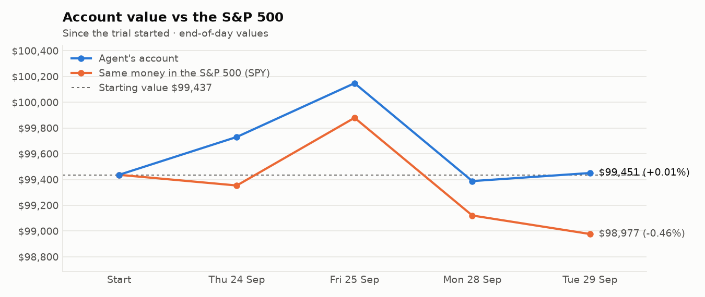
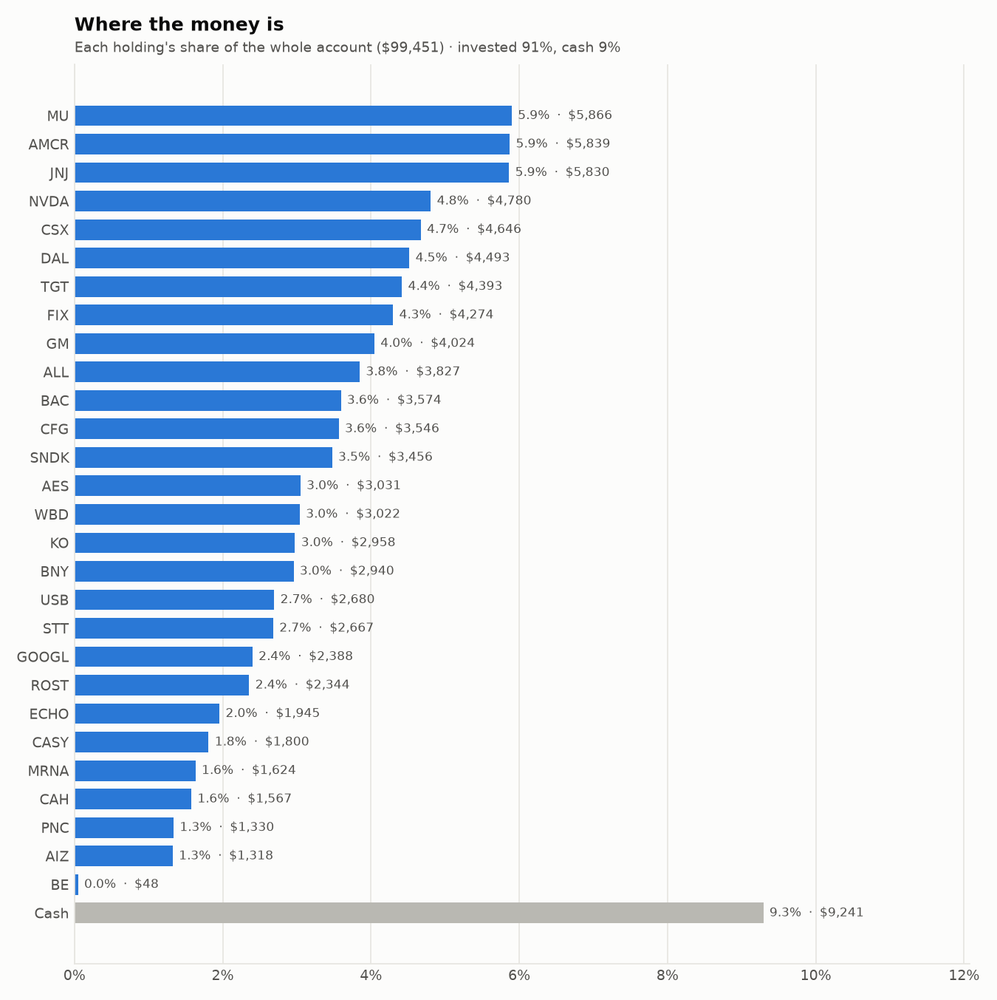
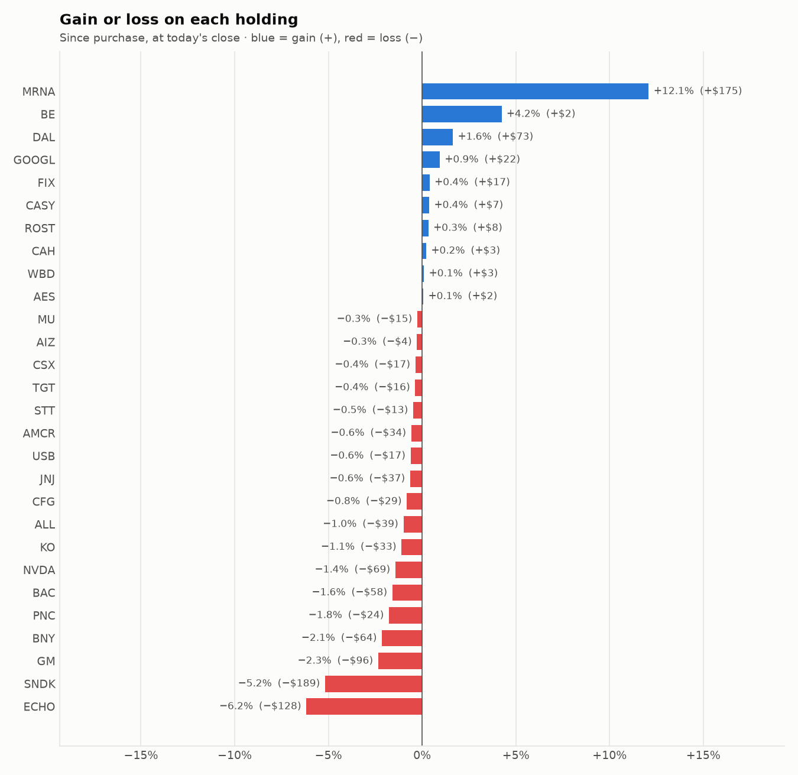

# Daily trading report — Tuesday 29 September 2026

## Summary

- **Account value:** $99,451 (+$63, +0.1% today)
- **S&P 500 (SPY) today:** -0.1% — the agent was ahead of the index by 0.21%
- **Trades:** 6 buy(s) ($17,106), 5 sell(s) ($17,807)
- **2026-09-29 Morning rebalance:** traded — 11 order(s) placed
- **2026-09-29 Afternoon risk check:** no trades needed — Risk-checked 28 holding(s): none was 10%+ below its purchase price, and none had both clearly negative news and a price drop of 3%+ since entry.

## Charts

## Why I bought

### CFG — bought 52.497 shares at ~$64.28 ($3,375)

**Why:** combined score +0.66; ranked #8 of 503; driven mainly by price momentum +1.25, value (cheapness) +0.88; entering/adding to the top-ranked target portfolio; research detail: 2 recent headline(s), net positive tone (+2); analyst consensus +1.04/2 (5 strong buy, 14 buy, 4 hold, 0 sell, 0 strong sell)

**Research scores** (combined +0.66, ranked #8 in the S&P 500, sector: Financials):

| Factor | Score | Measures |
|---|---|---|
| Value | +0.88 | cheap vs. sector peers on P/E and P/B |
| Quality | -0.08 | profitability (ROE, margins) and balance-sheet strength |
| Momentum | +1.25 | 12-month price trend, excluding the last month |
| Low volatility | +0.27 | steadier price than sector peers |
| Research | +0.76 | recent news tone + analyst consensus |

**Company financials (Finnhub, trailing 12 months):** P/E 13.0, P/B 1.1, return on equity 8.1%, debt/equity 0.40

**Price trend (Alpaca):** 12-month return (excl. last month) +36.7%, last month -7.7%, volatility 25.5%/yr

**News (Finnhub): 2 headline(s) in the last 2 days, net tone +2.** Most influential:
- [Citizens Financial Gains 22.2% in a Year: How to Play the Stock Now?](https://finnhub.io/api/news?id=01fa8da5edc6556e7cf1c85a6145c55d87d5c320efddb8c24905c9b31e49c151) — 28 Sep, Yahoo (tone +2)
- [Morgan Stanley Maintains Overweight on Citizens Financial Group, Lowers Price Target to $89](https://finnhub.io/api/news?id=cb15f78dafa962d4cc319837dc4139df2f8164a03f94bd0d5b9bb98526f04622) — 28 Sep, Benzinga (tone +0)

**Analysts (Finnhub, 2026-09-01):** 5 strong buy, 14 buy, 4 hold, 0 sell, 0 strong sell — consensus +1.04 on a -2 (strong sell) to +2 (strong buy) scale.

### JNJ — bought 10.79 shares at ~$268.18 ($2,894)

**Why:** combined score +0.70; ranked #5 of 503; driven mainly by low volatility +2.21, research (news + analyst consensus) +1.50; entering/adding to the top-ranked target portfolio; research detail: 8 recent headline(s), net positive tone (+8); analyst consensus +0.94/2 (7 strong buy, 15 buy, 9 hold, 0 sell, 0 strong sell)

**Research scores** (combined +0.70, ranked #5 in the S&P 500, sector: Health Care):

| Factor | Score | Measures |
|---|---|---|
| Value | -0.58 | cheap vs. sector peers on P/E and P/B |
| Quality | +0.32 | profitability (ROE, margins) and balance-sheet strength |
| Momentum | +0.50 | 12-month price trend, excluding the last month |
| Low volatility | +2.21 | steadier price than sector peers |
| Research | +1.50 | recent news tone + analyst consensus |

**Company financials (FMP, trailing 12 months):** P/E 31.0, P/B 7.7, return on equity 25.7%, gross margin 67.9%, debt/equity 0.58

**Price trend (Alpaca):** 12-month return (excl. last month) +50.5%, last month +2.4%, volatility 20.8%/yr

**News (Finnhub): 8 headline(s) in the last 2 days, net tone +8.** Most influential:
- [Johnson & Johnson: Strong Catalysts, But I'm Staying At Hold](https://finnhub.io/api/news?id=ec3e5b6524fe403d7855648c714dbe921dfad0c82d3d6477c08338dd45efb82d) — 29 Sep, SeekingAlpha (tone +2)
- [Johnson & Johnson (JNJ) Stock May Be Undervalued As Its 96% Run Continues](https://finnhub.io/api/news?id=99857ddfca6ebbd8a89955af1bfdd44683f27ed4190f1b821333a42f98b97f0a) — 29 Sep, Yahoo (tone +2)
- [Is Johnson & Johnson (JNJ) Building a Stronger Post-Stelara Growth Story?](https://finnhub.io/api/news?id=41fad11262432ca6929b6c373cddb535cc43306213989e56d3ca9608206ca61c) — 28 Sep, Yahoo (tone +1)
- [Can J&J’s Latest Trial Win Strengthen its Neuroscience Business?](https://finnhub.io/api/news?id=fe828da840bf7c9972942dd4dac7bcb3cfdfbf423e91e23d34e34f0b2e24976a) — 28 Sep, Yahoo (tone +1)
- [Johnson & Johnson’s Next Growth Engine Is Taking Shape](https://finnhub.io/api/news?id=a21355bcf3d9933ddaea4f8a801aa4bd9b611140af55ddc59afa5ed966dd6a25) — 28 Sep, Yahoo (tone +1)

**Analysts (Finnhub, 2026-09-01):** 7 strong buy, 15 buy, 9 hold, 0 sell, 0 strong sell — consensus +0.94 on a -2 (strong sell) to +2 (strong buy) scale.

### AMCR — bought 66.493 shares at ~$42.58 ($2,831)

**Why:** combined score +0.70; ranked #6 of 503; driven mainly by price momentum +3.00, quality (profitability/balance sheet) -0.51; entering/adding to the top-ranked target portfolio; research detail: 1 recent headline(s), neutral/mixed tone; analyst consensus +0.90/2 (5 strong buy, 8 buy, 7 hold, 0 sell, 0 strong sell)

**Research scores** (combined +0.70, ranked #6 in the S&P 500, sector: Materials):

| Factor | Score | Measures |
|---|---|---|
| Value | +0.37 | cheap vs. sector peers on P/E and P/B |
| Quality | -0.51 | profitability (ROE, margins) and balance-sheet strength |
| Momentum | +3.00 | 12-month price trend, excluding the last month |
| Low volatility | -0.01 | steadier price than sector peers |
| Research | -0.10 | recent news tone + analyst consensus |

**Company financials (Finnhub, trailing 12 months):** P/E 17.8, P/B 1.7, return on equity 9.4%, gross margin 20.0%, debt/equity 1.19

**Price trend (Alpaca):** 12-month return (excl. last month) +451.1%, last month -8.0%, volatility 28.5%/yr

**News (Finnhub): 1 headline(s) in the last 2 days, net tone +0.** Most influential:
- [Amcor announces Board Chair transition](https://finnhub.io/api/news?id=6fbb1c82d3a35e627c45e5bdfca4d2acc1b705f0e435ade7c0f7dd19d3e855c7) — 29 Sep, Yahoo (tone +0)

**Analysts (Finnhub, 2026-09-01):** 5 strong buy, 8 buy, 7 hold, 0 sell, 0 strong sell — consensus +0.90 on a -2 (strong sell) to +2 (strong buy) scale.

### USB — bought 46.094 shares at ~$58.50 ($2,696)

**Why:** combined score +0.61; ranked #14 of 503; driven mainly by price momentum +0.88, research (news + analyst consensus) +0.80; entering/adding to the top-ranked target portfolio; research detail: 2 recent headline(s), net positive tone (+3); analyst consensus +0.78/2 (6 strong buy, 10 buy, 10 hold, 1 sell, 0 strong sell)

**Research scores** (combined +0.61, ranked #14 in the S&P 500, sector: Financials):

| Factor | Score | Measures |
|---|---|---|
| Value | +0.71 | cheap vs. sector peers on P/E and P/B |
| Quality | -0.16 | profitability (ROE, margins) and balance-sheet strength |
| Momentum | +0.88 | 12-month price trend, excluding the last month |
| Low volatility | +0.79 | steadier price than sector peers |
| Research | +0.80 | recent news tone + analyst consensus |

**Company financials (Finnhub, trailing 12 months):** P/E 11.3, P/B 1.4, return on equity 12.5%, debt/equity 1.42

**Price trend (Alpaca):** 12-month return (excl. last month) +28.4%, last month -5.8%, volatility 20.2%/yr

**News (Finnhub): 2 headline(s) in the last 2 days, net tone +3.** Most influential:
- [PNC vs. U.S. Bancorp: Which Regional Bank Dividend Belongs in Your Portfolio?](https://finnhub.io/api/news?id=f82176d78be4f9de18dfc58a208491956492ba331b551cf9014bd0d8a534824d) — 27 Sep, Yahoo (tone +2)
- [HSBC Maintains Buy on U.S. Bancorp, Raises Price Target to $76](https://finnhub.io/api/news?id=c5a41f327ec955758423b04ce9e4995bde8bd43d15f027e21df131e4e6d859e0) — 28 Sep, Benzinga (tone +1)

**Analysts (Finnhub, 2026-09-01):** 6 strong buy, 10 buy, 10 hold, 1 sell, 0 strong sell — consensus +0.78 on a -2 (strong sell) to +2 (strong buy) scale.

### MU — bought 2.491 shares at ~$1,074.94 ($2,678)

**Why:** combined score +1.12; ranked #1 of 503; driven mainly by price momentum +2.87, research (news + analyst consensus) +1.98; entering/adding to the top-ranked target portfolio; research detail: 76 recent headline(s), net positive tone (+33); analyst consensus +1.21/2 (18 strong buy, 35 buy, 4 hold, 1 sell, 0 strong sell)

**Research scores** (combined +1.12, ranked #1 in the S&P 500, sector: Information Technology):

| Factor | Score | Measures |
|---|---|---|
| Value | +0.17 | cheap vs. sector peers on P/E and P/B |
| Quality | +0.67 | profitability (ROE, margins) and balance-sheet strength |
| Momentum | +2.87 | 12-month price trend, excluding the last month |
| Low volatility | -1.10 | steadier price than sector peers |
| Research | +1.98 | recent news tone + analyst consensus |

**Company financials (Finnhub, trailing 12 months):** P/E 23.3, P/B 10.3, return on equity 70.5%, gross margin 72.6%, debt/equity 0.06

**Price trend (Alpaca):** 12-month return (excl. last month) +697.4%, last month +13.5%, volatility 76.6%/yr

**News (Finnhub): 76 headline(s) in the last 2 days, net tone +33.** Most influential:
- [Micron Technology (NASDAQ:MU): A Growth-at-a-Reasonable-Price Memory Play](https://finnhub.io/api/news?id=616fa887a25bd6f6bfcffd9d0cde51888eb9a6d5ca8b957132c96565479e65e1) — 29 Sep, ChartMill (tone +2)
- [Micron Technology Growth Supported by Strong Demand, Rising Memory Prices, Wedbush Says](https://finnhub.io/api/news?id=44c4b229d28f958f3688cc7655e3e36f07c37676a63fc511047cc2e939248109) — 28 Sep, Yahoo (tone +2)
- [Micron stock target raised at Baird on higher DRAM pricing assumptions](https://finnhub.io/api/news?id=e0b8edb97791ddf6d577a4112cdab7abe259d2a35ec07d6663b142f9b9be2413) — 28 Sep, Yahoo (tone +2)
- [Palantir and Tyson Foods have been highlighted as Zacks Bull and Bear of the Day](https://finnhub.io/api/news?id=a17400512e400cbc5a2775974a476c50b852b418055d6a25f055c8f7b7aa57ce) — 28 Sep, Yahoo (tone +2)
- [AI Boom-Led Memory Chip Demand to Boost Micron's DRAM Revenues in Q4](https://finnhub.io/api/news?id=e4f5829ada8c428435e172c0c2969e67f80f1463a33a34ba077bdb3d8bbc1f9a) — 28 Sep, Yahoo (tone +2)

**Analysts (Finnhub, 2026-09-01):** 18 strong buy, 35 buy, 4 hold, 1 sell, 0 strong sell — consensus +1.21 on a -2 (strong sell) to +2 (strong buy) scale.

### FIX — bought 1.567 shares at ~$1,680.00 ($2,633)

**Why:** combined score +0.59; ranked #17 of 503; driven mainly by price momentum +3.00, low volatility -1.43; entering/adding to the top-ranked target portfolio; research detail: 1 recent headline(s), net positive tone (+1); analyst consensus +1.31/2 (7 strong buy, 7 buy, 2 hold, 0 sell, 0 strong sell)

**Research scores** (combined +0.59, ranked #17 in the S&P 500, sector: Industrials):

| Factor | Score | Measures |
|---|---|---|
| Value | -0.75 | cheap vs. sector peers on P/E and P/B |
| Quality | +0.19 | profitability (ROE, margins) and balance-sheet strength |
| Momentum | +3.00 | 12-month price trend, excluding the last month |
| Low volatility | -1.43 | steadier price than sector peers |
| Research | +0.85 | recent news tone + analyst consensus |

**Company financials (Finnhub, trailing 12 months):** P/E 40.4, P/B 21.7, return on equity 53.5%, gross margin 25.7%, debt/equity 0.02

**Price trend (Alpaca):** 12-month return (excl. last month) +128.1%, last month +2.8%, volatility 55.1%/yr

**News (Finnhub): 1 headline(s) in the last 2 days, net tone +1.** Most influential:
- [Why Hunt Electric Could Be a Strong Deal for Comfort Systems](https://finnhub.io/api/news?id=6488f0121a776474bd93c42f70a8c0b1561b48a28e4d0f63c3a23372cc80b7fe) — 28 Sep, Yahoo (tone +1)

**Analysts (Finnhub, 2026-09-01):** 7 strong buy, 7 buy, 2 hold, 0 sell, 0 strong sell — consensus +1.31 on a -2 (strong sell) to +2 (strong buy) scale.

## Why I sold

### UNP — sold 21 shares at ~$273.01 ($5,733)

**Why:** combined score +0.30; ranked #75 of 503; driven mainly by low volatility +1.03, price momentum +0.56; trimmed toward target weight, or dropped out of the top-ranked names; research detail: 1 recent headline(s), neutral/mixed tone; analyst consensus +0.97/2 (9 strong buy, 12 buy, 10 hold, 0 sell, 0 strong sell)

**Research scores** (combined +0.30, ranked #75 in the S&P 500, sector: Industrials):

| Factor | Score | Measures |
|---|---|---|
| Value | +0.00 | cheap vs. sector peers on P/E and P/B |
| Quality | +0.00 | profitability (ROE, margins) and balance-sheet strength |
| Momentum | +0.56 | 12-month price trend, excluding the last month |
| Low volatility | +1.03 | steadier price than sector peers |
| Research | +0.01 | recent news tone + analyst consensus |

**Price trend (Alpaca):** 12-month return (excl. last month) +38.1%, last month -10.9%, volatility 21.2%/yr

**News (Finnhub): 1 headline(s) in the last 2 days, net tone +0.** Most influential:
- [Can Union Pacific (UNP) and Norfolk Southern (NSC) Redraw America’s Railroad Map?](https://finnhub.io/api/news?id=4768334745e340eb23f020b2321b6a563fa2232894075534b4f3413bab6f5e61) — 28 Sep, Yahoo (tone +0)

**Analysts (Finnhub, 2026-09-01):** 9 strong buy, 12 buy, 10 hold, 0 sell, 0 strong sell — consensus +0.97 on a -2 (strong sell) to +2 (strong buy) scale.

### SPG — sold 28 shares at ~$204.72 ($5,732)

**Why:** combined score +0.41; ranked #38 of 503; driven mainly by low volatility +0.84, price momentum +0.78; trimmed toward target weight, or dropped out of the top-ranked names; research detail: 2 recent headline(s), net positive tone (+1); analyst consensus +0.62/2 (6 strong buy, 4 buy, 16 hold, 0 sell, 0 strong sell)

**Research scores** (combined +0.41, ranked #38 in the S&P 500, sector: Real Estate):

| Factor | Score | Measures |
|---|---|---|
| Value | +0.00 | cheap vs. sector peers on P/E and P/B |
| Quality | +0.00 | profitability (ROE, margins) and balance-sheet strength |
| Momentum | +0.78 | 12-month price trend, excluding the last month |
| Low volatility | +0.84 | steadier price than sector peers |
| Research | +0.47 | recent news tone + analyst consensus |

**Price trend (Alpaca):** 12-month return (excl. last month) +21.5%, last month -4.8%, volatility 17.8%/yr

**News (Finnhub): 2 headline(s) in the last 2 days, net tone +1.** Most influential:
- [Simon Property Group: Redemption Risk For SPG.PR.J](https://finnhub.io/api/news?id=ea6e7ccdb10f88972248d8772b80cc7c9820411efb20d290d004a2548baeaefc) — 26 Sep, SeekingAlpha (tone +1)
- [Barclays Maintains Equal-Weight on Simon Property Group, Lowers Price Target to $208](https://finnhub.io/api/news?id=8a3f78df193e1fc3b7eb08455ab4745dc787815f6410dcb506279171725988a2) — 28 Sep, Benzinga (tone +0)

**Analysts (Finnhub, 2026-09-01):** 6 strong buy, 4 buy, 16 hold, 0 sell, 0 strong sell — consensus +0.62 on a -2 (strong sell) to +2 (strong buy) scale.

### BE — sold 9.834 shares at ~$293.86 ($2,890)

**Why:** combined score +0.32; ranked #67 of 503; driven mainly by price momentum +3.00, low volatility -2.42; trimmed toward target weight, or dropped out of the top-ranked names; research detail: 12 recent headline(s), net positive tone (+9); analyst consensus +0.77/2 (7 strong buy, 17 buy, 14 hold, 1 sell, 0 strong sell)

**Research scores** (combined +0.32, ranked #67 in the S&P 500, sector: Industrials):

| Factor | Score | Measures |
|---|---|---|
| Value | -1.45 | cheap vs. sector peers on P/E and P/B |
| Quality | -0.37 | profitability (ROE, margins) and balance-sheet strength |
| Momentum | +3.00 | 12-month price trend, excluding the last month |
| Low volatility | -2.42 | steadier price than sector peers |
| Research | +1.46 | recent news tone + analyst consensus |

**Company financials (Finnhub, trailing 12 months):** P/E 315.9, P/B 53.4, return on equity 24.8%, gross margin 31.2%, debt/equity 1.67

**Price trend (Alpaca):** 12-month return (excl. last month) +335.9%, last month +20.7%, volatility 109.7%/yr

**News (Finnhub): 12 headline(s) in the last 2 days, net tone +9.** Most influential:
- [3 More AI Infrastructure Plays Beyond the Big Names](https://finnhub.io/api/news?id=50c814ff5632252707c10d714490a489cb34a975408b809947110c1650162ea2) — 27 Sep, Yahoo (tone +3)
- [BE Stock Slumps Most In Over A Month: This Analyst Says New Fremont Facility Is An Indicator Of Strong Demand](https://finnhub.io/api/news?id=48131c0a283e3d3456dd0e21ca59c2a825ec2b3e9d6ddcdb085136e1a057ff9f) — 28 Sep, Yahoo (tone +2)
- [Take the Zacks Approach to Beat the Markets: Bloom Energy, Microsoft & Amgen in Focus](https://finnhub.io/api/news?id=ca90682f5ea9c24da7a452467c520d9d0fafb31e823d2d8f774047a507180b07) — 28 Sep, Yahoo (tone +2)
- [Zacks Investment Ideas feature highlights: Nvidia, Bloom Energy and Amphenol](https://finnhub.io/api/news?id=6f8d14a8f00cbd70af8b1bed6c7197c926067041306899ca38b92470f9034915) — 29 Sep, Yahoo (tone +1)
- [Why Bloom Energy (BE) Shares Are Sliding Today](https://finnhub.io/api/news?id=10242223f106a9b75488e50ca3790527f30dde056980353f975e034b2816ec38) — 28 Sep, Yahoo (tone +1)

**Analysts (Finnhub, 2026-09-01):** 7 strong buy, 17 buy, 14 hold, 1 sell, 0 strong sell — consensus +0.77 on a -2 (strong sell) to +2 (strong buy) scale.

### WELL — sold 12 shares at ~$232.95 ($2,795)

**Why:** combined score +0.26; ranked #89 of 503; driven mainly by price momentum +1.69, value (cheapness) -0.71; trimmed toward target weight, or dropped out of the top-ranked names; research detail: analyst consensus +1.04/2 (6 strong buy, 17 buy, 5 hold, 0 sell, 0 strong sell)

**Research scores** (combined +0.26, ranked #89 in the S&P 500, sector: Real Estate):

| Factor | Score | Measures |
|---|---|---|
| Value | -0.71 | cheap vs. sector peers on P/E and P/B |
| Quality | -0.27 | profitability (ROE, margins) and balance-sheet strength |
| Momentum | +1.69 | 12-month price trend, excluding the last month |
| Low volatility | -0.11 | steadier price than sector peers |
| Research | +0.25 | recent news tone + analyst consensus |

**Company financials (Finnhub, trailing 12 months):** P/E 109.9, P/B 3.5, return on equity 3.6%, gross margin 40.3%, debt/equity 0.38

**Price trend (Alpaca):** 12-month return (excl. last month) +44.4%, last month -2.7%, volatility 20.3%/yr

**News (Finnhub):** no headlines in the last 2 days.

**Analysts (Finnhub, 2026-09-01):** 6 strong buy, 17 buy, 5 hold, 0 sell, 0 strong sell — consensus +1.04 on a -2 (strong sell) to +2 (strong buy) scale.

### ECHO — sold 7.375 shares at ~$88.98 ($656)

**Why:** combined score +0.21; ranked #118 of 503; driven mainly by price momentum +1.50, low volatility -1.11; trimmed toward target weight, or dropped out of the top-ranked names; research detail: analyst consensus +1.08/2 (4 strong buy, 6 buy, 3 hold, 0 sell, 0 strong sell)

**Research scores** (combined +0.21, ranked #118 in the S&P 500, sector: Communication Services):

| Factor | Score | Measures |
|---|---|---|
| Value | +0.00 | cheap vs. sector peers on P/E and P/B |
| Quality | +0.00 | profitability (ROE, margins) and balance-sheet strength |
| Momentum | +1.50 | 12-month price trend, excluding the last month |
| Low volatility | -1.11 | steadier price than sector peers |
| Research | +0.02 | recent news tone + analyst consensus |

**Price trend (Alpaca):** 12-month return (excl. last month) +70.0%, last month +3.1%, volatility 37.7%/yr

**News (Finnhub):** no headlines in the last 2 days.

**Analysts (Finnhub, 2026-09-01):** 4 strong buy, 6 buy, 3 hold, 0 sell, 0 strong sell — consensus +1.08 on a -2 (strong sell) to +2 (strong buy) scale.

## Holdings at the close

| Stock | Shares | Avg cost | Price | Market value | % of account | Today | Gain/loss $ | Gain/loss % |
|---|---:|---:|---:|---:|---:|---:|---:|---:|
| MU | 5.491 | $1,070.99 | $1,068.25 | $5,866 | 5.9% | +1.35% | −$15 | -0.26% |
| AMCR | 137.493 | $42.71 | $42.47 | $5,839 | 5.9% | -0.75% | −$34 | -0.58% |
| JNJ | 21.79 | $269.29 | $267.57 | $5,830 | 5.9% | -1.61% | −$37 | -0.64% |
| NVDA | 21 | $230.93 | $227.63 | $4,780 | 4.8% | -0.54% | −$69 | -1.43% |
| CSX | 99 | $47.10 | $46.93 | $4,646 | 4.7% | +0.36% | −$17 | -0.36% |
| DAL | 53 | $83.40 | $84.77 | $4,493 | 4.5% | +0.88% | +$73 | +1.64% |
| TGT | 28 | $157.46 | $156.88 | $4,393 | 4.4% | -0.98% | −$16 | -0.37% |
| FIX | 2.567 | $1,658.39 | $1,665.05 | $4,274 | 4.3% | +0.41% | +$17 | +0.40% |
| GM | 50 | $82.40 | $80.47 | $4,024 | 4.0% | -0.21% | −$96 | -2.34% |
| ALL | 17 | $227.36 | $225.09 | $3,827 | 3.8% | -1.08% | −$39 | -1.00% |
| BAC | 65 | $55.87 | $54.98 | $3,574 | 3.6% | -0.88% | −$58 | -1.59% |
| CFG | 55.497 | $64.42 | $63.89 | $3,546 | 3.6% | -1.40% | −$29 | -0.82% |
| SNDK | 2 | $1,822.48 | $1,728.15 | $3,456 | 3.5% | +0.89% | −$189 | -5.18% |
| AES | 204 | $14.85 | $14.86 | $3,031 | 3.0% | -0.07% | +$2 | +0.07% |
| WBD | 98 | $30.81 | $30.84 | $3,022 | 3.0% | -0.19% | +$3 | +0.10% |
| KO | 34 | $87.97 | $87.00 | $2,958 | 3.0% | -0.21% | −$33 | -1.10% |
| BNY | 20 | $150.20 | $146.98 | $2,940 | 3.0% | -0.98% | −$64 | -2.14% |
| USB | 46.094 | $58.50 | $58.14 | $2,680 | 2.7% | -1.09% | −$17 | -0.62% |
| STT | 15 | $178.63 | $177.78 | $2,667 | 2.7% | -1.08% | −$13 | -0.48% |
| GOOGL | 7 | $337.98 | $341.17 | $2,388 | 2.4% | -0.46% | +$22 | +0.94% |
| ROST | 10 | $233.61 | $234.40 | $2,344 | 2.4% | -1.13% | +$8 | +0.34% |
| ECHO | 21.625 | $95.87 | $89.95 | $1,945 | 2.0% | +0.82% | −$128 | -6.18% |
| CASY | 3 | $597.62 | $599.90 | $1,800 | 1.8% | -1.05% | +$7 | +0.38% |
| MRNA | 8 | $181.06 | $202.95 | $1,624 | 1.6% | +2.87% | +$175 | +12.09% |
| CAH | 7 | $223.42 | $223.91 | $1,567 | 1.6% | +1.64% | +$3 | +0.22% |
| PNC | 6 | $225.64 | $221.65 | $1,330 | 1.3% | -0.90% | −$24 | -1.77% |
| AIZ | 5 | $264.38 | $263.65 | $1,318 | 1.3% | +0.05% | −$4 | -0.28% |
| BE | 0.166 | $279.84 | $291.70 | $48 | 0.0% | +10.97% | +$2 | +4.24% |
| **Invested** | | | | **$90,209** | **90.7%** | | **−$569** | |
| **Cash** | | | | $9,241 | 9.3% | | | |
| **Total account** | | | | **$99,451** | 100% | | | |

_Scores are sector-neutral z-scores: 0 is average for the stock's sector, +1 is one standard deviation better. News tone is a keyword count over recent headlines, not a deep read. None of this guarantees a stock will rise; a few days of results can't show whether the strategy has a real edge over the S&P 500._
