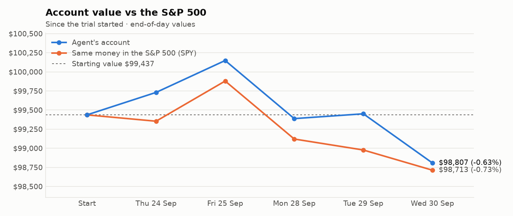
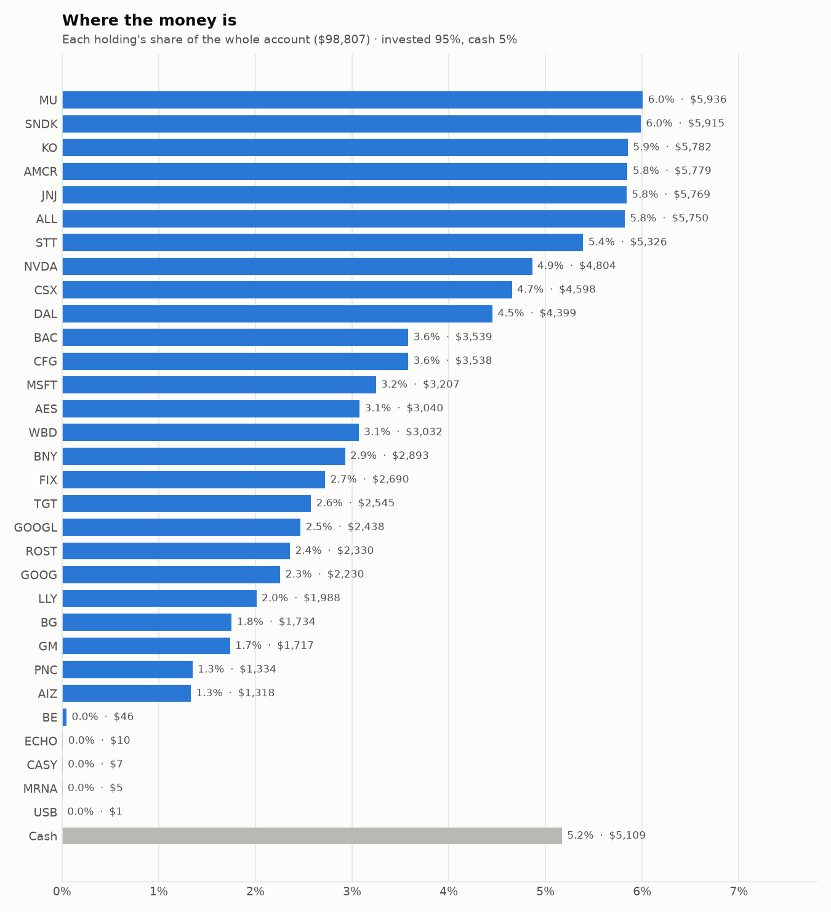
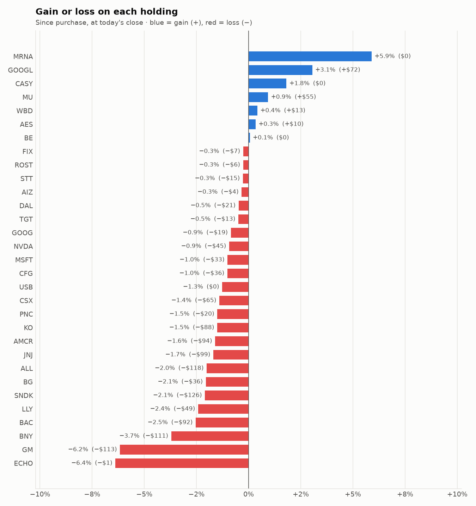

# Daily trading report — Wednesday 30 September 2026

## Summary

- **Account value:** $98,807 (-$644, -0.6% today)
- **S&P 500 (SPY) today:** -0.3% — the agent was behind the index by 0.38%
- **Trades:** 8 buy(s) ($19,235), 8 sell(s) ($15,102)
- **2026-09-30 Morning rebalance:** traded — 16 order(s) placed
- **2026-09-30 Afternoon risk check:** no trades needed — Risk-checked 31 holding(s): none was 10%+ below its purchase price, and none had both clearly negative news and a price drop of 3%+ since entry.

## Charts

## Why I bought

### MSFT — bought 6.25 shares at ~$518.33 ($3,240)

**Why:** combined score +0.57; ranked #15 of 503; driven mainly by research (news + analyst consensus) +2.07, low volatility +1.24; entering/adding to the top-ranked target portfolio; research detail: 82 recent headline(s), net positive tone (+35); analyst consensus +1.26/2 (23 strong buy, 41 buy, 5 hold, 0 sell, 0 strong sell)

**Research scores** (combined +0.57, ranked #15 in the S&P 500, sector: Information Technology):

| Factor | Score | Measures |
|---|---|---|
| Value | +0.06 | cheap vs. sector peers on P/E and P/B |
| Quality | +0.32 | profitability (ROE, margins) and balance-sheet strength |
| Momentum | -0.41 | 12-month price trend, excluding the last month |
| Low volatility | +1.24 | steadier price than sector peers |
| Research | +2.07 | recent news tone + analyst consensus |

**Company financials (FMP, trailing 12 months):** P/E 28.8, P/B 8.7, return on equity 33.2%, gross margin 67.9%, debt/equity 0.29

**Price trend (Alpaca):** 12-month return (excl. last month) +1.4%, last month -0.9%, volatility 40.4%/yr

**News (Finnhub): 82 headline(s) in the last 2 days, net tone +35.** Most influential:
- [Computers Global Market Report 2026: Capitalize on the $161.29 Billion Revenue Surge to $676.41 Billion by 2030—Benchmark Apple, Microsoft, Dell, Lenovo and ASUS to Secure Share as AI PCs and Tariffs Disrupt Global Supply Chains](https://finnhub.io/api/news?id=ae3fd240d4e28f00d3957d8020301e0cc93a999f473eab42b81d2f44e7226acd) — 28 Sep, Yahoo (tone +3)
- [Has MSFT Stock Run Out Of Steam?](https://finnhub.io/api/news?id=5269c26441c3abf13e705ed88d84cca3c0a1b94315f7cd480a5b50aa8846f2a8) — 29 Sep, Yahoo (tone +2)
- [Next Generation Computing Market Report 2026: Capitalize on the $486 Billion Revenue Surge to $811.85 Billion by 2030 as Microsoft, AWS, NVIDIA, IBM and Intel Accelerate AI, Quantum and Edge Computing Disruption](https://finnhub.io/api/news?id=91fb73dffa21ff5d80fdaf7d34a2d0b476d482388a30e3c4850260c6ce25fe8e) — 29 Sep, Yahoo (tone +2)
- [Microsoft is Edging Into Overvalued Territory Now](https://finnhub.io/api/news?id=5ec8c7a0dc90878fdc16e06c7084ab1d331377fc552d4daa8cfb03fc0fdc0f64) — 29 Sep, Yahoo (tone +2)
- [Microsoft: Still Great Business, But AI Raises Serious Questions](https://finnhub.io/api/news?id=416462e6def988fc11295658ac4d905137cf4b759cfa9227c2cb786933822a43) — 29 Sep, SeekingAlpha (tone +2)

**Analysts (Finnhub, 2026-09-01):** 23 strong buy, 41 buy, 5 hold, 0 sell, 0 strong sell — consensus +1.26 on a -2 (strong sell) to +2 (strong buy) scale.

### KO — bought 33.092 shares at ~$87.01 ($2,879)

**Why:** combined score +0.73; ranked #5 of 503; driven mainly by low volatility +1.53, price momentum +1.26; entering/adding to the top-ranked target portfolio; research detail: 16 recent headline(s), net positive tone (+6); analyst consensus +1.00/2 (8 strong buy, 19 buy, 8 hold, 0 sell, 0 strong sell)

**Research scores** (combined +0.73, ranked #5 in the S&P 500, sector: Consumer Staples):

| Factor | Score | Measures |
|---|---|---|
| Value | -0.60 | cheap vs. sector peers on P/E and P/B |
| Quality | +0.45 | profitability (ROE, margins) and balance-sheet strength |
| Momentum | +1.26 | 12-month price trend, excluding the last month |
| Low volatility | +1.53 | steadier price than sector peers |
| Research | +1.06 | recent news tone + analyst consensus |

**Company financials (Finnhub, trailing 12 months):** P/E 26.2, P/B 10.0, return on equity 43.0%, gross margin 61.9%, debt/equity 1.20

**Price trend (Alpaca):** 12-month return (excl. last month) +30.3%, last month -3.1%, volatility 20.4%/yr

**News (Finnhub): 16 headline(s) in the last 2 days, net tone +6.** Most influential:
- [Billionaires Love These 2 Dividend Kings](https://finnhub.io/api/news?id=47e4b4f208ea41744d2cba987c7e75261d580c5d6e06fdd176ecb062f61f902a) — 30 Sep, Yahoo (tone +1)
- [Defensive Dividends: 3 Companies Investors Can Rely On](https://finnhub.io/api/news?id=4f09ab652b0ab864739c65ee5f41a756c9bf610f027aaffe5c97b8d2fd8c1c80) — 29 Sep, Yahoo (tone +1)
- [KO vs. MNST: Which Beverage Stock Has the Stronger Growth Story?](https://finnhub.io/api/news?id=4aca4fbfb330784a21ebb92658a6c5cd807c3a1d380c36949ee7e458547f188d) — 29 Sep, Yahoo (tone +1)
- [What's Driving Coca-Cola's Broad-Based Global Volume Growth?](https://finnhub.io/api/news?id=4951b6797ddeb42d5af0eca776c55ee975d8774eaa5490549e4723d8e377eb64) — 28 Sep, Yahoo (tone +1)
- [Be Careful With Coca-Cola Right Now](https://finnhub.io/api/news?id=5d02edd3fe1bc703c2f11d834c5363aaeba6ce7100eebfda8a2a12c03701c213) — 28 Sep, Yahoo (tone +1)

**Analysts (Finnhub, 2026-09-01):** 8 strong buy, 19 buy, 8 hold, 0 sell, 0 strong sell — consensus +1.00 on a -2 (strong sell) to +2 (strong buy) scale.

### STT — bought 14.965 shares at ~$177.81 ($2,661)

**Why:** combined score +0.70; ranked #8 of 503; driven mainly by price momentum +2.24, low volatility +0.48; entering/adding to the top-ranked target portfolio; research detail: 2 recent headline(s), net positive tone (+1); analyst consensus +0.81/2 (3 strong buy, 11 buy, 7 hold, 0 sell, 0 strong sell)

**Research scores** (combined +0.70, ranked #8 in the S&P 500, sector: Financials):

| Factor | Score | Measures |
|---|---|---|
| Value | +0.32 | cheap vs. sector peers on P/E and P/B |
| Quality | -0.06 | profitability (ROE, margins) and balance-sheet strength |
| Momentum | +2.24 | 12-month price trend, excluding the last month |
| Low volatility | +0.48 | steadier price than sector peers |
| Research | +0.05 | recent news tone + analyst consensus |

**Company financials (Finnhub, trailing 12 months):** P/E 14.1, P/B 1.7, return on equity 12.4%, debt/equity 1.08

**Price trend (Alpaca):** 12-month return (excl. last month) +68.2%, last month -8.0%, volatility 23.0%/yr

**News (Finnhub): 2 headline(s) in the last 2 days, net tone +1.** Most influential:
- [State Street's Quarterly Earnings Preview: What You Need to Know](https://finnhub.io/api/news?id=28d86db3761121103490305e10653ffa4fcdf5f092516417b2fe26e2865f4cd9) — 29 Sep, Yahoo (tone +1)
- [State Street CEO Ron O’Hanley on why the right opportunity can come at the wrong time](https://finnhub.io/api/news?id=bcc0148f402c186a758e45dd1878b726733996a29e0a186014f0e5284b76f7ff) — 28 Sep, CNBC (tone +0)

**Analysts (Finnhub, 2026-09-01):** 3 strong buy, 11 buy, 7 hold, 0 sell, 0 strong sell — consensus +0.81 on a -2 (strong sell) to +2 (strong buy) scale.

### SNDK — bought 1.38 shares at ~$1,736.53 ($2,396)

**Why:** combined score +0.85; ranked #2 of 503; driven mainly by price momentum +3.00, low volatility -1.43; entering/adding to the top-ranked target portfolio; research detail: 24 recent headline(s), net positive tone (+11); analyst consensus +1.18/2 (11 strong buy, 17 buy, 5 hold, 0 sell, 0 strong sell)

**Research scores** (combined +0.85, ranked #2 in the S&P 500, sector: Information Technology):

| Factor | Score | Measures |
|---|---|---|
| Value | +0.09 | cheap vs. sector peers on P/E and P/B |
| Quality | +0.79 | profitability (ROE, margins) and balance-sheet strength |
| Momentum | +3.00 | 12-month price trend, excluding the last month |
| Low volatility | -1.43 | steadier price than sector peers |
| Research | +0.71 | recent news tone + analyst consensus |

**Company financials (Finnhub, trailing 12 months):** P/E 21.9, P/B 16.4, return on equity 93.1%, gross margin 71.5%, debt/equity 0.00

**Price trend (Alpaca):** 12-month return (excl. last month) +2964.5%, last month +16.6%, volatility 117.8%/yr

**News (Finnhub): 24 headline(s) in the last 2 days, net tone +11.** Most influential:
- [SanDisk Could Have a Much Bigger Opportunity Than Investors Expect](https://finnhub.io/api/news?id=25a915c7b31086363632835c27c4da0ef6cfd5b07ec9f09e553e614f50d10730) — 29 Sep, Yahoo (tone +3)
- [Examine Sandisk Carefully Before You Jump in on The Buyback News](https://finnhub.io/api/news?id=3cc48e861d7c3c2c1d057705a3509c28f173382f35ac060783f49339fe1436ae) — 29 Sep, Yahoo (tone +2)
- [What Does Sandisk (SNDK) AI Data Center Momentum Mean For Its Stock?](https://finnhub.io/api/news?id=4a7723db0e7d613135fd11b5464e96c2273d6e7c663aaf66ecb67a8efb0b47a7) — 29 Sep, Yahoo (tone +2)
- [Sandisk (SNDK) Could Be 19% Undervalued After Its Memory Forum Update](https://finnhub.io/api/news?id=7f7d6ee7828e0d6dc2dbf89b79e340ca22ea57e4a8149ce743aabfff0c0cfa11) — 29 Sep, Yahoo (tone +1)
- [As Macro Fears Grow Rapidly, Sandisk Is Printing Money](https://finnhub.io/api/news?id=a8fb82f74ddb4a9287e88396fb389353355111a81910c03522b8f682bcf0ad0f) — 29 Sep, SeekingAlpha (tone +1)

**Analysts (Finnhub, 2026-09-01):** 11 strong buy, 17 buy, 5 hold, 0 sell, 0 strong sell — consensus +1.18 on a -2 (strong sell) to +2 (strong buy) scale.

### GOOG — bought 6.458 shares at ~$348.27 ($2,249)

**Why:** combined score +0.53; ranked #19 of 503; driven mainly by price momentum +1.46, research (news + analyst consensus) +1.27; entering/adding to the top-ranked target portfolio; research detail: 39 recent headline(s), net positive tone (+16); analyst consensus +1.19/2 (20 strong buy, 43 buy, 7 hold, 0 sell, 0 strong sell)

**Research scores** (combined +0.53, ranked #19 in the S&P 500, sector: Communication Services):

| Factor | Score | Measures |
|---|---|---|
| Value | -0.67 | cheap vs. sector peers on P/E and P/B |
| Quality | +0.23 | profitability (ROE, margins) and balance-sheet strength |
| Momentum | +1.46 | 12-month price trend, excluding the last month |
| Low volatility | +0.02 | steadier price than sector peers |
| Research | +1.27 | recent news tone + analyst consensus |

**Company financials (Finnhub, trailing 12 months):** P/E 17.0, P/B 6.8, return on equity 50.8%, gross margin 60.9%, debt/equity 0.15

**Price trend (Alpaca):** 12-month return (excl. last month) +64.7%, last month -1.6%, volatility 33.7%/yr

**News (Finnhub): 39 headline(s) in the last 2 days, net tone +16.** Most influential:
- [Next Generation Computing Market Report 2026: Capitalize on the $486 Billion Revenue Surge to $811.85 Billion by 2030 as Microsoft, AWS, NVIDIA, IBM and Intel Accelerate AI, Quantum and Edge Computing Disruption](https://finnhub.io/api/news?id=91fb73dffa21ff5d80fdaf7d34a2d0b476d482388a30e3c4850260c6ce25fe8e) — 29 Sep, Yahoo (tone +2)
- [Alphabet Has More Growth Engines Than Investors Think, We See 63% Upside](https://finnhub.io/api/news?id=4298cf1aa1400454176e7a976f6b59d130383f780dddfe7aefa60597b572a54d) — 29 Sep, Yahoo (tone +2)
- [The Zacks Analyst Blog Highlights Alphabet, Mastercard, AbbVie, Perma-Pipe and ImmuCell](https://finnhub.io/api/news?id=447232e349620640030f2cbdd7ed1d566069625e2a4375fcda152031b1c5954f) — 29 Sep, Yahoo (tone +2)
- [How Has Alphabet Stock's Story Changed?](https://finnhub.io/api/news?id=e889819364be642924cf9f77fb92061179e2e8b57136d062a75b9d417d1db01a) — 28 Sep, Yahoo (tone +2)
- [Here’s How Two of The Biggest Hyperscalers Have Best Monetized AI Capex So Far](https://finnhub.io/api/news?id=27ad32110bede7ef94e287bf854a176ec9b3e36c05ccace0584244463a590245) — 28 Sep, Yahoo (tone +2)

**Analysts (Finnhub, 2026-09-01):** 20 strong buy, 43 buy, 7 hold, 0 sell, 0 strong sell — consensus +1.19 on a -2 (strong sell) to +2 (strong buy) scale.

### LLY — bought 1.712 shares at ~$1,189.78 ($2,037)

**Why:** combined score +0.52; ranked #21 of 503; driven mainly by research (news + analyst consensus) +1.88, value (cheapness) -1.01; entering/adding to the top-ranked target portfolio; research detail: 44 recent headline(s), net positive tone (+12); analyst consensus +1.05/2 (11 strong buy, 19 buy, 7 hold, 1 sell, 0 strong sell)

**Research scores** (combined +0.52, ranked #21 in the S&P 500, sector: Health Care):

| Factor | Score | Measures |
|---|---|---|
| Value | -1.01 | cheap vs. sector peers on P/E and P/B |
| Quality | +0.90 | profitability (ROE, margins) and balance-sheet strength |
| Momentum | +0.75 | 12-month price trend, excluding the last month |
| Low volatility | -0.11 | steadier price than sector peers |
| Research | +1.88 | recent news tone + analyst consensus |

**Company financials (Finnhub, trailing 12 months):** P/E 41.6, P/B 33.3, return on equity 92.6%, gross margin 83.4%, debt/equity 1.62

**Price trend (Alpaca):** 12-month return (excl. last month) +59.8%, last month +1.0%, volatility 29.6%/yr

**News (Finnhub): 44 headline(s) in the last 2 days, net tone +12.** Most influential:
- [Eli Lilly (NYSE:LLY) Offers a Breakout Setup Backed by High Growth Momentum](https://finnhub.io/api/news?id=cb69ba4af984f24f55ad0730963f037bff4ce91a7ca26dd9922eb660099cc808) — 28 Sep, ChartMill (tone +2)
- [Bristol Myers Squibb vs. Eli Lilly and: Which Healthcare Stock Is a Better Buy in 2026?](https://finnhub.io/api/news?id=dad28c5abdd129fdb1e804b20e2b6ae25777b536ab3328c866194994463de7a5) — 29 Sep, Yahoo (tone +1)
- [Eli Lilly CEO delivers stark message on what comes next](https://finnhub.io/api/news?id=207c5d0a0afa3b29d3d5d9b7f72855027afd1295e4839c7dfd31038801a42677) — 29 Sep, Yahoo (tone +1)
- [Prediction: Eli Lilly’s Next Growth Wave Could Surprise Investors](https://finnhub.io/api/news?id=541cc626871f4fd047a23aa28247f5cf229c09467a186e6d43bd868e5fb9dda3) — 29 Sep, Yahoo (tone +1)
- [Management Raised the Bar For Eli Lilly Stock; Does The Chart Agree?](https://finnhub.io/api/news?id=c06ff2c0c822e8896c0b556b2872150995680256580705e1edafdf2fc7709e30) — 29 Sep, Yahoo (tone +1)

**Analysts (Finnhub, 2026-09-01):** 11 strong buy, 19 buy, 7 hold, 1 sell, 0 strong sell — consensus +1.05 on a -2 (strong sell) to +2 (strong buy) scale.

### ALL — bought 8.919 shares at ~$224.59 ($2,003)

**Why:** combined score +0.72; ranked #6 of 503; driven mainly by value (cheapness) +1.68, quality (profitability/balance sheet) +1.27; entering/adding to the top-ranked target portfolio; research detail: 1 recent headline(s), net positive tone (+1); analyst consensus +0.47/2 (5 strong buy, 9 buy, 12 hold, 3 sell, 1 strong sell)

**Research scores** (combined +0.72, ranked #6 in the S&P 500, sector: Financials):

| Factor | Score | Measures |
|---|---|---|
| Value | +1.68 | cheap vs. sector peers on P/E and P/B |
| Quality | +1.27 | profitability (ROE, margins) and balance-sheet strength |
| Momentum | +0.87 | 12-month price trend, excluding the last month |
| Low volatility | -0.18 | steadier price than sector peers |
| Research | -0.31 | recent news tone + analyst consensus |

**Company financials (Finnhub, trailing 12 months):** P/E 4.3, P/B 1.8, return on equity 43.1%, debt/equity 0.22

**Price trend (Alpaca):** 12-month return (excl. last month) +27.9%, last month -13.6%, volatility 30.0%/yr

**News (Finnhub): 1 headline(s) in the last 2 days, net tone +1.** Most influential:
- [The Muse AI Panic Is More of a Test Than a Total Knockout for Allstate Stock](https://finnhub.io/api/news?id=c1f2da696f59542302d6ed7a058ce31a44b93ef198ba13036e5ce74f54fa8d2a) — 28 Sep, Yahoo (tone +1)

**Analysts (Finnhub, 2026-09-01):** 5 strong buy, 9 buy, 12 hold, 3 sell, 1 strong sell — consensus +0.47 on a -2 (strong sell) to +2 (strong buy) scale.

### BG — bought 16.346 shares at ~$108.29 ($1,770)

**Why:** combined score +0.51; ranked #23 of 503; driven mainly by price momentum +1.55, value (cheapness) +1.13; entering/adding to the top-ranked target portfolio; research detail: analyst consensus +1.15/2 (5 strong buy, 13 buy, 2 hold, 0 sell, 0 strong sell)

**Research scores** (combined +0.51, ranked #23 in the S&P 500, sector: Consumer Staples):

| Factor | Score | Measures |
|---|---|---|
| Value | +1.13 | cheap vs. sector peers on P/E and P/B |
| Quality | -0.57 | profitability (ROE, margins) and balance-sheet strength |
| Momentum | +1.55 | 12-month price trend, excluding the last month |
| Low volatility | -0.46 | steadier price than sector peers |
| Research | +0.42 | recent news tone + analyst consensus |

**Company financials (Finnhub, trailing 12 months):** P/E 20.6, P/B 1.3, return on equity 6.3%, gross margin 4.9%, debt/equity 0.96

**Price trend (Alpaca):** 12-month return (excl. last month) +36.3%, last month -6.3%, volatility 35.2%/yr

**News (Finnhub):** no headlines in the last 2 days.

**Analysts (Finnhub, 2026-09-01):** 5 strong buy, 13 buy, 2 hold, 0 sell, 0 strong sell — consensus +1.15 on a -2 (strong sell) to +2 (strong buy) scale.

## Why I sold

### USB — sold 46.078 shares at ~$57.88 ($2,667)

**Why:** combined score +0.38; ranked #55 of 503; driven mainly by price momentum +0.88, low volatility +0.79; trimmed toward target weight, or dropped out of the top-ranked names; research detail: 3 recent headline(s), net positive tone (+2); analyst consensus +0.78/2 (6 strong buy, 10 buy, 10 hold, 1 sell, 0 strong sell)

**Research scores** (combined +0.38, ranked #55 in the S&P 500, sector: Financials):

| Factor | Score | Measures |
|---|---|---|
| Value | +0.00 | cheap vs. sector peers on P/E and P/B |
| Quality | +0.00 | profitability (ROE, margins) and balance-sheet strength |
| Momentum | +0.88 | 12-month price trend, excluding the last month |
| Low volatility | +0.79 | steadier price than sector peers |
| Research | +0.23 | recent news tone + analyst consensus |

**Price trend (Alpaca):** 12-month return (excl. last month) +28.1%, last month -6.9%, volatility 19.9%/yr

**News (Finnhub): 3 headline(s) in the last 2 days, net tone +2.** Most influential:
- [What You Need To Know Ahead of U.S. Bancorp’s Earnings Release](https://finnhub.io/api/news?id=1272d38424fb348b54e95007b11e2fdef041fec9aa2ef78c59f553ece530cc0a) — 29 Sep, Yahoo (tone +1)
- [HSBC Maintains Buy on U.S. Bancorp, Raises Price Target to $76](https://finnhub.io/api/news?id=c5a41f327ec955758423b04ce9e4995bde8bd43d15f027e21df131e4e6d859e0) — 28 Sep, Benzinga (tone +1)
- [Elavon earns TSG’s 2026 Best B2B API Award for Innovative Payment Gateway](https://finnhub.io/api/news?id=8c03b7a92080f9dda2f6177bd1bcb01cd03c534e88b88dde00cd822f506888d6) — 29 Sep, Yahoo (tone +0)

**Analysts (Finnhub, 2026-09-01):** 6 strong buy, 10 buy, 10 hold, 1 sell, 0 strong sell — consensus +0.78 on a -2 (strong sell) to +2 (strong buy) scale.

### GM — sold 27.789 shares at ~$79.07 ($2,197)

**Why:** combined score +0.51; ranked #22 of 503; driven mainly by price momentum +1.71, value (cheapness) +0.69; trimmed toward target weight, or dropped out of the top-ranked names; research detail: 22 recent headline(s), net positive tone (+1); analyst consensus +1.05/2 (11 strong buy, 19 buy, 7 hold, 1 sell, 0 strong sell)

**Research scores** (combined +0.51, ranked #22 in the S&P 500, sector: Consumer Discretionary):

| Factor | Score | Measures |
|---|---|---|
| Value | +0.69 | cheap vs. sector peers on P/E and P/B |
| Quality | -0.68 | profitability (ROE, margins) and balance-sheet strength |
| Momentum | +1.71 | 12-month price trend, excluding the last month |
| Low volatility | +0.19 | steadier price than sector peers |
| Research | +0.29 | recent news tone + analyst consensus |

**Company financials (FMP, trailing 12 months):** P/E 39.5, P/B 1.2, return on equity 3.0%, gross margin 5.7%, debt/equity 2.06

**Price trend (Alpaca):** 12-month return (excl. last month) +46.9%, last month -6.7%, volatility 32.5%/yr

**News (Finnhub): 22 headline(s) in the last 2 days, net tone +1.** Most influential:
- [Is General Motors (GM) Stock Undervalued Right Now?](https://finnhub.io/api/news?id=fae4a7d68841076c6f980e700f1505ac3d08f59fba9867415495313f04c77fba) — 28 Sep, Yahoo (tone +2)
- [Why GM's joint venture battery plant upgrade is key and will add jobs](https://finnhub.io/api/news?id=aa941fe4956dae1c2b8feb99fab769aa16b9e497be6ec2e388f856d75d762f22) — 29 Sep, Yahoo (tone +1)
- [General Motors (GM) Warns of Tougher US Competition as China Risks Build](https://finnhub.io/api/news?id=3922eb802293768a49fcadd637a39c73307c02913f05c94622fdd8eb29fa2dcb) — 28 Sep, Yahoo (tone -1)
- [GM warns rivals fleeing China will intensify US competition – report](https://finnhub.io/api/news?id=3dd2fbf707d02a499e5e9afc6e430615ee7118c99de0f697a39a3f42184d3664) — 28 Sep, Yahoo (tone -1)
- [GM warns on US market as carmakers seek ‘safe haven’ from Chinese rivals](https://finnhub.io/api/news?id=01f8b7ceae474089782a3bf120abd3e139edc708ed62fb2641eb917db77d49b9) — 28 Sep, Yahoo (tone -1)

**Analysts (Finnhub, 2026-09-01):** 11 strong buy, 19 buy, 7 hold, 1 sell, 0 strong sell — consensus +1.05 on a -2 (strong sell) to +2 (strong buy) scale.

### ECHO — sold 21.509 shares at ~$90.67 ($1,950)

**Why:** combined score +0.11; ranked #178 of 503; driven mainly by low volatility -1.11, price momentum +1.06; trimmed toward target weight, or dropped out of the top-ranked names; research detail: 1 recent headline(s), net positive tone (+1); analyst consensus +1.08/2 (4 strong buy, 6 buy, 3 hold, 0 sell, 0 strong sell)

**Research scores** (combined +0.11, ranked #178 in the S&P 500, sector: Communication Services):

| Factor | Score | Measures |
|---|---|---|
| Value | +0.00 | cheap vs. sector peers on P/E and P/B |
| Quality | +0.00 | profitability (ROE, margins) and balance-sheet strength |
| Momentum | +1.06 | 12-month price trend, excluding the last month |
| Low volatility | -1.11 | steadier price than sector peers |
| Research | +0.05 | recent news tone + analyst consensus |

**Price trend (Alpaca):** 12-month return (excl. last month) +47.8%, last month +3.5%, volatility 37.2%/yr

**News (Finnhub): 1 headline(s) in the last 2 days, net tone +1.** Most influential:
- [This Fund Sees EchoStar (SATS) as a Special Situation With Embedded SpaceX Upside](https://finnhub.io/api/news?id=686e6efea4d18e6379edb3e42b9e8ec0ba5d65cecb1f8bbf7d76eaee720af290) — 30 Sep, Yahoo (tone +1)

**Analysts (Finnhub, 2026-09-01):** 4 strong buy, 6 buy, 3 hold, 0 sell, 0 strong sell — consensus +1.08 on a -2 (strong sell) to +2 (strong buy) scale.

### TGT — sold 11.76 shares at ~$158.38 ($1,863)

**Why:** combined score +0.55; ranked #18 of 503; driven mainly by price momentum +2.77, research (news + analyst consensus) -0.60; trimmed toward target weight, or dropped out of the top-ranked names; research detail: 19 recent headline(s), net negative tone (-1); analyst consensus +0.44/2 (7 strong buy, 8 buy, 25 hold, 3 sell, 0 strong sell)

**Research scores** (combined +0.55, ranked #18 in the S&P 500, sector: Consumer Staples):

| Factor | Score | Measures |
|---|---|---|
| Value | +0.31 | cheap vs. sector peers on P/E and P/B |
| Quality | -0.12 | profitability (ROE, margins) and balance-sheet strength |
| Momentum | +2.77 | 12-month price trend, excluding the last month |
| Low volatility | -0.40 | steadier price than sector peers |
| Research | -0.60 | recent news tone + analyst consensus |

**Company financials (FMP, trailing 12 months):** P/E 16.4, P/B 4.0, return on equity 26.7%, gross margin 29.3%, debt/equity 1.05

**Price trend (Alpaca):** 12-month return (excl. last month) +66.6%, last month -4.2%, volatility 28.5%/yr

**News (Finnhub): 19 headline(s) in the last 2 days, net tone -1.** Most influential:
- [HSBC Upgrades Target to Buy and Raises Price Target to $190](https://finnhub.io/api/news?id=cd5dff097b868edb970ecd3b14185df7ce974ad48c44fb44cdf5b7eb072e45fa) — 30 Sep, Yahoo (tone +2)
- [Target upgraded at HSBC as footfall points to turnaround gaining momentum](https://finnhub.io/api/news?id=588f8d3ebf011a6a6d864f3aeaf2dc4f83deab5f7e21aa70de86fa4770e82d05) — 30 Sep, Yahoo (tone +2)
- [Target's price cuts are working, Jefferies says](https://finnhub.io/api/news?id=9ec28a6c86b6b82d639beba75e6fbf89a45c997fdaf509abcfa1a947c3630263) — 29 Sep, Yahoo (tone -2)
- [Here Are Wednesday’s Top Wall Street Analyst Research Calls: Ally Financial, BankUnited, Ciena Corporation, CoreWeave, Dow, FormFactor, Lumentum Holdings, Moderna, Target, and More](https://finnhub.io/api/news?id=e036cb6cd4e709f0ee5df941cc8cdbbc7ee0352453225fcf768171476633a090) — 30 Sep, Yahoo (tone -1)
- [Wall Street Breakfast Podcast: Target Extends Value Drive](https://finnhub.io/api/news?id=a3263d96645d11832dacd4cc5ad77ee0271ebb2dbedaf20760af3b33f16514bb) — 30 Sep, SeekingAlpha (tone +1)

**Analysts (Finnhub, 2026-09-01):** 7 strong buy, 8 buy, 25 hold, 3 sell, 0 strong sell — consensus +0.44 on a -2 (strong sell) to +2 (strong buy) scale.

### CASY — sold 2.989 shares at ~$600.84 ($1,796)

**Why:** combined score +0.22; ranked #113 of 503; driven mainly by price momentum +2.28, low volatility -1.58; trimmed toward target weight, or dropped out of the top-ranked names; research detail: analyst consensus +1.04/2 (9 strong buy, 10 buy, 8 hold, 0 sell, 0 strong sell)

**Research scores** (combined +0.22, ranked #113 in the S&P 500, sector: Consumer Staples):

| Factor | Score | Measures |
|---|---|---|
| Value | -0.62 | cheap vs. sector peers on P/E and P/B |
| Quality | -0.22 | profitability (ROE, margins) and balance-sheet strength |
| Momentum | +2.28 | 12-month price trend, excluding the last month |
| Low volatility | -1.58 | steadier price than sector peers |
| Research | +0.29 | recent news tone + analyst consensus |

**Company financials (Finnhub, trailing 12 months):** P/E 28.5, P/B 7.9, return on equity 19.7%, gross margin 23.8%, debt/equity 0.59

**Price trend (Alpaca):** 12-month return (excl. last month) +51.6%, last month -20.7%, volatility 45.2%/yr

**News (Finnhub):** no headlines in the last 2 days.

**Analysts (Finnhub, 2026-09-01):** 9 strong buy, 10 buy, 8 hold, 0 sell, 0 strong sell — consensus +1.04 on a -2 (strong sell) to +2 (strong buy) scale.

### CAH — sold 7 shares at ~$222.50 ($1,558)

**Why:** combined score +0.22; ranked #119 of 503; driven mainly by low volatility +1.44, price momentum +0.69; trimmed toward target weight, or dropped out of the top-ranked names; research detail: 1 recent headline(s), neutral/mixed tone; analyst consensus +1.21/2 (8 strong buy, 13 buy, 3 hold, 0 sell, 0 strong sell)

**Research scores** (combined +0.22, ranked #119 in the S&P 500, sector: Health Care):

| Factor | Score | Measures |
|---|---|---|
| Value | -0.68 | cheap vs. sector peers on P/E and P/B |
| Quality | -0.55 | profitability (ROE, margins) and balance-sheet strength |
| Momentum | +0.69 | 12-month price trend, excluding the last month |
| Low volatility | +1.44 | steadier price than sector peers |
| Research | +0.39 | recent news tone + analyst consensus |

**Company financials (Finnhub, trailing 12 months):** P/E 29.9, P/B 14.5, return on equity 37.2%, gross margin 3.8%, debt/equity 5.65

**Price trend (Alpaca):** 12-month return (excl. last month) +57.2%, last month -4.5%, volatility 22.7%/yr

**News (Finnhub): 1 headline(s) in the last 2 days, net tone +0.** Most influential:
- [Cardinal Health (CAH): Buy, Sell, or Hold Post Q2 Earnings?](https://finnhub.io/api/news?id=ace080066fe00e3cab647d5a3270d58d32b923e43edeab3791ffd85545748769) — 29 Sep, Yahoo (tone +0)

**Analysts (Finnhub, 2026-09-01):** 8 strong buy, 13 buy, 3 hold, 0 sell, 0 strong sell — consensus +1.21 on a -2 (strong sell) to +2 (strong buy) scale.

### FIX — sold 0.941 shares at ~$1,648.93 ($1,552)

**Why:** combined score +0.55; ranked #17 of 503; driven mainly by price momentum +2.84, low volatility -1.41; trimmed toward target weight, or dropped out of the top-ranked names; research detail: 2 recent headline(s), net positive tone (+2); analyst consensus +1.31/2 (7 strong buy, 7 buy, 2 hold, 0 sell, 0 strong sell)

**Research scores** (combined +0.55, ranked #17 in the S&P 500, sector: Industrials):

| Factor | Score | Measures |
|---|---|---|
| Value | -0.82 | cheap vs. sector peers on P/E and P/B |
| Quality | +0.23 | profitability (ROE, margins) and balance-sheet strength |
| Momentum | +2.84 | 12-month price trend, excluding the last month |
| Low volatility | -1.41 | steadier price than sector peers |
| Research | +0.85 | recent news tone + analyst consensus |

**Company financials (Finnhub, trailing 12 months):** P/E 40.4, P/B 21.7, return on equity 53.5%, gross margin 25.7%, debt/equity 0.02

**Price trend (Alpaca):** 12-month return (excl. last month) +113.8%, last month +9.6%, volatility 54.8%/yr

**News (Finnhub): 2 headline(s) in the last 2 days, net tone +2.** Most influential:
- [Comfort Systems vs. EMCOR: Which Stock Is the Better Buy?](https://finnhub.io/api/news?id=f0c1d8a5ad347575d5a436c458e56b94a95472e721e65fc10533dd3e2ce6ed24) — 29 Sep, Yahoo (tone +1)
- [Why Hunt Electric Could Be a Strong Deal for Comfort Systems](https://finnhub.io/api/news?id=6488f0121a776474bd93c42f70a8c0b1561b48a28e4d0f63c3a23372cc80b7fe) — 28 Sep, Yahoo (tone +1)

**Analysts (Finnhub, 2026-09-01):** 7 strong buy, 7 buy, 2 hold, 0 sell, 0 strong sell — consensus +1.31 on a -2 (strong sell) to +2 (strong buy) scale.

### MRNA — sold 7.972 shares at ~$190.66 ($1,520)

**Why:** combined score +0.07; ranked #211 of 503; driven mainly by price momentum +3.00, low volatility -2.50; trimmed toward target weight, or dropped out of the top-ranked names; research detail: 10 recent headline(s), net negative tone (-2); analyst consensus +0.43/2 (4 strong buy, 7 buy, 17 hold, 2 sell, 0 strong sell)

**Research scores** (combined +0.07, ranked #211 in the S&P 500, sector: Health Care):

| Factor | Score | Measures |
|---|---|---|
| Value | +0.00 | cheap vs. sector peers on P/E and P/B |
| Quality | +0.00 | profitability (ROE, margins) and balance-sheet strength |
| Momentum | +3.00 | 12-month price trend, excluding the last month |
| Low volatility | -2.50 | steadier price than sector peers |
| Research | -1.51 | recent news tone + analyst consensus |

**Price trend (Alpaca):** 12-month return (excl. last month) +449.7%, last month +47.5%, volatility 374.1%/yr

**News (Finnhub): 10 headline(s) in the last 2 days, net tone -2.** Most influential:
- [Why Did AMD, HPE, MRNA Stocks Surge To 52-Week Highs Last Week?](https://finnhub.io/api/news?id=7253a155a1abccf3f02ea05505082170326df6ff9ce1ed32b30bd1d051af5019) — 28 Sep, Yahoo (tone +2)
- [Moderna Stock Has Run Too Far, Too Fast. Why Citi Just Downgraded It to Sell.](https://finnhub.io/api/news?id=fa47ec443f59963c3625e8ac707d08d8347ac5b0f28491dd28769751e1a9eb0b) — 30 Sep, Yahoo (tone -1)
- [MRNA Stock Falls Premarket After Citi Downgrade: Analyst Says Valuation Looks Stretched Despite Cancer Vaccine Momentum](https://finnhub.io/api/news?id=56f0c9ece7c01ec1810bcdd9f0956f5945caa2a7ec838f66a7edb7e950e41596) — 30 Sep, Yahoo (tone -1)
- [Here Are Wednesday’s Top Wall Street Analyst Research Calls: Ally Financial, BankUnited, Ciena Corporation, CoreWeave, Dow, FormFactor, Lumentum Holdings, Moderna, Target, and More](https://finnhub.io/api/news?id=e036cb6cd4e709f0ee5df941cc8cdbbc7ee0352453225fcf768171476633a090) — 30 Sep, Yahoo (tone -1)
- [MRNA Stock Eyes Best Year Ever: Analyst Calls China’s AI Drug Lead ‘Baseless’ As Moderna Awaits Cancer Data](https://finnhub.io/api/news?id=6820c9f6407798b076ea93b6a1419e9ed2df02adcb5ac40c752f2a523ae55b6e) — 28 Sep, Yahoo (tone -1)

**Analysts (Finnhub, 2026-09-01):** 4 strong buy, 7 buy, 17 hold, 2 sell, 0 strong sell — consensus +0.43 on a -2 (strong sell) to +2 (strong buy) scale.

## Holdings at the close

| Stock | Shares | Avg cost | Price | Market value | % of account | Today | Gain/loss $ | Gain/loss % |
|---|---:|---:|---:|---:|---:|---:|---:|---:|
| MU | 5.491 | $1,070.99 | $1,081.00 | $5,936 | 6.0% | +1.49% | +$55 | +0.93% |
| SNDK | 3.38 | $1,787.39 | $1,749.99 | $5,915 | 6.0% | +1.17% | −$126 | -2.09% |
| KO | 67.092 | $87.50 | $86.18 | $5,782 | 5.9% | -0.76% | −$88 | -1.50% |
| AMCR | 137.493 | $42.71 | $42.03 | $5,779 | 5.8% | -1.01% | −$94 | -1.60% |
| JNJ | 21.79 | $269.29 | $264.74 | $5,769 | 5.8% | -1.06% | −$99 | -1.69% |
| ALL | 25.919 | $226.41 | $221.86 | $5,750 | 5.8% | -1.58% | −$118 | -2.01% |
| STT | 29.965 | $178.22 | $177.73 | $5,326 | 5.4% | -0.03% | −$15 | -0.28% |
| NVDA | 21 | $230.93 | $228.78 | $4,804 | 4.9% | +0.69% | −$45 | -0.93% |
| CSX | 99 | $47.10 | $46.44 | $4,598 | 4.7% | -1.04% | −$65 | -1.40% |
| DAL | 53 | $83.40 | $83.00 | $4,399 | 4.5% | -2.20% | −$21 | -0.48% |
| BAC | 65 | $55.87 | $54.45 | $3,539 | 3.6% | -0.93% | −$92 | -2.54% |
| CFG | 55.497 | $64.42 | $63.76 | $3,538 | 3.6% | -0.20% | −$36 | -1.02% |
| MSFT | 6.25 | $518.33 | $513.10 | $3,207 | 3.2% | +0.81% | −$33 | -1.01% |
| AES | 204 | $14.85 | $14.90 | $3,040 | 3.1% | +0.27% | +$10 | +0.34% |
| WBD | 98 | $30.81 | $30.94 | $3,032 | 3.1% | +0.29% | +$13 | +0.42% |
| BNY | 20 | $150.20 | $144.63 | $2,893 | 2.9% | -1.60% | −$111 | -3.71% |
| FIX | 1.626 | $1,658.39 | $1,654.09 | $2,690 | 2.7% | -0.66% | −$7 | -0.26% |
| TGT | 16.24 | $157.46 | $156.69 | $2,545 | 2.6% | +0.17% | −$13 | -0.49% |
| GOOGL | 7 | $337.98 | $348.30 | $2,438 | 2.5% | +2.16% | +$72 | +3.05% |
| ROST | 10 | $233.61 | $233.00 | $2,330 | 2.4% | -0.60% | −$6 | -0.26% |
| GOOG | 6.458 | $348.27 | $345.30 | $2,230 | 2.3% | +2.37% | −$19 | -0.85% |
| LLY | 1.712 | $1,189.78 | $1,161.00 | $1,988 | 2.0% | -1.99% | −$49 | -2.42% |
| BG | 16.346 | $108.29 | $106.07 | $1,734 | 1.8% | -1.91% | −$36 | -2.05% |
| GM | 22.211 | $82.40 | $77.32 | $1,717 | 1.7% | -3.91% | −$113 | -6.17% |
| PNC | 6 | $225.64 | $222.26 | $1,334 | 1.3% | +0.28% | −$20 | -1.50% |
| AIZ | 5 | $264.38 | $263.50 | $1,318 | 1.3% | -0.06% | −$4 | -0.33% |
| BE | 0.166 | $279.83 | $280.00 | $46 | 0.0% | -3.86% | +$0 | +0.06% |
| ECHO | 0.116 | $95.87 | $89.75 | $10 | 0.0% | -0.16% | −$1 | -6.38% |
| CASY | 0.011 | $597.62 | $608.46 | $7 | 0.0% | +1.43% | +$0 | +1.81% |
| MRNA | 0.028 | $181.06 | $191.74 | $5 | 0.0% | -5.76% | +$0 | +5.90% |
| USB | 0.016 | $58.50 | $57.76 | $1 | 0.0% | -0.65% | −$0 | -1.26% |
| **Invested** | | | | **$93,698** | **94.8%** | | **−$1,063** | |
| **Cash** | | | | $5,109 | 5.2% | | | |
| **Total account** | | | | **$98,807** | 100% | | | |

_Scores are sector-neutral z-scores: 0 is average for the stock's sector, +1 is one standard deviation better. News tone is a keyword count over recent headlines, not a deep read. None of this guarantees a stock will rise; a few days of results can't show whether the strategy has a real edge over the S&P 500._
