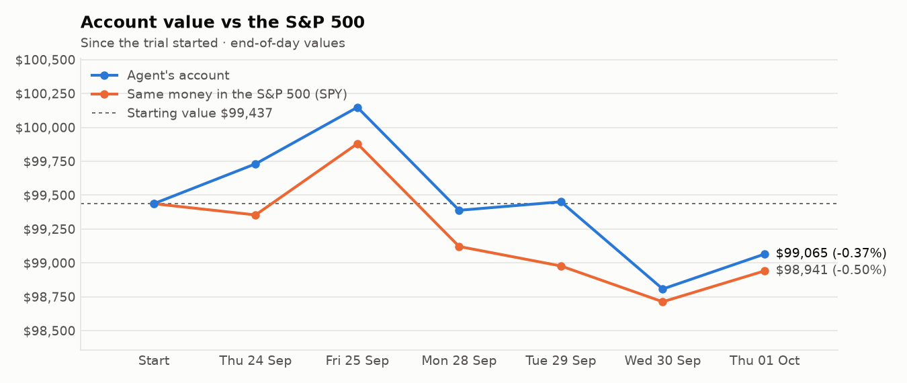
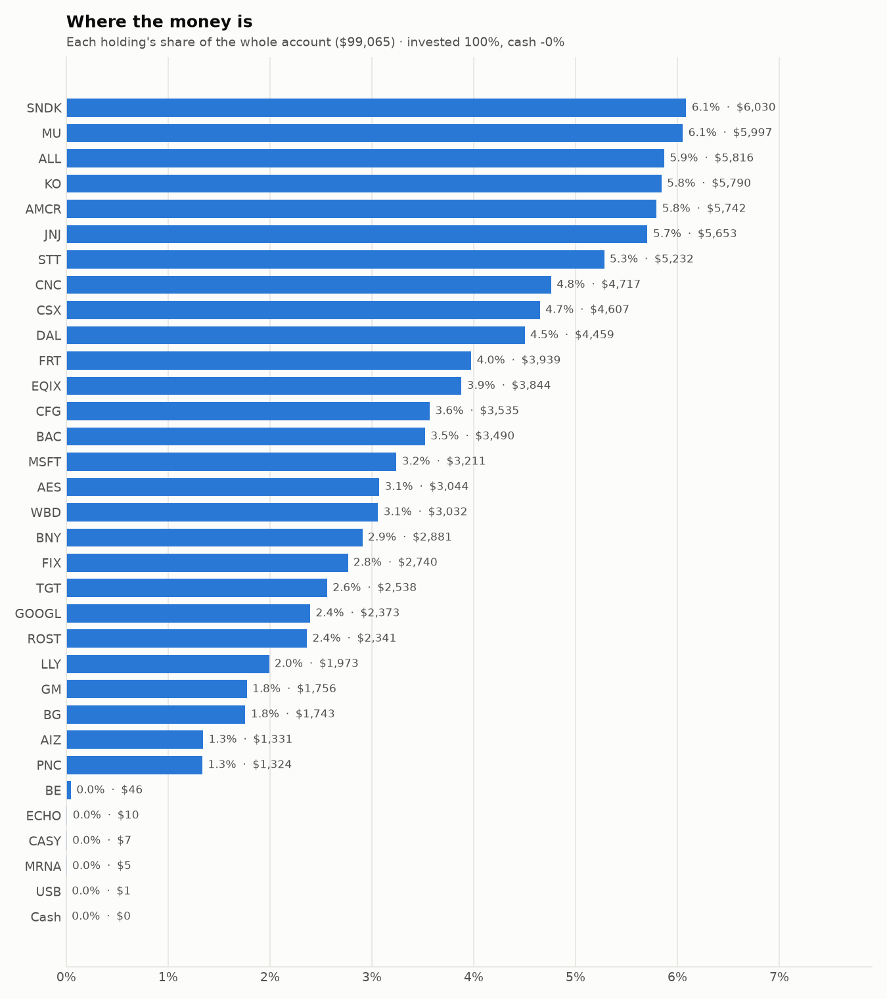
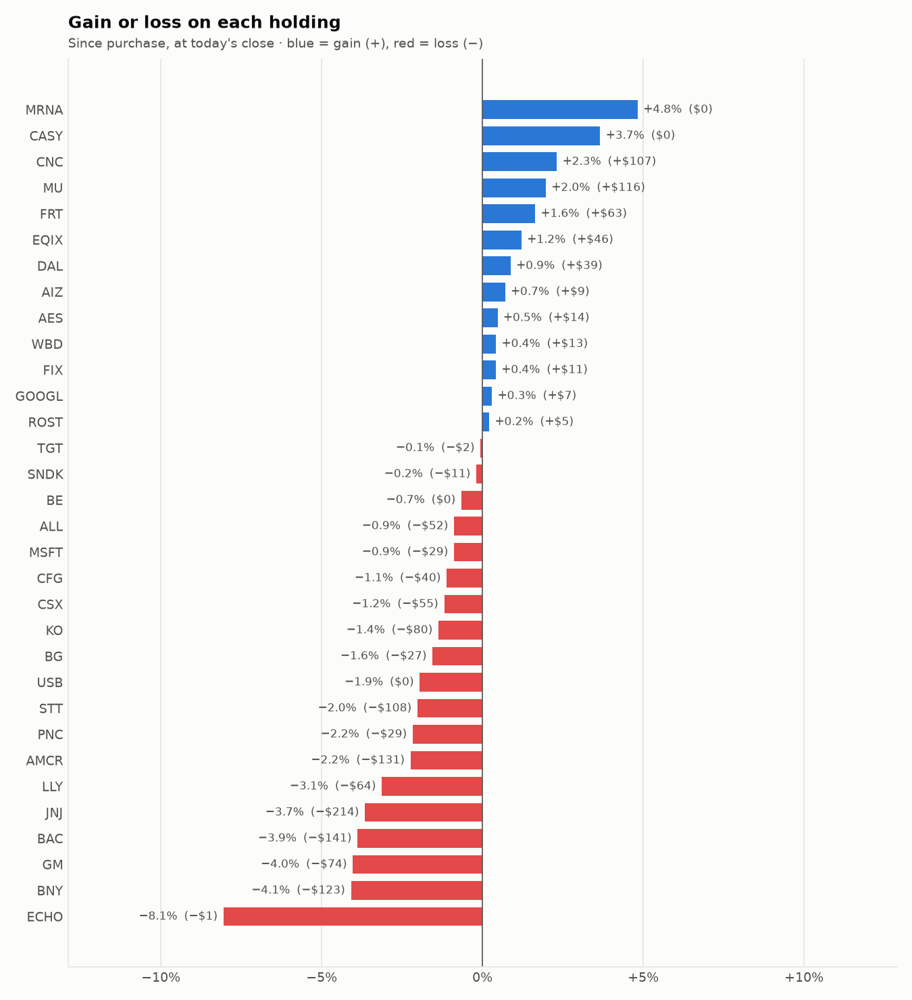

# Daily trading report — Thursday 01 October 2026

## Summary

- **Account value:** $99,065 (+$258, +0.3% today)
- **S&P 500 (SPY) today:** +0.2% — the agent was ahead of the index by 0.03%
- **Trades:** 3 buy(s) ($12,284), 2 sell(s) ($7,032)
- **2026-10-01 Morning rebalance:** traded — 5 order(s) placed
- **2026-10-01 Afternoon risk check:** no trades needed — Risk-checked 32 holding(s): none was 10%+ below its purchase price, and none had both clearly negative news and a price drop of 3%+ since entry.

## Charts

## Why I bought

### CNC — bought 77.341 shares at ~$59.61 ($4,610)

**Why:** combined score +0.66; ranked #10 of 503; driven mainly by price momentum +2.16, value (cheapness) +1.64; entering/adding to the top-ranked target portfolio; research detail: 5 recent headline(s), net positive tone (+8); analyst consensus +0.59/2 (5 strong buy, 7 buy, 14 hold, 1 sell, 0 strong sell)

**Research scores** (combined +0.66, ranked #10 in the S&P 500, sector: Health Care):

| Factor | Score | Measures |
|---|---|---|
| Value | +1.64 | cheap vs. sector peers on P/E and P/B |
| Quality | -0.76 | profitability (ROE, margins) and balance-sheet strength |
| Momentum | +2.16 | 12-month price trend, excluding the last month |
| Low volatility | -1.02 | steadier price than sector peers |
| Research | +0.49 | recent news tone + analyst consensus |

**Company financials (Finnhub, trailing 12 months):** P/B 1.4, return on equity -24.0%, gross margin 7.2%, debt/equity 0.71

**Price trend (Alpaca):** 12-month return (excl. last month) +126.9%, last month -3.4%, volatility 35.4%/yr

**News (Finnhub): 5 headline(s) in the last 2 days, net tone +8.** Most influential:
- [Best Growth Stocks to Buy for October 1st](https://finnhub.io/api/news?id=75439194574643aa380228a14cdfec29735b1b562e51815255384fcec0d26065) — 01 Oct, Yahoo (tone +2)
- [Zacks.com featured highlights include Banco Macro, Centene, Enersys, Gibraltar Industries and Kennametal](https://finnhub.io/api/news?id=30ce81826ebaf8ca0f9e4c8729808b829affdbbe75018924a851002a5ed5985c) — 01 Oct, Yahoo (tone +2)
- [5 Low P/B Stocks With Attractive Value and Strong Growth Potential](https://finnhub.io/api/news?id=324a6c7fdcdf9b3c1450196a5e2067746a14234c465f4ecc6df01ebe913e3a05) — 30 Sep, Yahoo (tone +2)
- [Best Growth Stocks to Buy for September 29th](https://finnhub.io/api/news?id=bfda21b89c0fd939dc59743894f887767de9e9e6fe08815f50068b574c6c5498) — 29 Sep, Yahoo (tone +2)
- [Wellcare Unveils 2027 Medicare Offerings Focused on Affordability and Integrated Care](https://finnhub.io/api/news?id=8a16115d78a4b8eb1fa4957c0c782b04d31bbc8a47edf778b66667a898713848) — 01 Oct, Yahoo (tone +0)

**Analysts (Finnhub, 2026-09-01):** 5 strong buy, 7 buy, 14 hold, 1 sell, 0 strong sell — consensus +0.59 on a -2 (strong sell) to +2 (strong buy) scale.

### FRT — bought 36.462 shares at ~$106.29 ($3,876)

**Why:** combined score +0.62; ranked #11 of 503; driven mainly by low volatility +1.77, value (cheapness) +0.69; entering/adding to the top-ranked target portfolio; research detail: 1 recent headline(s), neutral/mixed tone; analyst consensus +0.92/2 (6 strong buy, 11 buy, 8 hold, 0 sell, 0 strong sell)

**Research scores** (combined +0.62, ranked #11 in the S&P 500, sector: Real Estate):

| Factor | Score | Measures |
|---|---|---|
| Value | +0.69 | cheap vs. sector peers on P/E and P/B |
| Quality | +0.18 | profitability (ROE, margins) and balance-sheet strength |
| Momentum | +0.67 | 12-month price trend, excluding the last month |
| Low volatility | +1.77 | steadier price than sector peers |
| Research | +0.08 | recent news tone + analyst consensus |

**Company financials (Finnhub, trailing 12 months):** P/E 21.7, P/B 3.2, return on equity 13.3%, gross margin 67.5%, debt/equity 1.42

**Price trend (Alpaca):** 12-month return (excl. last month) +16.2%, last month -6.7%, volatility 13.0%/yr

**News (Finnhub): 1 headline(s) in the last 2 days, net tone +0.** Most influential:
- [Federal Realty Investment Trust Announces Third Quarter 2026 Earnings Release Date and Conference Call Information](https://finnhub.io/api/news?id=bf07ffdf0d6d313c2bc61b1283bcb0335b20232b9f89c46d436f222ec160fd8d) — 30 Sep, Yahoo (tone +0)

**Analysts (Finnhub, 2026-09-01):** 6 strong buy, 11 buy, 8 hold, 0 sell, 0 strong sell — consensus +0.92 on a -2 (strong sell) to +2 (strong buy) scale.

### EQIX — bought 3.797 shares at ~$1,000.20 ($3,798)

**Why:** combined score +0.62; ranked #12 of 503; driven mainly by research (news + analyst consensus) +2.15, price momentum +1.47; entering/adding to the top-ranked target portfolio; research detail: 7 recent headline(s), net positive tone (+6); analyst consensus +1.12/2 (12 strong buy, 21 buy, 7 hold, 0 sell, 0 strong sell)

**Research scores** (combined +0.62, ranked #12 in the S&P 500, sector: Real Estate):

| Factor | Score | Measures |
|---|---|---|
| Value | -0.61 | cheap vs. sector peers on P/E and P/B |
| Quality | -0.18 | profitability (ROE, margins) and balance-sheet strength |
| Momentum | +1.47 | 12-month price trend, excluding the last month |
| Low volatility | -0.12 | steadier price than sector peers |
| Research | +2.15 | recent news tone + analyst consensus |

**Company financials (Finnhub, trailing 12 months):** P/E 65.3, P/B 7.1, return on equity 10.8%, gross margin 51.5%, debt/equity 1.53

**Price trend (Alpaca):** 12-month return (excl. last month) +33.1%, last month -3.3%, volatility 27.7%/yr

**News (Finnhub): 7 headline(s) in the last 2 days, net tone +6.** Most influential:
- [Equinix Joins AI Capex Race, Consolidation Triggers Upgraded Buy Rating](https://finnhub.io/api/news?id=616710b9efd4b20f6cdf12cbb3ee1d2239af6d57630d2f6653ba79e256899448) — 01 Oct, SeekingAlpha (tone +2)
- [Equinix Says AI, Interconnection Demand Is Accelerating Growth](https://finnhub.io/api/news?id=0aedaf50d711f39b41b72398e8c3efd4e141350cb2fa7269f94a4c6e8ab0e095) — 30 Sep, Yahoo (tone +2)
- [Equinix (EQIX) Stock Still Looks Undervalued After A 51% Run](https://finnhub.io/api/news?id=66e4fd9d161e18ff4aff0e94e4a8e0b46f964c57ed805e2bfaa10f952d1afa17) — 29 Sep, Yahoo (tone +2)
- [Equinix, Inc. (EQIX) Presents at RBC Capital Markets 2026 Global Communications and Infrastructure Conference Transcript](https://finnhub.io/api/news?id=2ee06a47ce3c6d882f89ad82ae82bacb6749363748c8cad1431d8bc88aa9ea0f) — 29 Sep, SeekingAlpha (tone +0)
- [Equinix (EQIX) is a Top Dividend Stock Right Now: Should You Buy?](https://finnhub.io/api/news?id=d98313079eea2326988f0490f5412bcfc80d92b43b7483856acd003b5662e27f) — 29 Sep, Yahoo (tone +0)

**Analysts (Finnhub, 2026-09-01):** 12 strong buy, 21 buy, 7 hold, 0 sell, 0 strong sell — consensus +1.12 on a -2 (strong sell) to +2 (strong buy) scale.

## Why I sold

### NVDA — sold 21 shares at ~$230.21 ($4,834)

**Why:** combined score +0.36; ranked #54 of 503; driven mainly by research (news + analyst consensus) +1.37, low volatility +1.10; trimmed toward target weight, or dropped out of the top-ranked names; research detail: 54 recent headline(s), net positive tone (+21); analyst consensus +1.28/2 (24 strong buy, 41 buy, 3 hold, 1 sell, 0 strong sell)

**Research scores** (combined +0.36, ranked #54 in the S&P 500, sector: Information Technology):

| Factor | Score | Measures |
|---|---|---|
| Value | +0.00 | cheap vs. sector peers on P/E and P/B |
| Quality | +0.00 | profitability (ROE, margins) and balance-sheet strength |
| Momentum | -0.30 | 12-month price trend, excluding the last month |
| Low volatility | +1.10 | steadier price than sector peers |
| Research | +1.37 | recent news tone + analyst consensus |

**Price trend (Alpaca):** 12-month return (excl. last month) +22.6%, last month +3.4%, volatility 39.5%/yr

**News (Finnhub): 54 headline(s) in the last 2 days, net tone +21.** Most influential:
- [GMI Cloud Raises Over $660 Million to Accelerate Global AI Infrastructure Expansion](https://finnhub.io/api/news?id=b71a748b5bd3c0482dc46d7a7fe065c5bbdc21bb4555b69f416d98d338563142) — 30 Sep, Yahoo (tone +3)
- [NVIDIA (NVDA) Approves Record Buyback, Is The Stock Still Undervalued?](https://finnhub.io/api/news?id=7ae2f27366c349d9bbe2026d40398fb8851a3de6ac41732d09c698254400c7e3) — 30 Sep, Yahoo (tone +3)
- [Nvidia's record buyback exposes strange Wall Street gap](https://finnhub.io/api/news?id=cd0265d251859d4240e24219a4fb34340f41c5b484d860418f4c6718ac7f5b8f) — 30 Sep, Yahoo (tone +2)
- [Nvidia's Demand Outlook Still Supports The Bull Case](https://finnhub.io/api/news?id=21482316cf518d9f45f224d24ba9e9b1b75e1e99793d37718dbcf0a9d16a1189) — 30 Sep, SeekingAlpha (tone +2)
- [Generative AI Market Forecasts Growth from $185.45B (2026) to $1.65T by 2033, Profiling AWS, NVIDIA, OpenAI, Anthropic & Microsoft](https://finnhub.io/api/news?id=f32f729931fa0d5795fa1ed66d289dd01dbfffc0c00d65efcef7e1e8b2e5b1b1) — 01 Oct, Yahoo (tone +1)

**Analysts (Finnhub, 2026-09-01):** 24 strong buy, 41 buy, 3 hold, 1 sell, 0 strong sell — consensus +1.28 on a -2 (strong sell) to +2 (strong buy) scale.

### GOOG — sold 6.458 shares at ~$340.22 ($2,197)

**Why:** combined score +0.43; ranked #32 of 503; driven mainly by price momentum +1.36, research (news + analyst consensus) +0.89; trimmed toward target weight, or dropped out of the top-ranked names; research detail: 40 recent headline(s), net positive tone (+10); analyst consensus +1.19/2 (20 strong buy, 43 buy, 7 hold, 0 sell, 0 strong sell)

**Research scores** (combined +0.43, ranked #32 in the S&P 500, sector: Communication Services):

| Factor | Score | Measures |
|---|---|---|
| Value | -0.69 | cheap vs. sector peers on P/E and P/B |
| Quality | +0.23 | profitability (ROE, margins) and balance-sheet strength |
| Momentum | +1.36 | 12-month price trend, excluding the last month |
| Low volatility | +0.04 | steadier price than sector peers |
| Research | +0.89 | recent news tone + analyst consensus |

**Company financials (Finnhub, trailing 12 months):** P/E 17.5, P/B 6.8, return on equity 50.8%, gross margin 60.9%, debt/equity 0.15

**Price trend (Alpaca):** 12-month return (excl. last month) +58.0%, last month +1.6%, volatility 33.8%/yr

**News (Finnhub): 40 headline(s) in the last 2 days, net tone +10.** Most influential:
- [Next Generation Computing Market Report 2026: Capitalize on the $486 Billion Revenue Surge to $811.85 Billion by 2030 as Microsoft, AWS, NVIDIA, IBM and Intel Accelerate AI, Quantum and Edge Computing Disruption](https://finnhub.io/api/news?id=91fb73dffa21ff5d80fdaf7d34a2d0b476d482388a30e3c4850260c6ce25fe8e) — 29 Sep, Yahoo (tone +2)
- [Alphabet Has More Growth Engines Than Investors Think, We See 63% Upside](https://finnhub.io/api/news?id=4298cf1aa1400454176e7a976f6b59d130383f780dddfe7aefa60597b572a54d) — 29 Sep, Yahoo (tone +2)
- [The Zacks Analyst Blog Highlights Alphabet, Mastercard, AbbVie, Perma-Pipe and ImmuCell](https://finnhub.io/api/news?id=447232e349620640030f2cbdd7ed1d566069625e2a4375fcda152031b1c5954f) — 29 Sep, Yahoo (tone +2)
- [Artificial Intelligence Market Forecasts Growth from $601.93B (2026) to $3,638.08B by 2033, Profiling NVIDIA, Microsoft, Alphabet & AWS](https://finnhub.io/api/news?id=9874447d65011c09f1a3aa02469f52599e4250cd2ac0f71e794cb492c72b45f4) — 01 Oct, Yahoo (tone +1)
- [Zacks Earnings Trends Highlights: Micron, Nvidia and Alphabet](https://finnhub.io/api/news?id=a6e28c164ea021ad3191ce3f5e804b5cd8a20f27495239f6fd34e9da2e442d55) — 01 Oct, Yahoo (tone +1)

**Analysts (Finnhub, 2026-09-01):** 20 strong buy, 43 buy, 7 hold, 0 sell, 0 strong sell — consensus +1.19 on a -2 (strong sell) to +2 (strong buy) scale.

## Holdings at the close

| Stock | Shares | Avg cost | Price | Market value | % of account | Today | Gain/loss $ | Gain/loss % |
|---|---:|---:|---:|---:|---:|---:|---:|---:|
| SNDK | 3.38 | $1,787.39 | $1,784.00 | $6,030 | 6.1% | +2.54% | −$11 | -0.19% |
| MU | 5.491 | $1,070.99 | $1,092.11 | $5,997 | 6.1% | +2.53% | +$116 | +1.97% |
| ALL | 25.919 | $226.41 | $224.41 | $5,816 | 5.9% | +1.15% | −$52 | -0.88% |
| KO | 67.092 | $87.50 | $86.30 | $5,790 | 5.8% | +0.26% | −$80 | -1.37% |
| AMCR | 137.493 | $42.71 | $41.76 | $5,742 | 5.8% | -0.24% | −$131 | -2.24% |
| JNJ | 21.79 | $269.29 | $259.45 | $5,653 | 5.7% | -2.00% | −$214 | -3.65% |
| STT | 29.965 | $178.22 | $174.62 | $5,232 | 5.3% | +0.02% | −$108 | -2.02% |
| CNC | 77.341 | $59.61 | $60.99 | $4,717 | 4.8% | -1.82% | +$107 | +2.32% |
| CSX | 99 | $47.10 | $46.54 | $4,607 | 4.7% | +0.06% | −$55 | -1.19% |
| DAL | 53 | $83.40 | $84.13 | $4,459 | 4.5% | +0.80% | +$39 | +0.88% |
| FRT | 36.462 | $106.29 | $108.03 | $3,939 | 4.0% | -0.24% | +$63 | +1.64% |
| EQIX | 3.797 | $1,000.20 | $1,012.33 | $3,844 | 3.9% | +0.07% | +$46 | +1.21% |
| CFG | 55.497 | $64.42 | $63.70 | $3,535 | 3.6% | -0.09% | −$40 | -1.11% |
| BAC | 65 | $55.87 | $53.70 | $3,490 | 3.5% | -1.35% | −$141 | -3.88% |
| MSFT | 6.25 | $518.33 | $513.75 | $3,211 | 3.2% | +0.17% | −$29 | -0.88% |
| AES | 204 | $14.85 | $14.92 | $3,044 | 3.1% | +0.13% | +$14 | +0.47% |
| WBD | 98 | $30.81 | $30.94 | $3,032 | 3.1% | -0.03% | +$13 | +0.42% |
| BNY | 20 | $150.20 | $144.06 | $2,881 | 2.9% | -0.39% | −$123 | -4.09% |
| FIX | 1.626 | $1,677.99 | $1,684.97 | $2,740 | 2.8% | +1.87% | +$11 | +0.42% |
| TGT | 16.24 | $156.38 | $156.29 | $2,538 | 2.6% | -0.26% | −$2 | -0.06% |
| GOOGL | 7 | $337.98 | $338.98 | $2,373 | 2.4% | -1.48% | +$7 | +0.30% |
| ROST | 10 | $233.61 | $234.10 | $2,341 | 2.4% | +0.30% | +$5 | +0.21% |
| LLY | 1.712 | $1,189.78 | $1,152.56 | $1,973 | 2.0% | -0.39% | −$64 | -3.13% |
| GM | 22.211 | $82.40 | $79.08 | $1,756 | 1.8% | +2.70% | −$74 | -4.03% |
| BG | 16.346 | $108.29 | $106.61 | $1,743 | 1.8% | -0.32% | −$27 | -1.55% |
| AIZ | 5 | $264.38 | $266.24 | $1,331 | 1.3% | +1.04% | +$9 | +0.70% |
| PNC | 6 | $225.64 | $220.75 | $1,324 | 1.3% | -0.68% | −$29 | -2.17% |
| BE | 0.166 | $279.83 | $278.00 | $46 | 0.0% | +0.37% | −$0 | -0.65% |
| ECHO | 0.116 | $95.87 | $88.15 | $10 | 0.0% | -1.41% | −$1 | -8.05% |
| CASY | 0.011 | $597.62 | $619.50 | $7 | 0.0% | +1.81% | +$0 | +3.66% |
| MRNA | 0.028 | $181.06 | $189.80 | $5 | 0.0% | -1.44% | +$0 | +4.83% |
| USB | 0.016 | $58.50 | $57.36 | $1 | 0.0% | -0.69% | −$0 | -1.95% |
| **Invested** | | | | **$99,210** | **100.1%** | | **−$751** | |
| **Cash** | | | | $-145 | -0.1% | | | |
| **Total account** | | | | **$99,065** | 100% | | | |

_Scores are sector-neutral z-scores: 0 is average for the stock's sector, +1 is one standard deviation better. News tone is a keyword count over recent headlines, not a deep read. None of this guarantees a stock will rise; a few days of results can't show whether the strategy has a real edge over the S&P 500._
