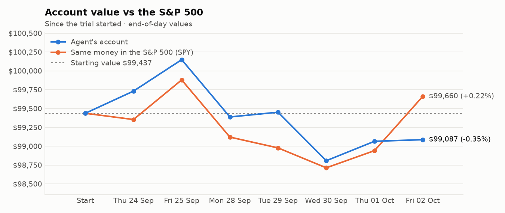
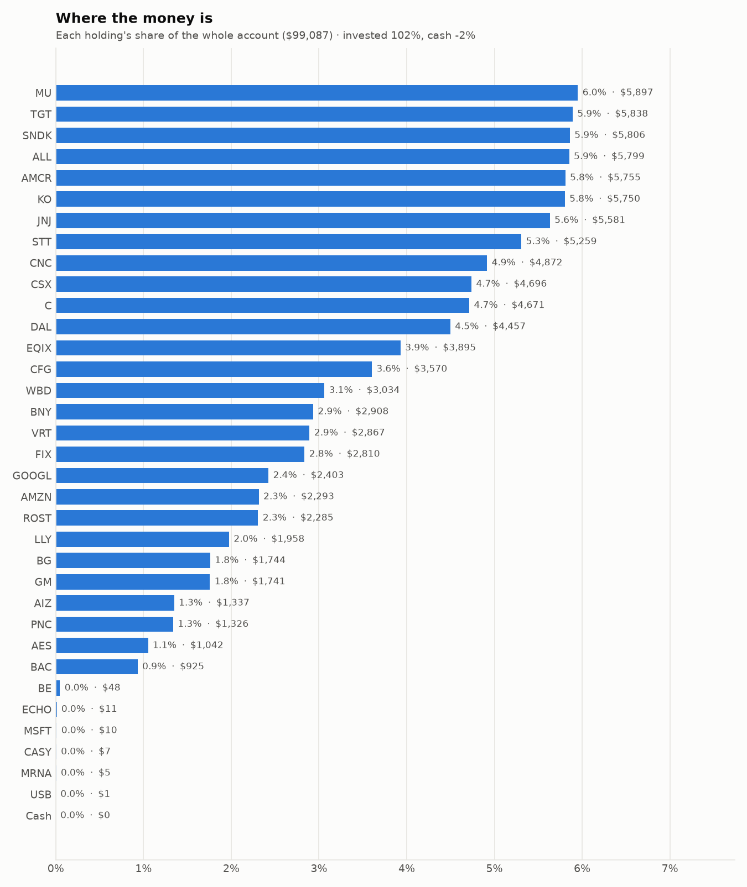
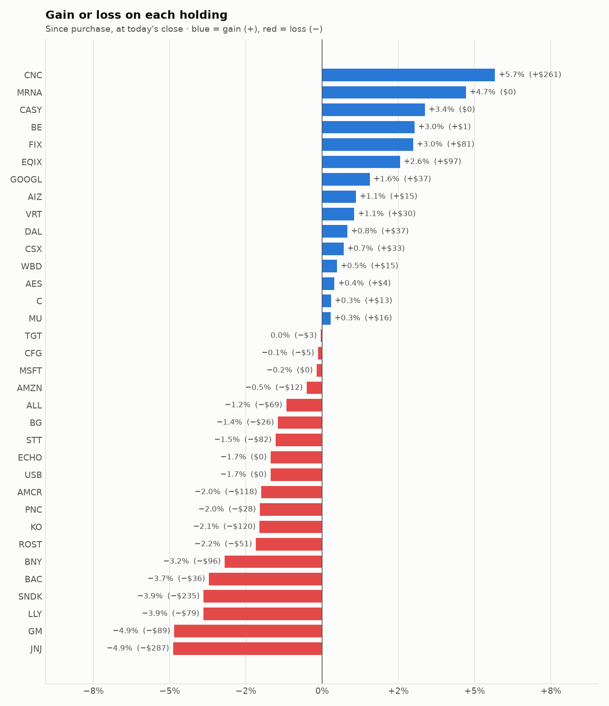

# Daily trading report — Friday 02 October 2026

## Summary

- **Account value:** $99,087 (+$22, +0.0% today)
- **S&P 500 (SPY) today:** +0.7% — the agent was behind the index by 0.70%
- **Trades:** 4 buy(s) ($13,100), 4 sell(s) ($11,731)
- **2026-10-02 Morning rebalance:** traded — 8 order(s) placed
- **2026-10-02 Afternoon risk check:** no trades needed — Risk-checked 34 holding(s): none was 10%+ below its purchase price, and none had both clearly negative news and a price drop of 3%+ since entry.

## Charts

## Why I bought

### C — bought 36.35 shares at ~$128.13 ($4,658)

**Why:** combined score +0.70; ranked #9 of 503; driven mainly by research (news + analyst consensus) +1.63, price momentum +1.42; entering/adding to the top-ranked target portfolio; research detail: 11 recent headline(s), net positive tone (+6); analyst consensus +1.04/2 (7 strong buy, 15 buy, 6 hold, 0 sell, 0 strong sell)

**Research scores** (combined +0.70, ranked #9 in the S&P 500, sector: Financials):

| Factor | Score | Measures |
|---|---|---|
| Value | +1.00 | cheap vs. sector peers on P/E and P/B |
| Quality | -0.85 | profitability (ROE, margins) and balance-sheet strength |
| Momentum | +1.42 | 12-month price trend, excluding the last month |
| Low volatility | -0.06 | steadier price than sector peers |
| Research | +1.63 | recent news tone + analyst consensus |

**Company financials (Finnhub, trailing 12 months):** P/E 11.9, P/B 1.1, return on equity 8.4%, debt/equity 3.84

**Price trend (Alpaca):** 12-month return (excl. last month) +37.2%, last month -4.2%, volatility 27.0%/yr

**News (Finnhub): 11 headline(s) in the last 2 days, net tone +6.** Most influential:
- [Citigroup Q3 Preview: Earnings Should Be Alright Despite Macro Risks (Upgrade)](https://finnhub.io/api/news?id=f5af5e5569ff2eba11bcb501d357c951da3542288803f3e8baeb2f058bf213aa) — 01 Oct, SeekingAlpha (tone +3)
- [Citi Raised Its Bitcoin Target to $113,000 While Forecasting Just $5 Billion of Inflows. What Has to Go Right?](https://finnhub.io/api/news?id=a9b9974bbb44b446c47804404091bc3be1ea394888aabe84942d5ad4ee605e65) — 02 Oct, Yahoo (tone +2)
- [Citi Projects Ethereum at $3,028 and Bitcoin at $113,000. Why Is the Bank So Much More Bullish on Bitcoin?](https://finnhub.io/api/news?id=07e0ff8fa9f4470d3e9a5f3aac9f01186ed01a8c4da4433d0e58db15b3491334) — 02 Oct, Yahoo (tone +2)
- [Moderna Climbs 3% Despite Citigroup’s Downgrade to Sell; BioNTech Inches Higher, Pfizer Treads Water](https://finnhub.io/api/news?id=8f361b2eb02af46d7061280f4e60d7ffa0b2f309294d3963a2bdce903cc74845) — 01 Oct, Yahoo (tone -1)
- [Citigroup Lifts Bitcoin Target to $113K, Ether to $3,028](https://finnhub.io/api/news?id=8b1bd2bc16591a55ee0e4923483442d279c45b9b3e74726f7330723f99475d42) — 01 Oct, Yahoo (tone +1)

**Analysts (Finnhub, 2026-09-01):** 7 strong buy, 15 buy, 6 hold, 0 sell, 0 strong sell — consensus +1.04 on a -2 (strong sell) to +2 (strong buy) scale.

### TGT — bought 21.234 shares at ~$155.48 ($3,301)

**Why:** combined score +0.77; ranked #3 of 503; driven mainly by price momentum +2.77, research (news + analyst consensus) +0.56; entering/adding to the top-ranked target portfolio; research detail: 15 recent headline(s), net positive tone (+7); analyst consensus +0.44/2 (7 strong buy, 8 buy, 25 hold, 3 sell, 0 strong sell)

**Research scores** (combined +0.77, ranked #3 in the S&P 500, sector: Consumer Staples):

| Factor | Score | Measures |
|---|---|---|
| Value | +0.27 | cheap vs. sector peers on P/E and P/B |
| Quality | -0.13 | profitability (ROE, margins) and balance-sheet strength |
| Momentum | +2.77 | 12-month price trend, excluding the last month |
| Low volatility | -0.39 | steadier price than sector peers |
| Research | +0.56 | recent news tone + analyst consensus |

**Company financials (FMP, trailing 12 months):** P/E 16.0, P/B 4.0, return on equity 26.7%, gross margin 29.3%, debt/equity 1.05

**Price trend (Alpaca):** 12-month return (excl. last month) +70.6%, last month -4.3%, volatility 27.6%/yr

**News (Finnhub): 15 headline(s) in the last 2 days, net tone +7.** Most influential:
- [Stocktwits Wall Street Wrap: Analysts Turn Bullish On Sweetgreen, Target And Airbnb – Liquidia And FICO Face Downgrades](https://finnhub.io/api/news?id=e651a0a7fe0766f91473db1c520cf4130c2a1a9d2bb6b9de54156e555e132353) — 02 Oct, Yahoo (tone +2)
- [Can Target’s (TGT) Turnaround Justify the 60% YTD Rally?](https://finnhub.io/api/news?id=e97af69e55bcc77762db194815b9e29cb43c10717a25cf7283577a36417839a7) — 01 Oct, Yahoo (tone +2)
- [HSBC Upgrades Target to Buy and Raises Price Target to $190](https://finnhub.io/api/news?id=cd5dff097b868edb970ecd3b14185df7ce974ad48c44fb44cdf5b7eb072e45fa) — 30 Sep, Yahoo (tone +2)
- [Target upgraded at HSBC as footfall points to turnaround gaining momentum](https://finnhub.io/api/news?id=588f8d3ebf011a6a6d864f3aeaf2dc4f83deab5f7e21aa70de86fa4770e82d05) — 30 Sep, Yahoo (tone +2)
- [What Target (TGT)'s Holiday Price Cuts and Premium Brand Push Mean For Shareholders](https://finnhub.io/api/news?id=5f3bcee57b2a708caa417b57de0919e6d37549c299772dac061595dff72a0ba2) — 30 Sep, Yahoo (tone -1)

**Analysts (Finnhub, 2026-09-01):** 7 strong buy, 8 buy, 25 hold, 3 sell, 0 strong sell — consensus +0.44 on a -2 (strong sell) to +2 (strong buy) scale.

### VRT — bought 11.37 shares at ~$249.50 ($2,837)

**Why:** combined score +0.60; ranked #17 of 503; driven mainly by price momentum +2.47, research (news + analyst consensus) +1.90; entering/adding to the top-ranked target portfolio; research detail: 11 recent headline(s), net positive tone (+7); analyst consensus +1.17/2 (10 strong buy, 22 buy, 4 hold, 0 sell, 0 strong sell)

**Research scores** (combined +0.60, ranked #17 in the S&P 500, sector: Industrials):

| Factor | Score | Measures |
|---|---|---|
| Value | -0.94 | cheap vs. sector peers on P/E and P/B |
| Quality | +0.26 | profitability (ROE, margins) and balance-sheet strength |
| Momentum | +2.47 | 12-month price trend, excluding the last month |
| Low volatility | -1.75 | steadier price than sector peers |
| Research | +1.90 | recent news tone + analyst consensus |

**Company financials (Finnhub, trailing 12 months):** P/E 53.6, P/B 27.0, return on equity 42.1%, gross margin 38.0%, debt/equity 0.62

**Price trend (Alpaca):** 12-month return (excl. last month) +100.6%, last month -3.8%, volatility 65.4%/yr

**News (Finnhub): 11 headline(s) in the last 2 days, net tone +7.** Most influential:
- [Vertiv Soars 49% YTD: Is This the Right Time to Buy the Stock?](https://finnhub.io/api/news?id=47316eac28ed86c1b715aa82feb44ba809ec50ec0893b9cf0802d8cbaa589939) — 01 Oct, Yahoo (tone +2)
- [3 Reasons Why Growth Investors Shouldn't Overlook Vertiv (VRT)](https://finnhub.io/api/news?id=926eb955270122deda6faef0faf9b643291105ec0cb69ed96202cc894dbc45a7) — 30 Sep, Yahoo (tone +2)
- [Is Vertiv Stock's Fall A Bargain Or A Warning?](https://finnhub.io/api/news?id=b09718fc9f9379f0bb2319271f57e4232ce9594164705fb4c079de34b237c58f) — 02 Oct, Yahoo (tone -1)
- [Wall Street Backs Coherent, Rocket Lab and Vertiv](https://finnhub.io/api/news?id=c446ea8bf121259d1da41295ccca5053960528dc6f7b29aae514cb9fdd17daf0) — 01 Oct, Yahoo (tone +1)
- [What Are Vertiv Investors Betting On?](https://finnhub.io/api/news?id=5bfba3d3cdd9e838f8549c02366b6a51e31d31fccf4b117585b67424bf543530) — 01 Oct, Yahoo (tone +1)

**Analysts (Finnhub, 2026-09-01):** 10 strong buy, 22 buy, 4 hold, 0 sell, 0 strong sell — consensus +1.17 on a -2 (strong sell) to +2 (strong buy) scale.

### AMZN — bought 9.124 shares at ~$252.59 ($2,305)

**Why:** combined score +0.58; ranked #20 of 503; driven mainly by research (news + analyst consensus) +2.13, price momentum +0.63; entering/adding to the top-ranked target portfolio; research detail: 92 recent headline(s), net positive tone (+19); analyst consensus +1.20/2 (20 strong buy, 49 buy, 5 hold, 0 sell, 0 strong sell)

**Research scores** (combined +0.58, ranked #20 in the S&P 500, sector: Consumer Discretionary):

| Factor | Score | Measures |
|---|---|---|
| Value | -0.07 | cheap vs. sector peers on P/E and P/B |
| Quality | +0.16 | profitability (ROE, margins) and balance-sheet strength |
| Momentum | +0.63 | 12-month price trend, excluding the last month |
| Low volatility | -0.16 | steadier price than sector peers |
| Research | +2.13 | recent news tone + analyst consensus |

**Company financials (FMP, trailing 12 months):** P/E 20.0, P/B 4.9, return on equity 30.5%, gross margin 50.8%, debt/equity 0.40

**Price trend (Alpaca):** 12-month return (excl. last month) +11.3%, last month -2.6%, volatility 41.8%/yr

**News (Finnhub): 92 headline(s) in the last 2 days, net tone +19.** Most influential:
- [Why Amazon’s (AMZN) Infrastructure Investment Sets Up Record Downstream FCF](https://finnhub.io/api/news?id=ec13ad971a57750e982e291118213615cc6f123ef675e76411d36a1b4c1e7115) — 01 Oct, Yahoo (tone +2)
- [$10,000 in Amazon Stock: What Could It Be Worth in 5 Years?](https://finnhub.io/api/news?id=fcf9062967b57e3ae7061642fde056cb419fd3b964a76b7dfb4e827761c0dfcf) — 02 Oct, Yahoo (tone +1)
- [Synopsys (SNPS) Bags New Multi-Billion Dollar Deals, Shares Spike](https://finnhub.io/api/news?id=6144daa7f23f6268830572f5f5ab839fd68ca36c5c6b3acd26578889012e4109) — 01 Oct, Yahoo (tone +1)
- [Amazon Inks $1B SNPS Deal to Power AWS Custom Chips: Should You Hold?](https://finnhub.io/api/news?id=30d6d418bbbb5eea6132492b84f76c844f71a99c6fc59bdc6dfbca91e94995c1) — 01 Oct, Yahoo (tone +1)
- [Anthropic IPO Filing Reveals a Major Vulnerability: Nearly 50% of Sales Flow Through Amazon and Google as Revenue Concentration Raises Risks: Report](https://finnhub.io/api/news?id=b3d721145e23133b936f8560672a0e4a015811f93844e89e97a4693b811f2533) — 01 Oct, Yahoo (tone +1)

**Analysts (Finnhub, 2026-09-01):** 20 strong buy, 49 buy, 5 hold, 0 sell, 0 strong sell — consensus +1.20 on a -2 (strong sell) to +2 (strong buy) scale.

## Why I sold

### FRT — sold 36.462 shares at ~$107.93 ($3,935)

**Why:** combined score +0.45; ranked #37 of 503; driven mainly by low volatility +1.79, price momentum +0.72; trimmed toward target weight, or dropped out of the top-ranked names; research detail: 2 recent headline(s), neutral/mixed tone; analyst consensus +0.92/2 (6 strong buy, 11 buy, 8 hold, 0 sell, 0 strong sell)

**Research scores** (combined +0.45, ranked #37 in the S&P 500, sector: Real Estate):

| Factor | Score | Measures |
|---|---|---|
| Value | +0.00 | cheap vs. sector peers on P/E and P/B |
| Quality | +0.00 | profitability (ROE, margins) and balance-sheet strength |
| Momentum | +0.72 | 12-month price trend, excluding the last month |
| Low volatility | +1.79 | steadier price than sector peers |
| Research | -0.00 | recent news tone + analyst consensus |

**Price trend (Alpaca):** 12-month return (excl. last month) +16.4%, last month -7.7%, volatility 12.8%/yr

**News (Finnhub): 2 headline(s) in the last 2 days, net tone +0.** Most influential:
- [Federal Realty Acquires The Summit, Alabama's Premier Retail Destination](https://finnhub.io/api/news?id=b893e2441063932f6a52f8dc2bcda03e42fb10c91de9fd77fa50b17317893e11) — 01 Oct, Yahoo (tone +0)
- [Federal Realty Investment Trust Announces Third Quarter 2026 Earnings Release Date and Conference Call Information](https://finnhub.io/api/news?id=bf07ffdf0d6d313c2bc61b1283bcb0335b20232b9f89c46d436f222ec160fd8d) — 30 Sep, Yahoo (tone +0)

**Analysts (Finnhub, 2026-09-01):** 6 strong buy, 11 buy, 8 hold, 0 sell, 0 strong sell — consensus +0.92 on a -2 (strong sell) to +2 (strong buy) scale.

### MSFT — sold 6.23 shares at ~$518.03 ($3,227)

**Why:** combined score +0.45; ranked #35 of 503; driven mainly by research (news + analyst consensus) +1.84, low volatility +1.26; trimmed toward target weight, or dropped out of the top-ranked names; research detail: 54 recent headline(s), net positive tone (+37); analyst consensus +1.26/2 (23 strong buy, 41 buy, 5 hold, 0 sell, 0 strong sell)

**Research scores** (combined +0.45, ranked #35 in the S&P 500, sector: Information Technology):

| Factor | Score | Measures |
|---|---|---|
| Value | +0.00 | cheap vs. sector peers on P/E and P/B |
| Quality | +0.00 | profitability (ROE, margins) and balance-sheet strength |
| Momentum | -0.42 | 12-month price trend, excluding the last month |
| Low volatility | +1.26 | steadier price than sector peers |
| Research | +1.84 | recent news tone + analyst consensus |

**Price trend (Alpaca):** 12-month return (excl. last month) -1.1%, last month +2.3%, volatility 40.2%/yr

**News (Finnhub): 54 headline(s) in the last 2 days, net tone +37.** Most influential:
- [Microsoft stock best quarter since 1998: Q3 2026 gains 37.5%](https://finnhub.io/api/news?id=629d23c2fbb07593e8f5bdf42e742639ed3d8e115bf5617ce5080ec3164cef04) — 01 Oct, Yahoo (tone +3)
- [Emotion Detection and Recognition Market Forecasts Growth from $29.14B (2026) to $43.29B by 2031, Profiling Microsoft, AWS, Oracle & Google](https://finnhub.io/api/news?id=59d8dfd3f81c89422b88dd06e0bac0948539a19c9f8e0b09c5343dc3c1720ab8) — 01 Oct, Yahoo (tone +3)
- [Natural Language Processing Market Forecasts Growth from $69.13B (2026) to $216.89B by 2031, Profiling Google, Microsoft, AWS, OpenAI & Oracle](https://finnhub.io/api/news?id=e572a51bcfffd6652ae7a04dd587f3e9b7305b0c8927dec7e33226f55a7091f3) — 01 Oct, Yahoo (tone +2)
- [Microsoft (MSFT) Could Be 21% Above Fair Value After ClickHouse Expansion](https://finnhub.io/api/news?id=b1c27efc452131fb1977d1fdb359bf298570ab081eaa48ae752015d86d1eb198) — 30 Sep, Yahoo (tone +2)
- [The AI Revolution Could Be Microsoft’s Next Trillion-Dollar Opportunity](https://finnhub.io/api/news?id=eae9b312e71ee662f58c3d5de5d579c5c2a9ec52b72e7ea4125d2d519ac0d804) — 30 Sep, Yahoo (tone +2)

**Analysts (Finnhub, 2026-09-01):** 23 strong buy, 41 buy, 5 hold, 0 sell, 0 strong sell — consensus +1.26 on a -2 (strong sell) to +2 (strong buy) scale.

### BAC — sold 47.808 shares at ~$53.67 ($2,566)

**Why:** combined score +0.53; ranked #26 of 503; driven mainly by low volatility +1.02, value (cheapness) +0.81; trimmed toward target weight, or dropped out of the top-ranked names; research detail: 22 recent headline(s), net positive tone (+2); analyst consensus +1.00/2 (6 strong buy, 17 buy, 6 hold, 0 sell, 0 strong sell)

**Research scores** (combined +0.53, ranked #26 in the S&P 500, sector: Financials):

| Factor | Score | Measures |
|---|---|---|
| Value | +0.81 | cheap vs. sector peers on P/E and P/B |
| Quality | -0.43 | profitability (ROE, margins) and balance-sheet strength |
| Momentum | +0.73 | 12-month price trend, excluding the last month |
| Low volatility | +1.02 | steadier price than sector peers |
| Research | +0.57 | recent news tone + analyst consensus |

**Company financials (Finnhub, trailing 12 months):** P/E 11.1, P/B 1.3, return on equity 11.1%, debt/equity 2.43

**Price trend (Alpaca):** 12-month return (excl. last month) +22.2%, last month -13.4%, volatility 20.7%/yr

**News (Finnhub): 22 headline(s) in the last 2 days, net tone +2.** Most influential:
- [JPM vs. BAC: The Bank Built to Sustain Dividend Growth When Markets Turn](https://finnhub.io/api/news?id=144dd0610d3477b5ecc774e0bdc52dca04238bbdfa1fc58f86dab3e26bf1151a) — 30 Sep, Yahoo (tone +3)
- [Why Bank of America Is Betting That Nike Stock Will Fall from Here](https://finnhub.io/api/news?id=6056db3e5247b9a7eaa0d52cf8ede0e7a9116845f9f11f9c3838362ac86d971e) — 01 Oct, Yahoo (tone -2)
- [Bank of America (BAC) Stock Could Be 40% Below Fair Value On AI Spending Plans](https://finnhub.io/api/news?id=d719a74bc20cd5661c6038805f158af63dba1be4efaee8779d76971483381798) — 30 Sep, Yahoo (tone +2)
- [BofA’s Hartnett Sees Risk-Off Mood Lasting Until Dollar Peaks](https://finnhub.io/api/news?id=6591307e878953d5c0452ab49e8085b76234d7994e09f65717559e6cb9b7a4b3) — 02 Oct, Yahoo (tone +1)
- [Bank of America’s $5,000 gold forecast comes with a warning](https://finnhub.io/api/news?id=373a5c21829e9ec86cb8a880597f4fdc2cc3a3c52b9196e81a578ef48a041add) — 01 Oct, Yahoo (tone -1)

**Analysts (Finnhub, 2026-09-01):** 6 strong buy, 17 buy, 6 hold, 0 sell, 0 strong sell — consensus +1.00 on a -2 (strong sell) to +2 (strong buy) scale.

### AES — sold 134.118 shares at ~$14.93 ($2,002)

**Why:** combined score +0.53; ranked #27 of 503; driven mainly by low volatility +3.00, value (cheapness) +1.74; trimmed toward target weight, or dropped out of the top-ranked names; research detail: 1 recent headline(s), neutral/mixed tone; analyst consensus -0.33/2 (0 strong buy, 0 buy, 13 hold, 4 sell, 1 strong sell)

**Research scores** (combined +0.53, ranked #27 in the S&P 500, sector: Utilities):

| Factor | Score | Measures |
|---|---|---|
| Value | +1.74 | cheap vs. sector peers on P/E and P/B |
| Quality | -0.79 | profitability (ROE, margins) and balance-sheet strength |
| Momentum | +0.74 | 12-month price trend, excluding the last month |
| Low volatility | +3.00 | steadier price than sector peers |
| Research | -1.50 | recent news tone + analyst consensus |

**Company financials (Finnhub, trailing 12 months):** P/E 5.7, P/B 2.1, return on equity 43.3%, gross margin 20.3%, debt/equity 6.50

**Price trend (Alpaca):** 12-month return (excl. last month) +8.9%, last month +1.2%, volatility 3.7%/yr

**News (Finnhub): 1 headline(s) in the last 2 days, net tone +0.** Most influential:
- [Wall Street's Most Accurate Analysts Spotlight On 3 Utilities Stocks Delivering High-Dividend Yields](https://finnhub.io/api/news?id=37b1521689cbb705ee4cda0f3b97ac861bcb6f929f5c17eef65d052d8e8972f2) — 30 Sep, Benzinga (tone +0)

**Analysts (Finnhub, 2026-09-01):** 0 strong buy, 0 buy, 13 hold, 4 sell, 1 strong sell — consensus -0.33 on a -2 (strong sell) to +2 (strong buy) scale.

## Holdings at the close

| Stock | Shares | Avg cost | Price | Market value | % of account | Today | Gain/loss $ | Gain/loss % |
|---|---:|---:|---:|---:|---:|---:|---:|---:|
| MU | 5.491 | $1,070.99 | $1,073.99 | $5,897 | 6.0% | -2.13% | +$16 | +0.28% |
| TGT | 37.474 | $155.87 | $155.80 | $5,838 | 5.9% | -0.57% | −$3 | -0.05% |
| SNDK | 3.38 | $1,787.39 | $1,717.89 | $5,806 | 5.9% | -3.90% | −$235 | -3.89% |
| ALL | 25.919 | $226.41 | $223.74 | $5,799 | 5.9% | -0.30% | −$69 | -1.18% |
| AMCR | 137.493 | $42.71 | $41.86 | $5,755 | 5.8% | +0.12% | −$118 | -2.00% |
| KO | 67.092 | $87.50 | $85.70 | $5,750 | 5.8% | -0.46% | −$120 | -2.05% |
| JNJ | 21.79 | $269.29 | $256.13 | $5,581 | 5.6% | -0.98% | −$287 | -4.89% |
| STT | 29.965 | $178.22 | $175.50 | $5,259 | 5.3% | +0.50% | −$82 | -1.53% |
| CNC | 77.341 | $59.61 | $62.99 | $4,872 | 4.9% | +3.28% | +$261 | +5.67% |
| CSX | 99 | $47.10 | $47.43 | $4,696 | 4.7% | +1.91% | +$33 | +0.70% |
| C | 36.35 | $128.13 | $128.50 | $4,671 | 4.7% | +1.18% | +$13 | +0.29% |
| DAL | 53 | $83.40 | $84.09 | $4,457 | 4.5% | -0.05% | +$37 | +0.83% |
| EQIX | 3.797 | $1,000.20 | $1,025.72 | $3,895 | 3.9% | +1.32% | +$97 | +2.55% |
| CFG | 55.497 | $64.42 | $64.33 | $3,570 | 3.6% | +0.99% | −$5 | -0.13% |
| WBD | 98 | $30.81 | $30.96 | $3,034 | 3.1% | +0.03% | +$15 | +0.49% |
| BNY | 20 | $150.20 | $145.40 | $2,908 | 2.9% | +1.03% | −$96 | -3.20% |
| VRT | 11.37 | $249.50 | $252.13 | $2,867 | 2.9% | +2.44% | +$30 | +1.06% |
| FIX | 1.626 | $1,677.99 | $1,728.01 | $2,810 | 2.8% | +2.53% | +$81 | +2.98% |
| GOOGL | 7 | $337.98 | $343.26 | $2,403 | 2.4% | +1.49% | +$37 | +1.56% |
| AMZN | 9.124 | $252.59 | $251.31 | $2,293 | 2.3% | +1.24% | −$12 | -0.51% |
| ROST | 10 | $233.61 | $228.54 | $2,285 | 2.3% | -2.38% | −$51 | -2.17% |
| LLY | 1.712 | $1,189.78 | $1,143.40 | $1,958 | 2.0% | -0.56% | −$79 | -3.90% |
| BG | 16.346 | $108.29 | $106.72 | $1,744 | 1.8% | +0.10% | −$26 | -1.45% |
| GM | 22.211 | $82.40 | $78.40 | $1,741 | 1.8% | -1.15% | −$89 | -4.85% |
| AIZ | 5 | $264.38 | $267.32 | $1,337 | 1.3% | +0.41% | +$15 | +1.11% |
| PNC | 6 | $225.64 | $221.03 | $1,326 | 1.3% | +0.13% | −$28 | -2.04% |
| AES | 69.882 | $14.85 | $14.91 | $1,042 | 1.1% | -0.07% | +$4 | +0.40% |
| BAC | 17.192 | $55.87 | $53.79 | $925 | 0.9% | +0.12% | −$36 | -3.71% |
| BE | 0.166 | $279.83 | $288.30 | $48 | 0.0% | +3.86% | +$1 | +3.03% |
| ECHO | 0.116 | $95.87 | $94.25 | $11 | 0.0% | +6.80% | −$0 | -1.69% |
| MSFT | 0.02 | $518.33 | $517.40 | $10 | 0.0% | +0.90% | −$0 | -0.18% |
| CASY | 0.011 | $597.62 | $617.76 | $7 | 0.0% | -0.28% | +$0 | +3.37% |
| MRNA | 0.028 | $181.06 | $189.60 | $5 | 0.0% | +0.35% | +$0 | +4.72% |
| USB | 0.016 | $58.50 | $57.51 | $1 | 0.0% | +0.26% | −$0 | -1.69% |
| **Invested** | | | | **$100,601** | **101.5%** | | **−$692** | |
| **Cash** | | | | $-1,514 | -1.5% | | | |
| **Total account** | | | | **$99,087** | 100% | | | |

_Scores are sector-neutral z-scores: 0 is average for the stock's sector, +1 is one standard deviation better. News tone is a keyword count over recent headlines, not a deep read. None of this guarantees a stock will rise; a few days of results can't show whether the strategy has a real edge over the S&P 500._
