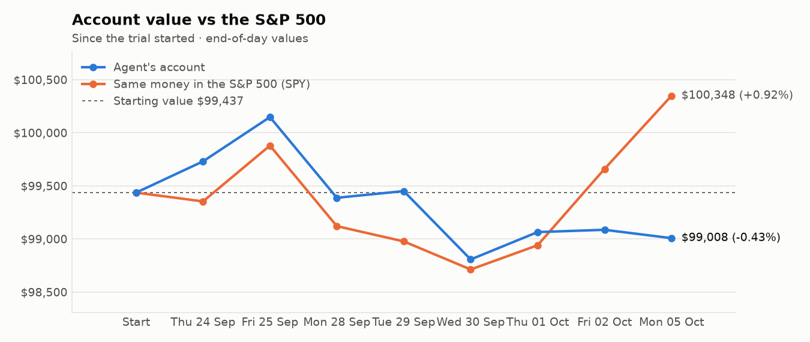
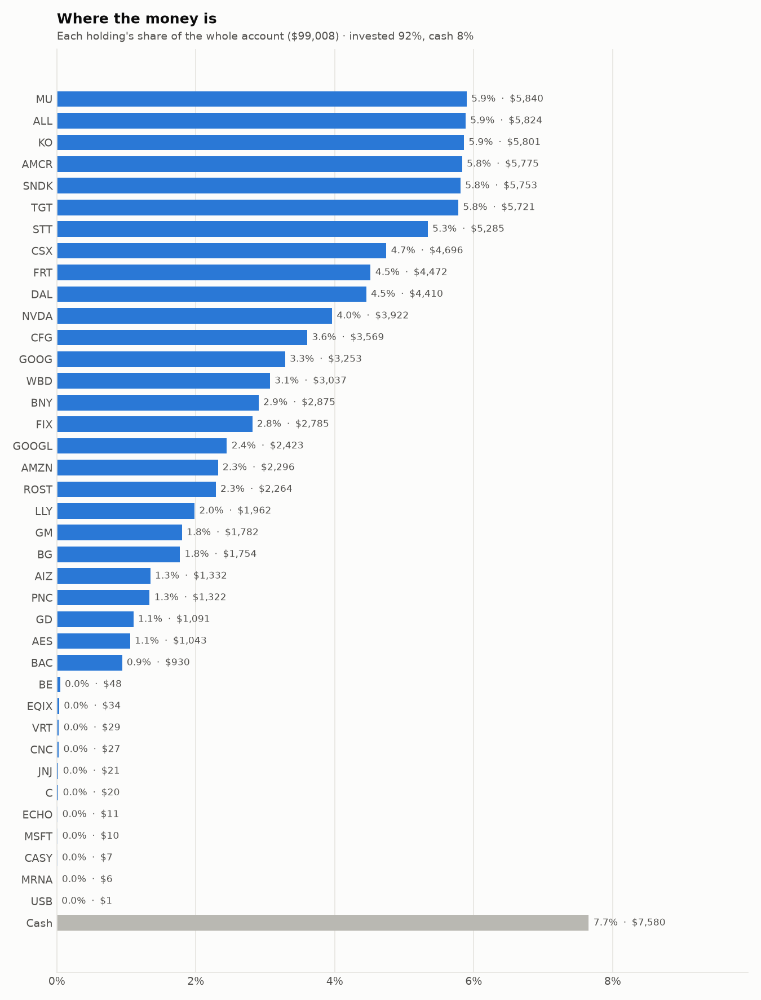
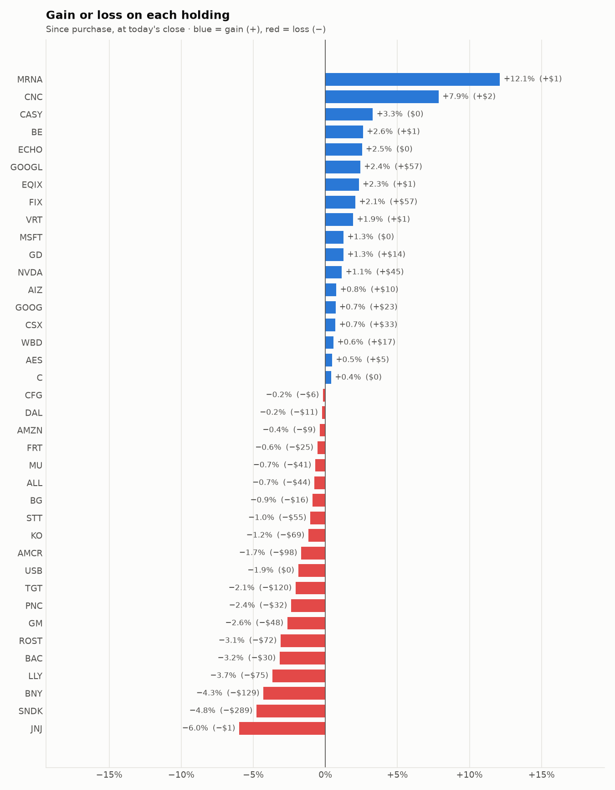

# Daily trading report — Monday 05 October 2026

## Summary

- **Account value:** $99,008 (-$79, -0.1% today)
- **S&P 500 (SPY) today:** +0.7% — the agent was behind the index by 0.77%
- **Trades:** 4 buy(s) ($12,681), 5 sell(s) ($21,775)
- **2026-10-05 Morning rebalance:** traded — 9 order(s) placed
- **2026-10-05 Afternoon risk check:** no trades needed — Risk-checked 38 holding(s): none was 10%+ below its purchase price, and none had both clearly negative news and a price drop of 3%+ since entry.

## Charts

## Why I bought

### FRT — bought 42.198 shares at ~$106.56 ($4,497)

**Why:** combined score +0.67; ranked #8 of 503; driven mainly by low volatility +1.77, price momentum +0.77; entering/adding to the top-ranked target portfolio; research detail: 1 recent headline(s), neutral/mixed tone; analyst consensus +0.92/2 (6 strong buy, 11 buy, 8 hold, 0 sell, 0 strong sell)

**Research scores** (combined +0.67, ranked #8 in the S&P 500, sector: Real Estate):

| Factor | Score | Measures |
|---|---|---|
| Value | +0.52 | cheap vs. sector peers on P/E and P/B |
| Quality | +0.21 | profitability (ROE, margins) and balance-sheet strength |
| Momentum | +0.77 | 12-month price trend, excluding the last month |
| Low volatility | +1.77 | steadier price than sector peers |
| Research | +0.30 | recent news tone + analyst consensus |

**Company financials (Finnhub, trailing 12 months):** P/E 21.4, P/B 3.2, return on equity 13.3%, gross margin 67.5%, debt/equity 1.42

**Price trend (Alpaca):** 12-month return (excl. last month) +19.0%, last month -9.6%, volatility 13.0%/yr

**News (Finnhub): 1 headline(s) in the last 2 days, net tone +0.** Most influential:
- [Federal Realty: The Only REIT Dividend King Trades At A Discount](https://finnhub.io/api/news?id=07fdb81a0c463ecd795edc54ec2da40e33c06beeca50fe5ea9cfa8e1953c35d0) — 04 Oct, SeekingAlpha (tone +0)

**Analysts (Finnhub, 2026-09-01):** 6 strong buy, 11 buy, 8 hold, 0 sell, 0 strong sell — consensus +0.92 on a -2 (strong sell) to +2 (strong buy) scale.

### NVDA — bought 16.369 shares at ~$236.87 ($3,877)

**Why:** combined score +0.64; ranked #11 of 503; driven mainly by research (news + analyst consensus) +2.09, low volatility +1.11; entering/adding to the top-ranked target portfolio; research detail: 47 recent headline(s), net positive tone (+10); analyst consensus +1.28/2 (24 strong buy, 41 buy, 3 hold, 1 sell, 0 strong sell)

**Research scores** (combined +0.64, ranked #11 in the S&P 500, sector: Information Technology):

| Factor | Score | Measures |
|---|---|---|
| Value | -0.26 | cheap vs. sector peers on P/E and P/B |
| Quality | +0.85 | profitability (ROE, margins) and balance-sheet strength |
| Momentum | -0.26 | 12-month price trend, excluding the last month |
| Low volatility | +1.11 | steadier price than sector peers |
| Research | +2.09 | recent news tone + analyst consensus |

**Company financials (FMP, trailing 12 months):** P/E 29.8, P/B 25.0, return on equity 110.1%, gross margin 74.7%, debt/equity 0.17

**Price trend (Alpaca):** 12-month return (excl. last month) +31.4%, last month +4.3%, volatility 38.9%/yr

**News (Finnhub): 47 headline(s) in the last 2 days, net tone +10.** Most influential:
- [The Stock Market Dynamic Has Shifted, Just Look at Intel and Nvidia](https://finnhub.io/api/news?id=3d03c2e99cebb17fb55fb66868052e6506b34adf8323aaf197666e46383b1a91) — 05 Oct, Yahoo (tone +2)
- [A Soft Jobs Report Takes the Heat Off Rates, and Nvidia Closes In on $6 Trillion](https://finnhub.io/api/news?id=7d9e5e396c8898c7050f63983a8921f960929cb810ab5c0bf558e790bc1a21bc) — 05 Oct, ChartMill (tone +2)
- [Nvidia’s Valuations Show AI Rally Isn’t a Bubble, DBS Says](https://finnhub.io/api/news?id=83064d5968224253df53c1c2335d2f9d8fd87472da7e2e290e49749815484492) — 05 Oct, Yahoo (tone +2)
- [NVDY: NVIDIA Shares Break To Record Highs, Don't Cede The Upside Now](https://finnhub.io/api/news?id=e012dd3b6154bc6910355a2e04a2cc4eb074dd4da88b54ee273195beb60f6842) — 04 Oct, SeekingAlpha (tone +2)
- [NVIDIA (NASDAQ:NVDA) Screens as a Decent Value Stock](https://finnhub.io/api/news?id=73a643d2c4cf10b8f3f5a7a1ddafb946f9cafd0cb161fc3dcb82bab7de44b5a7) — 03 Oct, ChartMill (tone +2)

**Analysts (Finnhub, 2026-09-01):** 24 strong buy, 41 buy, 3 hold, 1 sell, 0 strong sell — consensus +1.28 on a -2 (strong sell) to +2 (strong buy) scale.

### GOOG — bought 9.472 shares at ~$340.99 ($3,230)

**Why:** combined score +0.61; ranked #15 of 503; driven mainly by research (news + analyst consensus) +1.76, price momentum +1.37; entering/adding to the top-ranked target portfolio; research detail: 15 recent headline(s), net positive tone (+8); analyst consensus +1.19/2 (20 strong buy, 43 buy, 7 hold, 0 sell, 0 strong sell)

**Research scores** (combined +0.61, ranked #15 in the S&P 500, sector: Communication Services):

| Factor | Score | Measures |
|---|---|---|
| Value | -0.69 | cheap vs. sector peers on P/E and P/B |
| Quality | +0.23 | profitability (ROE, margins) and balance-sheet strength |
| Momentum | +1.37 | 12-month price trend, excluding the last month |
| Low volatility | +0.03 | steadier price than sector peers |
| Research | +1.76 | recent news tone + analyst consensus |

**Company financials (Finnhub, trailing 12 months):** P/E 17.2, P/B 6.8, return on equity 50.8%, gross margin 60.9%, debt/equity 0.15

**Price trend (Alpaca):** 12-month return (excl. last month) +57.5%, last month +2.0%, volatility 34.0%/yr

**News (Finnhub): 15 headline(s) in the last 2 days, net tone +8.** Most influential:
- [Prediction: Alphabet's Profit Growth Carries It to $5 Trillion Before 2028](https://finnhub.io/api/news?id=236631b0f26dc17ae18e5f3e8ebeb124f6a08715983ae9facf1da11f98e96905) — 05 Oct, Yahoo (tone +2)
- [Alphabet Appears To Be The Easiest AI Trade Of The Year Before Its Q3 Print](https://finnhub.io/api/news?id=4a39b962ddf35f73858c4ef5435afb63a707a4d785609dc8abc71d83f19503f0) — 04 Oct, SeekingAlpha (tone +2)
- [Meta And Alphabet Will Beat OpenAI And Anthropic](https://finnhub.io/api/news?id=dd57e1974d3811293fcde416d83a551972624f1a00a16ad6c647f9fbfa68b99a) — 05 Oct, SeekingAlpha (tone +1)
- [Amazon vs. Alphabet: Which AI Cloud Stock Makes the Better Case After the Spending Bill?](https://finnhub.io/api/news?id=6b2a60755384475fe6fde01a90afc81b6f772fe04aaf60e7d2155a12585a8360) — 04 Oct, Yahoo (tone +1)
- [Better Artificial Intelligence Stock: Alphabet vs. Meta Platforms](https://finnhub.io/api/news?id=5f0ddc9385e61425a34d556cef4490307a28dee7382190a6513ae687062e28fa) — 03 Oct, Yahoo (tone +1)

**Analysts (Finnhub, 2026-09-01):** 20 strong buy, 43 buy, 7 hold, 0 sell, 0 strong sell — consensus +1.19 on a -2 (strong sell) to +2 (strong buy) scale.

### GD — bought 3.251 shares at ~$331.27 ($1,077)

**Why:** combined score +0.59; ranked #17 of 503; driven mainly by research (news + analyst consensus) +1.59, low volatility +1.29; entering/adding to the top-ranked target portfolio; research detail: 2 recent headline(s), net positive tone (+3); analyst consensus +0.85/2 (7 strong buy, 15 buy, 10 hold, 1 sell, 0 strong sell)

**Research scores** (combined +0.59, ranked #17 in the S&P 500, sector: Industrials):

| Factor | Score | Measures |
|---|---|---|
| Value | +0.97 | cheap vs. sector peers on P/E and P/B |
| Quality | -0.48 | profitability (ROE, margins) and balance-sheet strength |
| Momentum | -0.09 | 12-month price trend, excluding the last month |
| Low volatility | +1.29 | steadier price than sector peers |
| Research | +1.59 | recent news tone + analyst consensus |

**Company financials (Finnhub, trailing 12 months):** P/E 19.9, P/B 3.8, return on equity 17.4%, gross margin 15.4%, debt/equity 0.28

**Price trend (Alpaca):** 12-month return (excl. last month) +12.2%, last month -9.3%, volatility 17.0%/yr

**News (Finnhub): 2 headline(s) in the last 2 days, net tone +3.** Most influential:
- [RTX vs. GD: Which Pentagon-Backed Dividend Will Outperform Over the Next Decade?](https://finnhub.io/api/news?id=71f0fe8ce7bc8564747946a23ee3b8650de5a06dda6dc19ca74440aa168201fc) — 04 Oct, Yahoo (tone +2)
- [General Dynamics (NYSE:GD): A Dividend Quality Pick Built for Income Investors](https://finnhub.io/api/news?id=1cf6d8958e7ff675995724ba3e32082c1ddc2a17afef7d616d2e252e8131b84f) — 03 Oct, ChartMill (tone +1)

**Analysts (Finnhub, 2026-09-01):** 7 strong buy, 15 buy, 10 hold, 1 sell, 0 strong sell — consensus +0.85 on a -2 (strong sell) to +2 (strong buy) scale.

## Why I sold

### JNJ — sold 21.707 shares at ~$254.89 ($5,533)

**Why:** combined score +0.44; ranked #35 of 503; driven mainly by low volatility +2.10, price momentum +0.55; trimmed toward target weight, or dropped out of the top-ranked names; research detail: 1 recent headline(s), neutral/mixed tone; analyst consensus +0.94/2 (7 strong buy, 15 buy, 9 hold, 0 sell, 0 strong sell)

**Research scores** (combined +0.44, ranked #35 in the S&P 500, sector: Health Care):

| Factor | Score | Measures |
|---|---|---|
| Value | +0.00 | cheap vs. sector peers on P/E and P/B |
| Quality | +0.00 | profitability (ROE, margins) and balance-sheet strength |
| Momentum | +0.55 | 12-month price trend, excluding the last month |
| Low volatility | +2.10 | steadier price than sector peers |
| Research | -0.05 | recent news tone + analyst consensus |

**Price trend (Alpaca):** 12-month return (excl. last month) +54.7%, last month -7.0%, volatility 20.2%/yr

**News (Finnhub): 1 headline(s) in the last 2 days, net tone +0.** Most influential:
- [Johnson & Johnson (JNJ) Reports Sustained Phase 3 Skin Clearance For ICOTYDE](https://finnhub.io/api/news?id=473ae1ef6edf60b0fe455476bf7c7af9939b6caa55c44fe68768f55da66da9cc) — 03 Oct, Yahoo (tone +0)

**Analysts (Finnhub, 2026-09-01):** 7 strong buy, 15 buy, 9 hold, 0 sell, 0 strong sell — consensus +0.94 on a -2 (strong sell) to +2 (strong buy) scale.

### CNC — sold 76.915 shares at ~$63.65 ($4,896)

**Why:** combined score +0.37; ranked #50 of 503; driven mainly by price momentum +2.04, value (cheapness) +1.59; trimmed toward target weight, or dropped out of the top-ranked names; research detail: analyst consensus +0.59/2 (5 strong buy, 7 buy, 14 hold, 1 sell, 0 strong sell)

**Research scores** (combined +0.37, ranked #50 in the S&P 500, sector: Health Care):

| Factor | Score | Measures |
|---|---|---|
| Value | +1.59 | cheap vs. sector peers on P/E and P/B |
| Quality | -0.74 | profitability (ROE, margins) and balance-sheet strength |
| Momentum | +2.04 | 12-month price trend, excluding the last month |
| Low volatility | -1.03 | steadier price than sector peers |
| Research | -0.78 | recent news tone + analyst consensus |

**Company financials (Finnhub, trailing 12 months):** P/B 1.4, return on equity -24.0%, gross margin 7.2%, debt/equity 0.71

**Price trend (Alpaca):** 12-month return (excl. last month) +127.5%, last month -6.5%, volatility 36.1%/yr

**News (Finnhub):** no headlines in the last 2 days.

**Analysts (Finnhub, 2026-09-01):** 5 strong buy, 7 buy, 14 hold, 1 sell, 0 strong sell — consensus +0.59 on a -2 (strong sell) to +2 (strong buy) scale.

### C — sold 36.197 shares at ~$128.77 ($4,661)

**Why:** combined score +0.43; ranked #41 of 503; driven mainly by price momentum +1.53, value (cheapness) +0.94; trimmed toward target weight, or dropped out of the top-ranked names; research detail: 1 recent headline(s), neutral/mixed tone; analyst consensus +1.04/2 (7 strong buy, 15 buy, 6 hold, 0 sell, 0 strong sell)

**Research scores** (combined +0.43, ranked #41 in the S&P 500, sector: Financials):

| Factor | Score | Measures |
|---|---|---|
| Value | +0.94 | cheap vs. sector peers on P/E and P/B |
| Quality | -0.86 | profitability (ROE, margins) and balance-sheet strength |
| Momentum | +1.53 | 12-month price trend, excluding the last month |
| Low volatility | -0.05 | steadier price than sector peers |
| Research | +0.18 | recent news tone + analyst consensus |

**Company financials (Finnhub, trailing 12 months):** P/E 12.1, P/B 1.1, return on equity 8.4%, debt/equity 3.84

**Price trend (Alpaca):** 12-month return (excl. last month) +41.8%, last month -4.3%, volatility 26.9%/yr

**News (Finnhub): 1 headline(s) in the last 2 days, net tone +0.** Most influential:
- [Once 'Nearly Impossible,' Now Reality: Brian Armstrong Cheers Citi Partnership, Says Coinbase 'Has Come a Long Way'](https://finnhub.io/api/news?id=8471e808f876987ad82ae9502ed040e40629b7dceaa446348201b2ccd193cf7a) — 05 Oct, Yahoo (tone +0)

**Analysts (Finnhub, 2026-09-01):** 7 strong buy, 15 buy, 6 hold, 0 sell, 0 strong sell — consensus +1.04 on a -2 (strong sell) to +2 (strong buy) scale.

### EQIX — sold 3.764 shares at ~$1,017.61 ($3,830)

**Why:** combined score +0.45; ranked #34 of 503; driven mainly by price momentum +1.39, research (news + analyst consensus) +0.65; trimmed toward target weight, or dropped out of the top-ranked names; research detail: analyst consensus +1.12/2 (12 strong buy, 21 buy, 7 hold, 0 sell, 0 strong sell)

**Research scores** (combined +0.45, ranked #34 in the S&P 500, sector: Real Estate):

| Factor | Score | Measures |
|---|---|---|
| Value | +0.00 | cheap vs. sector peers on P/E and P/B |
| Quality | +0.00 | profitability (ROE, margins) and balance-sheet strength |
| Momentum | +1.39 | 12-month price trend, excluding the last month |
| Low volatility | -0.15 | steadier price than sector peers |
| Research | +0.65 | recent news tone + analyst consensus |

**Price trend (Alpaca):** 12-month return (excl. last month) +32.2%, last month +0.7%, volatility 27.6%/yr

**News (Finnhub):** no headlines in the last 2 days.

**Analysts (Finnhub, 2026-09-01):** 12 strong buy, 21 buy, 7 hold, 0 sell, 0 strong sell — consensus +1.12 on a -2 (strong sell) to +2 (strong buy) scale.

### VRT — sold 11.254 shares at ~$253.73 ($2,855)

**Why:** combined score +0.32; ranked #69 of 503; driven mainly by price momentum +2.54, low volatility -1.75; trimmed toward target weight, or dropped out of the top-ranked names; research detail: analyst consensus +1.17/2 (10 strong buy, 22 buy, 4 hold, 0 sell, 0 strong sell)

**Research scores** (combined +0.32, ranked #69 in the S&P 500, sector: Industrials):

| Factor | Score | Measures |
|---|---|---|
| Value | -1.04 | cheap vs. sector peers on P/E and P/B |
| Quality | +0.28 | profitability (ROE, margins) and balance-sheet strength |
| Momentum | +2.54 | 12-month price trend, excluding the last month |
| Low volatility | -1.75 | steadier price than sector peers |
| Research | +0.51 | recent news tone + analyst consensus |

**Company financials (Finnhub, trailing 12 months):** P/E 55.1, P/B 27.0, return on equity 42.1%, gross margin 38.0%, debt/equity 0.62

**Price trend (Alpaca):** 12-month return (excl. last month) +107.0%, last month -1.8%, volatility 65.5%/yr

**News (Finnhub):** no headlines in the last 2 days.

**Analysts (Finnhub, 2026-09-01):** 10 strong buy, 22 buy, 4 hold, 0 sell, 0 strong sell — consensus +1.17 on a -2 (strong sell) to +2 (strong buy) scale.

## Holdings at the close

| Stock | Shares | Avg cost | Price | Market value | % of account | Today | Gain/loss $ | Gain/loss % |
|---|---:|---:|---:|---:|---:|---:|---:|---:|
| MU | 5.491 | $1,070.99 | $1,063.51 | $5,840 | 5.9% | -1.06% | −$41 | -0.70% |
| ALL | 25.919 | $226.41 | $224.71 | $5,824 | 5.9% | +0.43% | −$44 | -0.75% |
| KO | 67.092 | $87.50 | $86.47 | $5,801 | 5.9% | +0.96% | −$69 | -1.17% |
| AMCR | 137.493 | $42.71 | $42.00 | $5,775 | 5.8% | +0.33% | −$98 | -1.67% |
| SNDK | 3.38 | $1,787.39 | $1,702.00 | $5,753 | 5.8% | -1.05% | −$289 | -4.78% |
| TGT | 37.474 | $155.87 | $152.66 | $5,721 | 5.8% | -2.14% | −$120 | -2.06% |
| STT | 29.965 | $178.22 | $176.37 | $5,285 | 5.3% | +0.23% | −$55 | -1.04% |
| CSX | 99 | $47.10 | $47.43 | $4,696 | 4.7% | +0.00% | +$33 | +0.70% |
| FRT | 42.198 | $106.56 | $105.97 | $4,472 | 4.5% | -0.67% | −$25 | -0.55% |
| DAL | 53 | $83.40 | $83.20 | $4,410 | 4.5% | -1.06% | −$11 | -0.24% |
| NVDA | 16.369 | $236.87 | $239.59 | $3,922 | 4.0% | +2.41% | +$45 | +1.15% |
| CFG | 55.497 | $64.42 | $64.31 | $3,569 | 3.6% | -0.03% | −$6 | -0.16% |
| GOOG | 9.472 | $340.99 | $343.41 | $3,253 | 3.3% | +0.90% | +$23 | +0.71% |
| WBD | 98 | $30.81 | $30.98 | $3,037 | 3.1% | +0.15% | +$17 | +0.57% |
| BNY | 20 | $150.20 | $143.75 | $2,875 | 2.9% | -1.13% | −$129 | -4.29% |
| FIX | 1.626 | $1,677.99 | $1,713.00 | $2,785 | 2.8% | -0.87% | +$57 | +2.09% |
| GOOGL | 7 | $337.98 | $346.17 | $2,423 | 2.4% | +0.78% | +$57 | +2.42% |
| AMZN | 9.124 | $252.59 | $251.60 | $2,296 | 2.3% | +0.03% | −$9 | -0.39% |
| ROST | 10 | $233.61 | $226.37 | $2,264 | 2.3% | -0.95% | −$72 | -3.10% |
| LLY | 1.712 | $1,189.78 | $1,146.00 | $1,962 | 2.0% | +0.28% | −$75 | -3.68% |
| GM | 22.211 | $82.40 | $80.23 | $1,782 | 1.8% | +2.50% | −$48 | -2.63% |
| BG | 16.346 | $108.29 | $107.32 | $1,754 | 1.8% | +0.56% | −$16 | -0.90% |
| AIZ | 5 | $264.38 | $266.41 | $1,332 | 1.3% | -0.34% | +$10 | +0.77% |
| PNC | 6 | $225.64 | $220.28 | $1,322 | 1.3% | -0.34% | −$32 | -2.38% |
| GD | 3.251 | $331.27 | $335.45 | $1,091 | 1.1% | +1.62% | +$14 | +1.26% |
| AES | 69.882 | $14.85 | $14.92 | $1,043 | 1.1% | +0.07% | +$5 | +0.47% |
| BAC | 17.192 | $55.87 | $54.10 | $930 | 0.9% | +0.65% | −$30 | -3.17% |
| BE | 0.166 | $279.83 | $287.14 | $48 | 0.0% | -0.70% | +$1 | +2.61% |
| EQIX | 0.033 | $1,000.20 | $1,023.44 | $34 | 0.0% | -0.22% | +$1 | +2.32% |
| VRT | 0.116 | $249.50 | $254.31 | $29 | 0.0% | +0.84% | +$1 | +1.93% |
| CNC | 0.426 | $59.61 | $64.30 | $27 | 0.0% | +2.08% | +$2 | +7.87% |
| JNJ | 0.083 | $269.29 | $253.20 | $21 | 0.0% | -1.11% | −$1 | -5.98% |
| C | 0.153 | $128.13 | $128.65 | $20 | 0.0% | +0.12% | +$0 | +0.41% |
| ECHO | 0.116 | $95.87 | $98.31 | $11 | 0.0% | +4.31% | +$0 | +2.55% |
| MSFT | 0.02 | $518.45 | $525.00 | $10 | 0.0% | +1.44% | +$0 | +1.26% |
| CASY | 0.011 | $597.62 | $617.33 | $7 | 0.0% | -0.07% | +$0 | +3.30% |
| MRNA | 0.028 | $181.06 | $203.00 | $6 | 0.0% | +6.84% | +$1 | +12.12% |
| USB | 0.016 | $58.50 | $57.40 | $1 | 0.0% | -0.19% | −$0 | -1.88% |
| **Invested** | | | | **$91,428** | **92.3%** | | **−$905** | |
| **Cash** | | | | $7,580 | 7.7% | | | |
| **Total account** | | | | **$99,008** | 100% | | | |

_Scores are sector-neutral z-scores: 0 is average for the stock's sector, +1 is one standard deviation better. News tone is a keyword count over recent headlines, not a deep read. None of this guarantees a stock will rise; a few days of results can't show whether the strategy has a real edge over the S&P 500._
