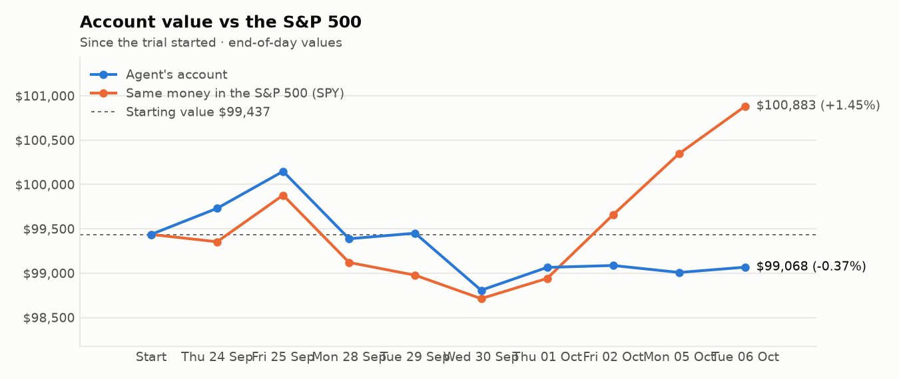
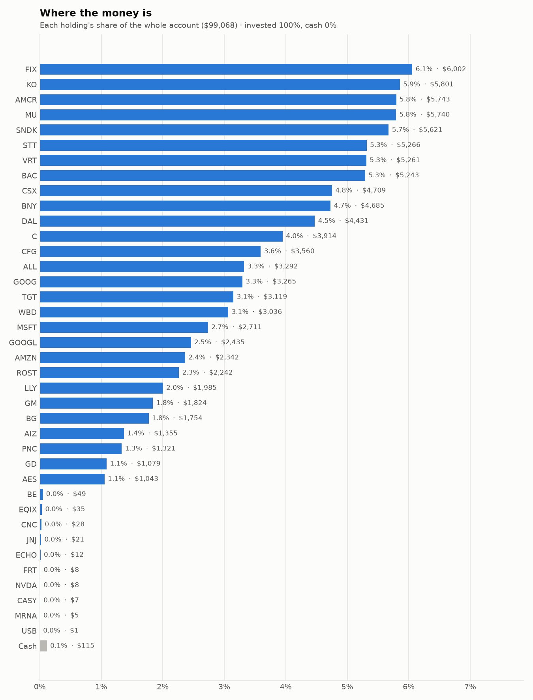
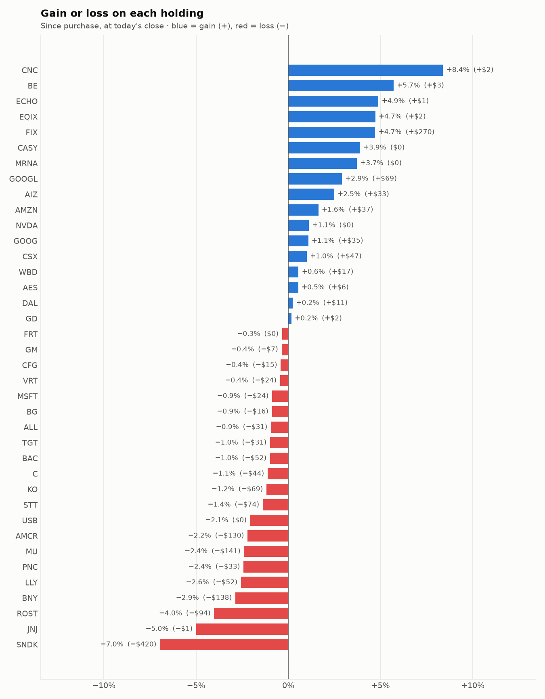

# Daily trading report — Tuesday 06 October 2026

## Summary

- **Account value:** $99,068 (+$60, +0.1% today)
- **S&P 500 (SPY) today:** +0.5% — the agent was behind the index by 0.47%
- **Trades:** 6 buy(s) ($21,078), 4 sell(s) ($13,613)
- **2026-10-06 Morning rebalance:** traded — 10 order(s) placed
- **2026-10-06 Afternoon risk check:** no trades needed — Risk-checked 38 holding(s): none was 10%+ below its purchase price, and none had both clearly negative news and a price drop of 3%+ since entry.

## Charts

## Why I bought

### VRT — bought 20.644 shares at ~$254.61 ($5,256)

**Why:** combined score +0.67; ranked #7 of 503; driven mainly by price momentum +2.66, research (news + analyst consensus) +2.12; entering/adding to the top-ranked target portfolio; research detail: 7 recent headline(s), net positive tone (+7); analyst consensus +1.17/2 (10 strong buy, 22 buy, 4 hold, 0 sell, 0 strong sell)

**Research scores** (combined +0.67, ranked #7 in the S&P 500, sector: Industrials):

| Factor | Score | Measures |
|---|---|---|
| Value | -0.98 | cheap vs. sector peers on P/E and P/B |
| Quality | +0.22 | profitability (ROE, margins) and balance-sheet strength |
| Momentum | +2.66 | 12-month price trend, excluding the last month |
| Low volatility | -1.75 | steadier price than sector peers |
| Research | +2.12 | recent news tone + analyst consensus |

**Company financials (Finnhub, trailing 12 months):** P/E 55.9, P/B 27.0, return on equity 42.1%, gross margin 38.0%, debt/equity 0.62

**Price trend (Alpaca):** 12-month return (excl. last month) +114.0%, last month -5.7%, volatility 65.5%/yr

**News (Finnhub): 7 headline(s) in the last 2 days, net tone +7.** Most influential:
- [This Vertiv Analyst Begins Coverage On A Bullish Note; Here Are Top 5 Initiations For Monday](https://finnhub.io/api/news?id=0eff7f02dbf43e3b57db060f7ba705ce0e2cfb902c6e600be61f13065e95d777) — 05 Oct, Benzinga (tone +2)
- [The Overlooked AI Stock Poised to Outperform Nvidia and Palantir](https://finnhub.io/api/news?id=6d391a88a99329ad4bbdb966d4e2921aabe0c88baae31f89d2ccb7824c434058) — 06 Oct, Yahoo (tone +1)
- [Vertiv's Q3 Earnings Setup Unlocks Solid Upside (Preview)](https://finnhub.io/api/news?id=9cc8e34bf8f8c838481b59ec6acb7bee13cca0a48f452d6f0236db22a87871d3) — 06 Oct, SeekingAlpha (tone +1)
- [Vertiv vs. nVent: Why Is the Faster-Growing AI Infrastructure Stock Cheaper?](https://finnhub.io/api/news?id=c6ea6a864adc1f62147acc849475277c2f365791cc25ace0f9436ce6ca3c9ab5) — 05 Oct, Yahoo (tone +1)
- [BMO Capital Initiates Coverage of Vertiv Holdings with Outperform Rating](https://finnhub.io/api/news?id=576117ee3fd989a8a3eb04f0516d8120cbef692ba1fc890e04c9a5a08a08fd33) — 05 Oct, Fintel (tone +1)

**Analysts (Finnhub, 2026-09-01):** 10 strong buy, 22 buy, 4 hold, 0 sell, 0 strong sell — consensus +1.17 on a -2 (strong sell) to +2 (strong buy) scale.

### BAC — bought 79.659 shares at ~$54.42 ($4,335)

**Why:** combined score +0.79; ranked #4 of 503; driven mainly by research (news + analyst consensus) +1.87, low volatility +1.05; entering/adding to the top-ranked target portfolio; research detail: 15 recent headline(s), net positive tone (+8); analyst consensus +1.00/2 (6 strong buy, 17 buy, 6 hold, 0 sell, 0 strong sell)

**Research scores** (combined +0.79, ranked #4 in the S&P 500, sector: Financials):

| Factor | Score | Measures |
|---|---|---|
| Value | +0.80 | cheap vs. sector peers on P/E and P/B |
| Quality | -0.40 | profitability (ROE, margins) and balance-sheet strength |
| Momentum | +0.69 | 12-month price trend, excluding the last month |
| Low volatility | +1.05 | steadier price than sector peers |
| Research | +1.87 | recent news tone + analyst consensus |

**Company financials (Finnhub, trailing 12 months):** P/E 11.3, P/B 1.3, return on equity 11.1%, debt/equity 2.43

**Price trend (Alpaca):** 12-month return (excl. last month) +25.9%, last month -14.3%, volatility 20.3%/yr

**News (Finnhub): 15 headline(s) in the last 2 days, net tone +8.** Most influential:
- [Bank of America Just Upgraded DraftKings Stock. Here's Why.](https://finnhub.io/api/news?id=e732fb43f0d8d128865f78337457c3db9d96834a9e113d3a2c109db52f933907) — 05 Oct, Yahoo (tone +2)
- [DraftKings stock surges 5%: BofA upgrades to Buy on prediction markets](https://finnhub.io/api/news?id=18d23c5152396b0575d737427165ed04110a0e50e1cd92b45b86505798bd8466) — 05 Oct, Yahoo (tone +2)
- [Bank of America sees Eaton heading for a big surprise](https://finnhub.io/api/news?id=321915a8db37e1415b56803cf58577856643770452306b72ab0df1f1b4b6a33c) — 05 Oct, Yahoo (tone +1)
- [DraftKings upgraded to 'Buy' by BofA on prediction market opportunity](https://finnhub.io/api/news?id=b444d58f0595266f45f977f3473e3c1d94c293f157e8a1e3b2bf623a63b0ddb6) — 05 Oct, Yahoo (tone +1)
- [Bank of America Put a $60 Price Target on IonQ. The Quantum Bet Is Picking Up Speed.](https://finnhub.io/api/news?id=4509d0b7374e7ce43372623ae4b7384e3076272d8e875e04a428d639f72bb5e3) — 05 Oct, Yahoo (tone +1)

**Analysts (Finnhub, 2026-09-01):** 6 strong buy, 17 buy, 6 hold, 0 sell, 0 strong sell — consensus +1.00 on a -2 (strong sell) to +2 (strong buy) scale.

### C — bought 30.285 shares at ~$130.05 ($3,938)

**Why:** combined score +0.65; ranked #11 of 503; driven mainly by price momentum +1.57, research (news + analyst consensus) +1.12; entering/adding to the top-ranked target portfolio; research detail: 7 recent headline(s), net positive tone (+3); analyst consensus +1.04/2 (7 strong buy, 15 buy, 6 hold, 0 sell, 0 strong sell)

**Research scores** (combined +0.65, ranked #11 in the S&P 500, sector: Financials):

| Factor | Score | Measures |
|---|---|---|
| Value | +0.99 | cheap vs. sector peers on P/E and P/B |
| Quality | -0.81 | profitability (ROE, margins) and balance-sheet strength |
| Momentum | +1.57 | 12-month price trend, excluding the last month |
| Low volatility | -0.05 | steadier price than sector peers |
| Research | +1.12 | recent news tone + analyst consensus |

**Company financials (Finnhub, trailing 12 months):** P/E 12.1, P/B 1.1, return on equity 8.4%, debt/equity 3.84

**Price trend (Alpaca):** 12-month return (excl. last month) +45.4%, last month -6.9%, volatility 26.8%/yr

**News (Finnhub): 7 headline(s) in the last 2 days, net tone +3.** Most influential:
- [Will Citigroup (C) Beat Estimates Again in Its Next Earnings Report?](https://finnhub.io/api/news?id=9e02866a2e0d05d78467e01e46c61a9e6b07d03616368671423a89b091153d4d) — 05 Oct, Yahoo (tone +1)
- [Citigroup's Japan & UAE Token Push: A Growth Catalyst for Services?](https://finnhub.io/api/news?id=5fe2b8a7b75c2f80493b1899a1f37f8b48d9600f640b1cb1a16d3caddcc2f200) — 05 Oct, Yahoo (tone +1)
- [Are You Looking for a High-Growth Dividend Stock?](https://finnhub.io/api/news?id=d3d25bd40492782af7db3d05d5b47598912b0cc5df8c51d285426b259e032f05) — 05 Oct, Yahoo (tone +1)
- [Citi Tops Global IPO Underwriting, Overtakes Goldman Sachs After SpaceX, SK Hynix, NSE Listings](https://finnhub.io/api/news?id=620bf45cb7acf339f18b4417ee17ec0326559d3f7a88d84e8ca4a0242cb7ce6c) — 06 Oct, Yahoo (tone +0)
- [How Investors Are Reacting To Citigroup (C) Expanding Token Services And Instant Cross-Border Payments](https://finnhub.io/api/news?id=8da91547e0cb6d2f129ceeb289ca884615a6e6afddfe1e6cf218b9d897e6a976) — 06 Oct, Yahoo (tone +0)

**Analysts (Finnhub, 2026-09-01):** 7 strong buy, 15 buy, 6 hold, 0 sell, 0 strong sell — consensus +1.04 on a -2 (strong sell) to +2 (strong buy) scale.

### FIX — bought 1.681 shares at ~$1,786.93 ($3,004)

**Why:** combined score +0.86; ranked #2 of 503; driven mainly by price momentum +2.97, research (news + analyst consensus) +2.26; entering/adding to the top-ranked target portfolio; research detail: 3 recent headline(s), net positive tone (+7); analyst consensus +1.31/2 (7 strong buy, 7 buy, 2 hold, 0 sell, 0 strong sell)

**Research scores** (combined +0.86, ranked #2 in the S&P 500, sector: Industrials):

| Factor | Score | Measures |
|---|---|---|
| Value | -0.78 | cheap vs. sector peers on P/E and P/B |
| Quality | +0.19 | profitability (ROE, margins) and balance-sheet strength |
| Momentum | +2.97 | 12-month price trend, excluding the last month |
| Low volatility | -1.41 | steadier price than sector peers |
| Research | +2.26 | recent news tone + analyst consensus |

**Company financials (Finnhub, trailing 12 months):** P/E 42.3, P/B 21.7, return on equity 53.5%, gross margin 25.7%, debt/equity 0.02

**Price trend (Alpaca):** 12-month return (excl. last month) +125.2%, last month +8.3%, volatility 52.4%/yr

**News (Finnhub): 3 headline(s) in the last 2 days, net tone +7.** Most influential:
- [Is Comfort Systems' 92% EPS Surge Just the Start of More Gains Ahead?](https://finnhub.io/api/news?id=c1881631c6c24ded81aa05fa2ccfd6ced8de9fbf852ee905bbf3574a2ab17f9b) — 05 Oct, Yahoo (tone +4)
- [Comfort Systems USA (NYSE:FIX) Delivers High Growth and Strengthening Fundamentals](https://finnhub.io/api/news?id=795aaeb37ddd96992dfab1bfdb8a73796ba1ee472985522d3e03905180dcfe52) — 06 Oct, ChartMill (tone +3)
- [Comfort Systems USA Is a $1,600 Stock Almost Nobody Owns. Here's Why It Keeps Crushing the Market.](https://finnhub.io/api/news?id=901a21fdb2fa0513211bbf0c5d7d9ba9cad8e0c903de59b3fadb5cc1c8273018) — 04 Oct, Yahoo (tone +0)

**Analysts (Finnhub, 2026-09-01):** 7 strong buy, 7 buy, 2 hold, 0 sell, 0 strong sell — consensus +1.31 on a -2 (strong sell) to +2 (strong buy) scale.

### MSFT — bought 5.104 shares at ~$533.80 ($2,725)

**Why:** combined score +0.57; ranked #19 of 503; driven mainly by research (news + analyst consensus) +2.07, low volatility +1.27; entering/adding to the top-ranked target portfolio; research detail: 62 recent headline(s), net positive tone (+34); analyst consensus +1.26/2 (23 strong buy, 41 buy, 5 hold, 0 sell, 0 strong sell)

**Research scores** (combined +0.57, ranked #19 in the S&P 500, sector: Information Technology):

| Factor | Score | Measures |
|---|---|---|
| Value | +0.00 | cheap vs. sector peers on P/E and P/B |
| Quality | +0.34 | profitability (ROE, margins) and balance-sheet strength |
| Momentum | -0.41 | 12-month price trend, excluding the last month |
| Low volatility | +1.27 | steadier price than sector peers |
| Research | +2.07 | recent news tone + analyst consensus |

**Company financials (FMP, trailing 12 months):** P/E 29.6, P/B 9.0, return on equity 33.2%, gross margin 67.9%, debt/equity 0.29

**Price trend (Alpaca):** 12-month return (excl. last month) +1.0%, last month +2.9%, volatility 40.3%/yr

**News (Finnhub): 62 headline(s) in the last 2 days, net tone +34.** Most influential:
- [MSFT Gets A Bullish Call From Melius — Analyst Says AI Fears Could Benefit Leaders Like Microsoft](https://finnhub.io/api/news?id=40066932c69b2be92b5a12bb5b29ffaff052fce9b03994a88d372448b6ca611b) — 05 Oct, Yahoo (tone +3)
- [Microsoft (NASDAQ:MSFT): Strong Growth Meets High-Quality Technical Setup](https://finnhub.io/api/news?id=ad60b3710ec320b5426e582298e527e2f6b26ec9a77fb9cdeda2bfd01d41e681) — 06 Oct, ChartMill (tone +2)
- [Nasdaq Hits a Fresh Record While the 10-Year Climbs to 5.31%](https://finnhub.io/api/news?id=cf7d02a17a97c293cb3d48d6293c22a01187ab427091a00190a1bacf4496ab2e) — 06 Oct, ChartMill (tone +2)
- [Jim Cramer Says Software Was the Story of Q3. The Numbers Agree](https://finnhub.io/api/news?id=d8c38b68c9401cee7fa4bdbee5dfecc1ff6e5638c8b020206a0bc8d21c97aaa6) — 06 Oct, Yahoo (tone +2)
- [MSFT Stock Gains: Melius Research Calls Microsoft ‘Adults In Charge’ Of AI, Upgrades To ‘Buy’](https://finnhub.io/api/news?id=880f2f2882c24081a6ebc2d06035da5d73e0bf7a1e03eee24121b2daaa365c0d) — 05 Oct, Yahoo (tone +2)

**Analysts (Finnhub, 2026-09-01):** 23 strong buy, 41 buy, 5 hold, 0 sell, 0 strong sell — consensus +1.26 on a -2 (strong sell) to +2 (strong buy) scale.

### BNY — bought 12.596 shares at ~$144.45 ($1,819)

**Why:** combined score +0.69; ranked #5 of 503; driven mainly by price momentum +2.09, low volatility +1.01; entering/adding to the top-ranked target portfolio; research detail: 1 recent headline(s), net positive tone (+1); analyst consensus +0.81/2 (3 strong buy, 11 buy, 7 hold, 0 sell, 0 strong sell)

**Research scores** (combined +0.69, ranked #5 in the S&P 500, sector: Financials):

| Factor | Score | Measures |
|---|---|---|
| Value | -0.09 | cheap vs. sector peers on P/E and P/B |
| Quality | -0.06 | profitability (ROE, margins) and balance-sheet strength |
| Momentum | +2.09 | 12-month price trend, excluding the last month |
| Low volatility | +1.01 | steadier price than sector peers |
| Research | +0.24 | recent news tone + analyst consensus |

**Company financials (Finnhub, trailing 12 months):** P/E 15.5, P/B 2.2, return on equity 14.2%, debt/equity 1.38

**Price trend (Alpaca):** 12-month return (excl. last month) +57.0%, last month -12.5%, volatility 21.6%/yr

**News (Finnhub): 1 headline(s) in the last 2 days, net tone +1.** Most influential:
- [Bank Of New York Mellon Likely To Report Higher Q3 Earnings; These Most Accurate Analysts Revise Forecasts Ahead Of Earnings Call](https://finnhub.io/api/news?id=57a0724b857a3ebefd57ae472683c461eb8354ed4970ecfc7479006fcf609fbb) — 05 Oct, Benzinga (tone +1)

**Analysts (Finnhub, 2026-09-01):** 3 strong buy, 11 buy, 7 hold, 0 sell, 0 strong sell — consensus +0.81 on a -2 (strong sell) to +2 (strong buy) scale.

## Why I sold

### FRT — sold 42.12 shares at ~$106.38 ($4,481)

**Why:** combined score +0.45; ranked #33 of 503; driven mainly by low volatility +1.77, price momentum +0.64; trimmed toward target weight, or dropped out of the top-ranked names; research detail: 1 recent headline(s), neutral/mixed tone; analyst consensus +0.92/2 (6 strong buy, 11 buy, 8 hold, 0 sell, 0 strong sell)

**Research scores** (combined +0.45, ranked #33 in the S&P 500, sector: Real Estate):

| Factor | Score | Measures |
|---|---|---|
| Value | +0.00 | cheap vs. sector peers on P/E and P/B |
| Quality | +0.00 | profitability (ROE, margins) and balance-sheet strength |
| Momentum | +0.64 | 12-month price trend, excluding the last month |
| Low volatility | +1.77 | steadier price than sector peers |
| Research | +0.14 | recent news tone + analyst consensus |

**Price trend (Alpaca):** 12-month return (excl. last month) +17.0%, last month -9.5%, volatility 13.0%/yr

**News (Finnhub): 1 headline(s) in the last 2 days, net tone +0.** Most influential:
- [Federal Realty: The Only REIT Dividend King Trades At A Discount](https://finnhub.io/api/news?id=07fdb81a0c463ecd795edc54ec2da40e33c06beeca50fe5ea9cfa8e1953c35d0) — 04 Oct, SeekingAlpha (tone +0)

**Analysts (Finnhub, 2026-09-01):** 6 strong buy, 11 buy, 8 hold, 0 sell, 0 strong sell — consensus +0.92 on a -2 (strong sell) to +2 (strong buy) scale.

### NVDA — sold 16.337 shares at ~$241.97 ($3,953)

**Why:** combined score +0.39; ranked #48 of 503; driven mainly by research (news + analyst consensus) +1.42, low volatility +1.12; trimmed toward target weight, or dropped out of the top-ranked names; research detail: 81 recent headline(s), net positive tone (+14); analyst consensus +1.28/2 (24 strong buy, 41 buy, 3 hold, 1 sell, 0 strong sell)

**Research scores** (combined +0.39, ranked #48 in the S&P 500, sector: Information Technology):

| Factor | Score | Measures |
|---|---|---|
| Value | +0.00 | cheap vs. sector peers on P/E and P/B |
| Quality | +0.00 | profitability (ROE, margins) and balance-sheet strength |
| Momentum | -0.24 | 12-month price trend, excluding the last month |
| Low volatility | +1.12 | steadier price than sector peers |
| Research | +1.42 | recent news tone + analyst consensus |

**Price trend (Alpaca):** 12-month return (excl. last month) +34.0%, last month +4.6%, volatility 38.3%/yr

**News (Finnhub): 81 headline(s) in the last 2 days, net tone +14.** Most influential:
- [Why Are Nasdaq, Dow Futures Rising Premarket? SPCX, NVDA, CEG, AMD, ORCL, NOK In Focus](https://finnhub.io/api/news?id=9b2690aaa98e03f5a2f2511a4b46b97fd79dfffb05f92ff936c81ada02f72b1d) — 06 Oct, Yahoo (tone +2)
- [Dow Jones Futures: Nasdaq Hits Record Highs; TSMC, Nvidia, Elon Musk-Led SpaceX, Tesla Rally](https://finnhub.io/api/news?id=e2c64a14c0e41f421fd4f7a4b4ae51527ec82124dcaaade89b0072a2daea6227) — 05 Oct, Yahoo (tone +2)
- [DBS Group CIO Hou Wey Fook says AI rally is not a bubble](https://finnhub.io/api/news?id=0387f9f856fa944b6e673767bbbf3301ead14a2748f3baeaa5ae9dc16059f9cb) — 05 Oct, Yahoo (tone +2)
- [Nasdaq hits record high as AI stocks rally amid high bond yields](https://finnhub.io/api/news?id=eeda09aa32c5116813a8b009d8aa12a51c7a03e68d14b4ebcd7e4713e8516da3) — 05 Oct, Yahoo (tone +2)
- [Embedded Systems Market 2026: Trends and Forecast to 2030 / Capitalize on Edge AI as Intel, Qualcomm, Nvidia, NXP Semiconductors, and Arm Accelerate the Market to $180.07 Billion](https://finnhub.io/api/news?id=94e30b7c6e8508b8c87f9acba80f4f42ddecb8f3366c1015a54a9e0055f9af6b) — 05 Oct, Yahoo (tone +2)

**Analysts (Finnhub, 2026-09-01):** 24 strong buy, 41 buy, 3 hold, 1 sell, 0 strong sell — consensus +1.28 on a -2 (strong sell) to +2 (strong buy) scale.

### TGT — sold 17.261 shares at ~$153.69 ($2,653)

**Why:** combined score +0.59; ranked #16 of 503; driven mainly by price momentum +2.82, research (news + analyst consensus) -0.45; trimmed toward target weight, or dropped out of the top-ranked names; research detail: 10 recent headline(s), neutral/mixed tone; analyst consensus +0.44/2 (7 strong buy, 8 buy, 25 hold, 3 sell, 0 strong sell)

**Research scores** (combined +0.59, ranked #16 in the S&P 500, sector: Consumer Staples):

| Factor | Score | Measures |
|---|---|---|
| Value | +0.29 | cheap vs. sector peers on P/E and P/B |
| Quality | -0.13 | profitability (ROE, margins) and balance-sheet strength |
| Momentum | +2.82 | 12-month price trend, excluding the last month |
| Low volatility | -0.40 | steadier price than sector peers |
| Research | -0.45 | recent news tone + analyst consensus |

**Company financials (FMP, trailing 12 months):** P/E 15.9, P/B 3.9, return on equity 26.7%, gross margin 29.3%, debt/equity 1.05

**Price trend (Alpaca):** 12-month return (excl. last month) +77.5%, last month -6.7%, volatility 27.7%/yr

**News (Finnhub): 10 headline(s) in the last 2 days, net tone +0.** Most influential:
- [Nexus Advanced Technologies Signs Confidential Exclusivity for Proposed $500 Million Reverse Merger](https://finnhub.io/api/news?id=e923d1a35cdccf075fd1daaaa3ce3b877b5aa7d75a99ebff591123b3f21e4716) — 06 Oct, Yahoo (tone +0)
- [Target’s turnaround has seen early success. Now comes the holidays.](https://finnhub.io/api/news?id=c53a67e90005a2cb65d9c7b8eaa157b6b1f1dc0147dfd3cc123079d39d3e9816) — 06 Oct, Yahoo (tone +0)
- [Target Has a Growing Dividend and an Improving Business. Is the Stock a Bargain?](https://finnhub.io/api/news?id=cef72767c013ae03ca764ed20d129c7aad1687e33601d1d11025101d2e5de39b) — 05 Oct, Yahoo (tone +0)
- [Target (TGT) Stock Slides as Market Rises: Facts to Know Before You Trade](https://finnhub.io/api/news?id=f5cfc2ddb894f364eeebb65b982faeed2283d537d4615cd3271f490705b70332) — 05 Oct, Yahoo (tone +0)
- [Walmart Remains In The Red in 2026: 49% Gains Await Investors Who Act Now According to This Wall Street Pro](https://finnhub.io/api/news?id=304f3c1d8ff891b0203300c31a05e94ea424cc1f2ceed437a65437f6daa6f0f9) — 05 Oct, Yahoo (tone +0)

**Analysts (Finnhub, 2026-09-01):** 7 strong buy, 8 buy, 25 hold, 3 sell, 0 strong sell — consensus +0.44 on a -2 (strong sell) to +2 (strong buy) scale.

### ALL — sold 11.239 shares at ~$224.80 ($2,527)

**Why:** combined score +0.61; ranked #13 of 503; driven mainly by value (cheapness) +1.66, quality (profitability/balance sheet) +1.28; trimmed toward target weight, or dropped out of the top-ranked names; research detail: 2 recent headline(s), net negative tone (-1); analyst consensus +0.47/2 (5 strong buy, 9 buy, 12 hold, 3 sell, 1 strong sell)

**Research scores** (combined +0.61, ranked #13 in the S&P 500, sector: Financials):

| Factor | Score | Measures |
|---|---|---|
| Value | +1.66 | cheap vs. sector peers on P/E and P/B |
| Quality | +1.28 | profitability (ROE, margins) and balance-sheet strength |
| Momentum | +0.82 | 12-month price trend, excluding the last month |
| Low volatility | -0.17 | steadier price than sector peers |
| Research | -0.77 | recent news tone + analyst consensus |

**Company financials (Finnhub, trailing 12 months):** P/E 4.3, P/B 1.8, return on equity 43.1%, debt/equity 0.22

**Price trend (Alpaca):** 12-month return (excl. last month) +28.7%, last month -14.6%, volatility 30.0%/yr

**News (Finnhub): 2 headline(s) in the last 2 days, net tone -1.** Most influential:
- [Elizabeth Warren, Josh Hawley Launch Probe Into Insurance Giants Over Claims That End With $0 Payouts — State Farm, Allstate Face Tough Questions: Report](https://finnhub.io/api/news?id=700ce2a78502c26deb9e2246ff434bfceeae582c14ed71642cf1f41b657858b8) — 05 Oct, Yahoo (tone -1)
- [Allstate to hold Q3 2026 earnings call Nov. 5, 2026](https://finnhub.io/api/news?id=209f108a0b895f8db61fae6402773885b5567a97ad7fdd9ee7f5ec62e214ada8) — 05 Oct, Yahoo (tone +0)

**Analysts (Finnhub, 2026-09-01):** 5 strong buy, 9 buy, 12 hold, 3 sell, 1 strong sell — consensus +0.47 on a -2 (strong sell) to +2 (strong buy) scale.

## Holdings at the close

| Stock | Shares | Avg cost | Price | Market value | % of account | Today | Gain/loss $ | Gain/loss % |
|---|---:|---:|---:|---:|---:|---:|---:|---:|
| FIX | 3.307 | $1,733.36 | $1,815.00 | $6,002 | 6.1% | +5.95% | +$270 | +4.71% |
| KO | 67.092 | $87.50 | $86.46 | $5,801 | 5.9% | -0.06% | −$69 | -1.18% |
| AMCR | 137.493 | $42.71 | $41.77 | $5,743 | 5.8% | -0.07% | −$130 | -2.21% |
| MU | 5.491 | $1,070.99 | $1,045.28 | $5,740 | 5.8% | -1.76% | −$141 | -2.40% |
| SNDK | 3.38 | $1,787.39 | $1,663.00 | $5,621 | 5.7% | -2.42% | −$420 | -6.96% |
| STT | 29.965 | $178.22 | $175.75 | $5,266 | 5.3% | -0.35% | −$74 | -1.39% |
| VRT | 20.76 | $254.58 | $253.44 | $5,261 | 5.3% | -0.07% | −$24 | -0.45% |
| BAC | 96.851 | $54.68 | $54.14 | $5,243 | 5.3% | +0.25% | −$52 | -0.99% |
| CSX | 99 | $47.10 | $47.57 | $4,709 | 4.8% | +0.30% | +$47 | +1.00% |
| BNY | 32.596 | $147.98 | $143.73 | $4,685 | 4.7% | -0.01% | −$138 | -2.87% |
| DAL | 53 | $83.40 | $83.60 | $4,431 | 4.5% | +0.63% | +$11 | +0.24% |
| C | 30.438 | $130.04 | $128.58 | $3,914 | 4.0% | +0.02% | −$44 | -1.12% |
| CFG | 55.497 | $64.42 | $64.15 | $3,560 | 3.6% | -0.25% | −$15 | -0.41% |
| ALL | 14.68 | $226.41 | $224.27 | $3,292 | 3.3% | -0.20% | −$31 | -0.94% |
| GOOG | 9.472 | $340.99 | $344.68 | $3,265 | 3.3% | +0.25% | +$35 | +1.08% |
| TGT | 20.213 | $155.87 | $154.33 | $3,119 | 3.1% | +0.88% | −$31 | -0.99% |
| WBD | 98 | $30.81 | $30.98 | $3,036 | 3.1% | +0.10% | +$17 | +0.55% |
| MSFT | 5.124 | $533.74 | $529.06 | $2,711 | 2.7% | +0.74% | −$24 | -0.88% |
| GOOGL | 7 | $337.98 | $347.80 | $2,435 | 2.5% | +0.38% | +$69 | +2.91% |
| AMZN | 9.124 | $252.59 | $256.70 | $2,342 | 2.4% | +2.11% | +$37 | +1.63% |
| ROST | 10 | $233.61 | $224.21 | $2,242 | 2.3% | -0.95% | −$94 | -4.02% |
| LLY | 1.712 | $1,189.78 | $1,159.25 | $1,985 | 2.0% | +1.41% | −$52 | -2.57% |
| GM | 22.211 | $82.40 | $82.10 | $1,824 | 1.8% | +2.33% | −$7 | -0.36% |
| BG | 16.346 | $108.29 | $107.33 | $1,754 | 1.8% | +0.01% | −$16 | -0.89% |
| AIZ | 5 | $264.38 | $270.96 | $1,355 | 1.4% | +1.71% | +$33 | +2.49% |
| PNC | 6 | $225.64 | $220.16 | $1,321 | 1.3% | -0.05% | −$33 | -2.43% |
| GD | 3.251 | $331.27 | $331.83 | $1,079 | 1.1% | +0.03% | +$2 | +0.17% |
| AES | 69.882 | $14.85 | $14.93 | $1,043 | 1.1% | +0.20% | +$6 | +0.54% |
| BE | 0.166 | $279.83 | $295.80 | $49 | 0.0% | +3.19% | +$3 | +5.71% |
| EQIX | 0.033 | $1,000.20 | $1,047.36 | $35 | 0.0% | +2.34% | +$2 | +4.72% |
| CNC | 0.426 | $59.61 | $64.61 | $28 | 0.0% | +0.48% | +$2 | +8.39% |
| JNJ | 0.083 | $268.18 | $254.78 | $21 | 0.0% | +0.73% | −$1 | -5.00% |
| ECHO | 0.116 | $95.87 | $100.55 | $12 | 0.0% | +2.38% | +$1 | +4.88% |
| FRT | 0.078 | $106.56 | $106.20 | $8 | 0.0% | +0.22% | −$0 | -0.34% |
| NVDA | 0.032 | $236.87 | $239.51 | $8 | 0.0% | +0.26% | +$0 | +1.11% |
| CASY | 0.011 | $597.62 | $620.80 | $7 | 0.0% | +0.56% | +$0 | +3.88% |
| MRNA | 0.028 | $181.06 | $187.79 | $5 | 0.0% | -7.59% | +$0 | +3.72% |
| USB | 0.016 | $58.50 | $57.29 | $1 | 0.0% | +0.03% | −$0 | -2.07% |
| **Invested** | | | | **$98,952** | **99.9%** | | **−$865** | |
| **Cash** | | | | $115 | 0.1% | | | |
| **Total account** | | | | **$99,068** | 100% | | | |

_Scores are sector-neutral z-scores: 0 is average for the stock's sector, +1 is one standard deviation better. News tone is a keyword count over recent headlines, not a deep read. None of this guarantees a stock will rise; a few days of results can't show whether the strategy has a real edge over the S&P 500._
