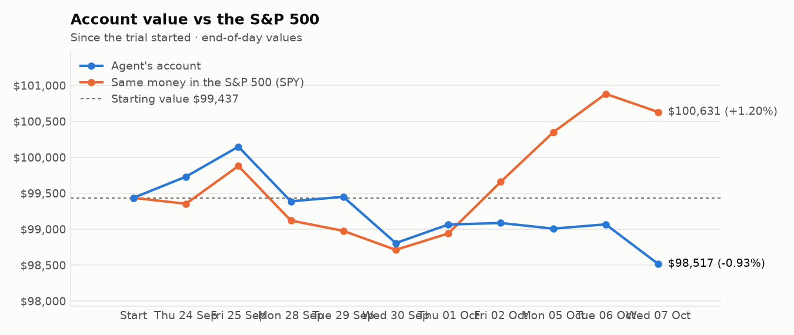
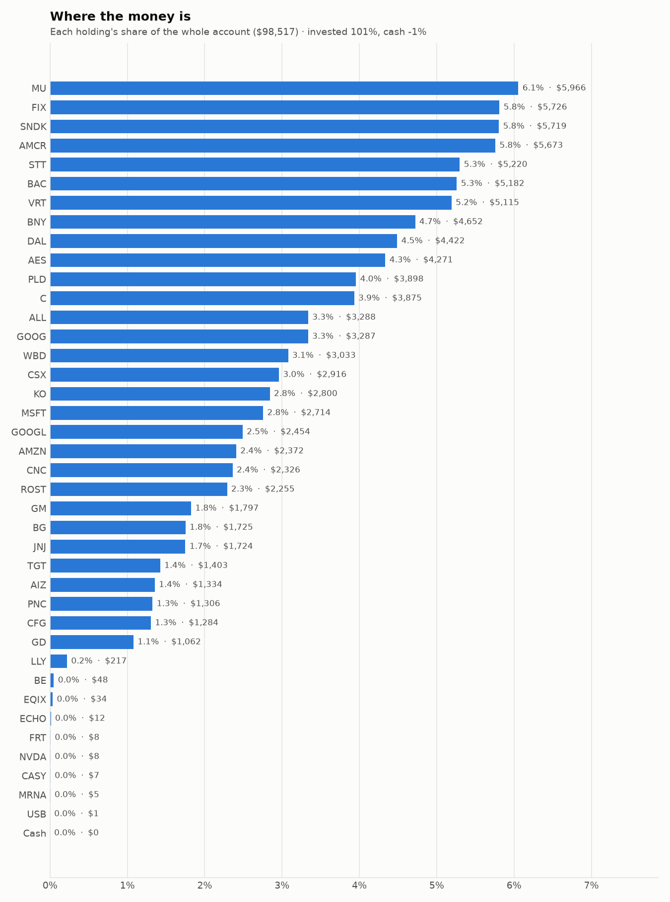
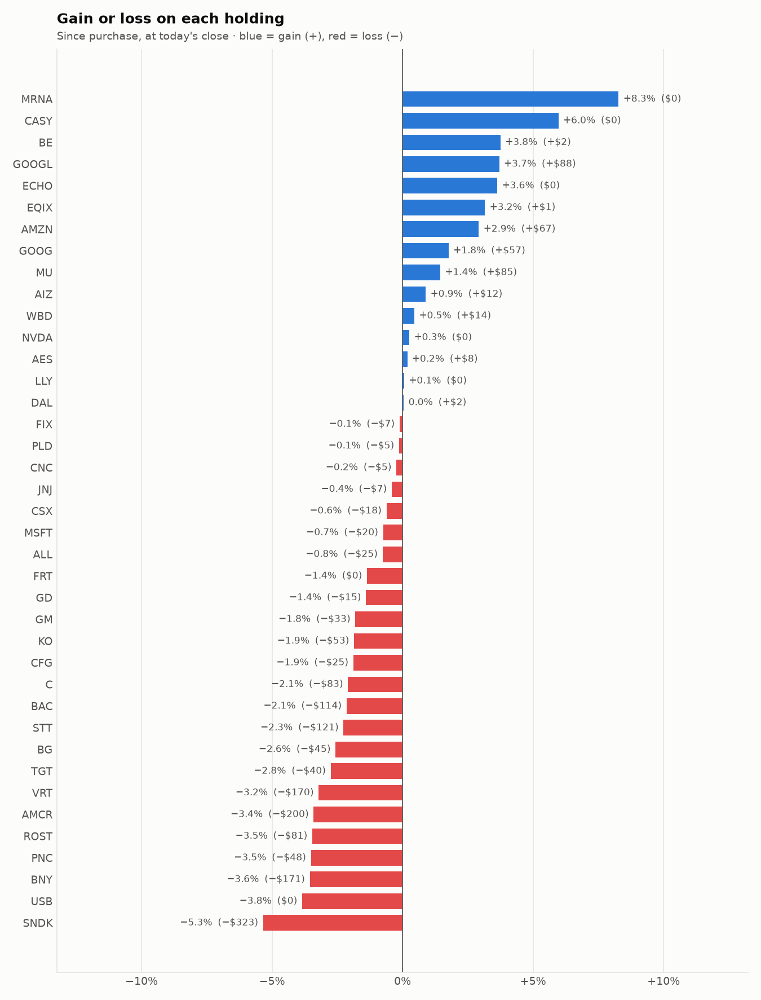

# Daily trading report — Wednesday 07 October 2026

## Summary

- **Account value:** $98,517 (-$551, -0.6% today)
- **S&P 500 (SPY) today:** -0.3% — the agent was behind the index by 0.31%
- **Trades:** 4 buy(s) ($11,144), 5 sell(s) ($10,408)
- **2026-10-07 Morning rebalance:** traded — 9 order(s) placed
- **2026-10-07 Afternoon risk check:** no trades needed — Risk-checked 39 holding(s): none was 10%+ below its purchase price, and none had both clearly negative news and a price drop of 3%+ since entry.

## Charts

## Why I bought

### PLD — bought 30.618 shares at ~$127.47 ($3,903)

**Why:** combined score +0.65; ranked #11 of 503; driven mainly by research (news + analyst consensus) +1.27, price momentum +0.96; entering/adding to the top-ranked target portfolio; research detail: 6 recent headline(s), net positive tone (+2); analyst consensus +0.87/2 (5 strong buy, 10 buy, 8 hold, 0 sell, 0 strong sell)

**Research scores** (combined +0.65, ranked #11 in the S&P 500, sector: Real Estate):

| Factor | Score | Measures |
|---|---|---|
| Value | +0.22 | cheap vs. sector peers on P/E and P/B |
| Quality | +0.31 | profitability (ROE, margins) and balance-sheet strength |
| Momentum | +0.96 | 12-month price trend, excluding the last month |
| Low volatility | +0.33 | steadier price than sector peers |
| Research | +1.27 | recent news tone + analyst consensus |

**Company financials (Finnhub, trailing 12 months):** P/E 29.5, P/B 2.4, return on equity 7.9%, gross margin 74.3%, debt/equity 0.68

**Price trend (Alpaca):** 12-month return (excl. last month) +21.9%, last month -6.3%, volatility 20.1%/yr

**News (Finnhub): 6 headline(s) in the last 2 days, net tone +2.** Most influential:
- [What is Prologis’s (PLD) Economic Moat, and is it Widening or Narrowing?](https://finnhub.io/api/news?id=850bbab5e7ff1ea3bb47c36222d503107395176c2df698b7749991418a58e3e2) — 06 Oct, Yahoo (tone +1)
- [Top Wall Street Forecasters Revamp Prologis Expectations Ahead Of Q3 Earnings](https://finnhub.io/api/news?id=6e5c9aabec32cb12f07435a095d7079bd5a13cfc8b569e6c2784359991f3f9ee) — 06 Oct, Benzinga (tone +1)
- [Form 8.3 Prologis, Inc.](https://finnhub.io/api/news?id=6fe087780f63e04e150027fbd224bc6520cdfea68bcfc41b16541d7bc2076aa7) — 07 Oct, Yahoo (tone +0)
- [Dimensional Fund Advisors Ltd. : Form 8.3 - PROLOGIS INC - Ordinary Shares](https://finnhub.io/api/news?id=98615acc8aac712590f758f9a28c102b5644b7460a86f0df1425b0b4151ca036) — 07 Oct, Yahoo (tone +0)
- [Amid the Weakness, Data Center Trade Prologis Stock Offers an Incredible Deal](https://finnhub.io/api/news?id=d7b0a3d9c20efe3d43f4c7d4335d590dd4936f2b449d1531538ddb86d2cb4b1b) — 06 Oct, Yahoo (tone +0)

**Analysts (Finnhub, 2026-09-01):** 5 strong buy, 10 buy, 8 hold, 0 sell, 0 strong sell — consensus +0.87 on a -2 (strong sell) to +2 (strong buy) scale.

### AES — bought 216.211 shares at ~$14.92 ($3,226)

**Why:** combined score +0.67; ranked #10 of 503; driven mainly by low volatility +3.00, value (cheapness) +1.69; entering/adding to the top-ranked target portfolio; research detail: analyst consensus -0.33/2 (0 strong buy, 0 buy, 13 hold, 4 sell, 1 strong sell)

**Research scores** (combined +0.67, ranked #10 in the S&P 500, sector: Utilities):

| Factor | Score | Measures |
|---|---|---|
| Value | +1.69 | cheap vs. sector peers on P/E and P/B |
| Quality | -0.79 | profitability (ROE, margins) and balance-sheet strength |
| Momentum | +1.30 | 12-month price trend, excluding the last month |
| Low volatility | +3.00 | steadier price than sector peers |
| Research | -1.45 | recent news tone + analyst consensus |

**Company financials (Finnhub, trailing 12 months):** P/E 5.7, P/B 2.1, return on equity 43.3%, gross margin 20.3%, debt/equity 6.50

**Price trend (Alpaca):** 12-month return (excl. last month) +15.5%, last month +0.9%, volatility 3.4%/yr

**News (Finnhub):** no headlines in the last 2 days.

**Analysts (Finnhub, 2026-09-01):** 0 strong buy, 0 buy, 13 hold, 4 sell, 1 strong sell — consensus -0.33 on a -2 (strong sell) to +2 (strong buy) scale.

### CNC — bought 35.369 shares at ~$65.21 ($2,306)

**Why:** combined score +0.58; ranked #19 of 503; driven mainly by price momentum +2.18, value (cheapness) +1.64; entering/adding to the top-ranked target portfolio; research detail: 4 recent headline(s), net positive tone (+4); analyst consensus +0.59/2 (5 strong buy, 7 buy, 14 hold, 1 sell, 0 strong sell)

**Research scores** (combined +0.58, ranked #19 in the S&P 500, sector: Health Care):

| Factor | Score | Measures |
|---|---|---|
| Value | +1.64 | cheap vs. sector peers on P/E and P/B |
| Quality | -0.76 | profitability (ROE, margins) and balance-sheet strength |
| Momentum | +2.18 | 12-month price trend, excluding the last month |
| Low volatility | -1.01 | steadier price than sector peers |
| Research | +0.06 | recent news tone + analyst consensus |

**Company financials (Finnhub, trailing 12 months):** P/B 1.4, return on equity -24.0%, gross margin 7.2%, debt/equity 0.71

**Price trend (Alpaca):** 12-month return (excl. last month) +134.2%, last month -3.7%, volatility 36.3%/yr

**News (Finnhub): 4 headline(s) in the last 2 days, net tone +4.** Most influential:
- [Buy 5 Growth Stocks to Boost Your Portfolio in Q4 After a Mixed Q3](https://finnhub.io/api/news?id=c1005da31cd0f3c602c9af0cac58248e16d7fe24bbaa0515d210cc9c6c61c56e) — 06 Oct, Yahoo (tone +2)
- [Are Investors Undervaluing Centene (CNC) Right Now?](https://finnhub.io/api/news?id=f502f4661cf999b4d6ab41fa00a964601362043ef3bc662a4be30ba073b146e5) — 05 Oct, Yahoo (tone +2)
- [Ambetter Health Solutions and Marathon Health Expand Access to Primary Care for Members in Indiana and Missouri](https://finnhub.io/api/news?id=9758ff544c747c0479fc8c6b037f69bdd04040060d3b7a672ae04acd250c44bb) — 07 Oct, Yahoo (tone +0)
- [Centene Narrows Medicare Advantage Footprint as Costs Remain Elevated](https://finnhub.io/api/news?id=250795b088b35ed1b82bfdb6b49d9d54ec1117504f6d0546c96de0ab5b934acd) — 06 Oct, Yahoo (tone +0)

**Analysts (Finnhub, 2026-09-01):** 5 strong buy, 7 buy, 14 hold, 1 sell, 0 strong sell — consensus +0.59 on a -2 (strong sell) to +2 (strong buy) scale.

### JNJ — bought 6.581 shares at ~$259.67 ($1,709)

**Why:** combined score +0.55; ranked #23 of 503; driven mainly by low volatility +2.03, research (news + analyst consensus) +0.79; entering/adding to the top-ranked target portfolio; research detail: 12 recent headline(s), net positive tone (+4); analyst consensus +0.94/2 (7 strong buy, 15 buy, 9 hold, 0 sell, 0 strong sell)

**Research scores** (combined +0.55, ranked #23 in the S&P 500, sector: Health Care):

| Factor | Score | Measures |
|---|---|---|
| Value | -0.56 | cheap vs. sector peers on P/E and P/B |
| Quality | +0.33 | profitability (ROE, margins) and balance-sheet strength |
| Momentum | +0.55 | 12-month price trend, excluding the last month |
| Low volatility | +2.03 | steadier price than sector peers |
| Research | +0.79 | recent news tone + analyst consensus |

**Company financials (FMP, trailing 12 months):** P/E 30.0, P/B 7.5, return on equity 25.7%, gross margin 67.9%, debt/equity 0.58

**Price trend (Alpaca):** 12-month return (excl. last month) +54.0%, last month -7.4%, volatility 20.4%/yr

**News (Finnhub): 12 headline(s) in the last 2 days, net tone +4.** Most influential:
- [RBC Capital Maintains Outperform on Johnson & Johnson, Raises Price Target to $290](https://finnhub.io/api/news?id=efd1b6bf312f07f06327bd3942229843cb39220f7eaa7f7738c506c9ab3f3951) — 06 Oct, Benzinga (tone +2)
- [Johnson & Johnson (JNJ) Earnings Expected to Grow: Should You Buy?](https://finnhub.io/api/news?id=a3f8a87f2247a10637941042e5271f6a24617c3f3a272b6c8b7b459dd7c40c30) — 06 Oct, Yahoo (tone +1)
- [Looking for a Dividend Stock That Can Weather a Downturn? Start With Johnson & Johnson.](https://finnhub.io/api/news?id=f43a06ff48ede3b7971a5089f0740a9c10e64111694d61759a09b43a5a2aae64) — 05 Oct, Yahoo (tone +1)
- [How ICOTYDE’s Long-Term Psoriasis Data At Johnson & Johnson (JNJ) Has Changed Its Investment Story](https://finnhub.io/api/news?id=552f908d437d3fb1b959e7c642199c5f1b56fb5d2cb5296ceb2cba2e6bc6ca4e) — 07 Oct, Yahoo (tone +0)
- [Jim Cramer Has Soured on Intuitive Surgical (ISRG). The Reason is Johnson & Johnson](https://finnhub.io/api/news?id=bdf8418f87165d23312194e0e17076b00a74df9674e630b0287ab8ee4385bf67) — 06 Oct, Yahoo (tone +0)

**Analysts (Finnhub, 2026-09-01):** 7 strong buy, 15 buy, 9 hold, 0 sell, 0 strong sell — consensus +0.94 on a -2 (strong sell) to +2 (strong buy) scale.

## Why I sold

### KO — sold 34.487 shares at ~$86.30 ($2,976)

**Why:** combined score +0.60; ranked #15 of 503; driven mainly by low volatility +1.52, price momentum +1.06; trimmed toward target weight, or dropped out of the top-ranked names; research detail: 12 recent headline(s), net positive tone (+2); analyst consensus +1.00/2 (8 strong buy, 19 buy, 8 hold, 0 sell, 0 strong sell)

**Research scores** (combined +0.60, ranked #15 in the S&P 500, sector: Consumer Staples):

| Factor | Score | Measures |
|---|---|---|
| Value | -0.65 | cheap vs. sector peers on P/E and P/B |
| Quality | +0.43 | profitability (ROE, margins) and balance-sheet strength |
| Momentum | +1.06 | 12-month price trend, excluding the last month |
| Low volatility | +1.52 | steadier price than sector peers |
| Research | +0.78 | recent news tone + analyst consensus |

**Company financials (Finnhub, trailing 12 months):** P/E 26.0, P/B 10.0, return on equity 43.0%, gross margin 61.9%, debt/equity 1.20

**Price trend (Alpaca):** 12-month return (excl. last month) +29.0%, last month -2.1%, volatility 20.2%/yr

**News (Finnhub): 12 headline(s) in the last 2 days, net tone +2.** Most influential:
- [Want Income for Life? Coca-Cola Has Raised Its Dividend for 64 Straight Years and Yields 2.5%. Here's Whether It Belongs in Your Portfolio.](https://finnhub.io/api/news?id=f385d344e2232630a84564990dde463a13e6bcc9d769ba01ed61f5da2891518c) — 05 Oct, Yahoo (tone +1)
- [Can Coca-Cola's Balanced Growth Strategy Sustain Momentum?](https://finnhub.io/api/news?id=c38bec15c7ffd287dac2fcbb52ebd0e0695f674a5cb7f0d4ccad1417219ab445) — 05 Oct, Yahoo (tone +1)
- [Better Dividend Stock: Coca-Cola vs. Realty Income](https://finnhub.io/api/news?id=a6f3e547caa1868cb14e66f4e04ef31e715725ecd80b8560d0c13229c02f17c3) — 06 Oct, Yahoo (tone +0)
- [Coca-Cola refreshes soda lineup amid GLP-1 consumer shift](https://finnhub.io/api/news?id=8a5e4ee60c236a916de2acb83619c27a85e9016b2aae45b018ab0e66b187947a) — 06 Oct, Yahoo (tone +0)
- [Jim Cramer Finds More Than a Stock Price Gap Between PepsiCo (PEP) and Coca-Cola (KO)](https://finnhub.io/api/news?id=1df8439e5f9b77a9e9662532aafe1ce85f8a7fe3461d15a0fbf8c53ca183c848) — 06 Oct, Yahoo (tone +0)

**Analysts (Finnhub, 2026-09-01):** 8 strong buy, 19 buy, 8 hold, 0 sell, 0 strong sell — consensus +1.00 on a -2 (strong sell) to +2 (strong buy) scale.

### CFG — sold 35.177 shares at ~$63.11 ($2,220)

**Why:** combined score +0.54; ranked #27 of 503; driven mainly by price momentum +1.18, value (cheapness) +0.91; trimmed toward target weight, or dropped out of the top-ranked names; research detail: 2 recent headline(s), neutral/mixed tone; analyst consensus +1.04/2 (5 strong buy, 14 buy, 4 hold, 0 sell, 0 strong sell)

**Research scores** (combined +0.54, ranked #27 in the S&P 500, sector: Financials):

| Factor | Score | Measures |
|---|---|---|
| Value | +0.91 | cheap vs. sector peers on P/E and P/B |
| Quality | -0.09 | profitability (ROE, margins) and balance-sheet strength |
| Momentum | +1.18 | 12-month price trend, excluding the last month |
| Low volatility | +0.40 | steadier price than sector peers |
| Research | +0.09 | recent news tone + analyst consensus |

**Company financials (Finnhub, trailing 12 months):** P/E 12.7, P/B 1.1, return on equity 8.1%, debt/equity 0.40

**Price trend (Alpaca):** 12-month return (excl. last month) +34.7%, last month -9.4%, volatility 23.4%/yr

**News (Finnhub): 2 headline(s) in the last 2 days, net tone +0.** Most influential:
- [Citizens Financial Group (CFG) Stock Fair Value Edges Lower After Mixed Analyst Revisions](https://finnhub.io/api/news?id=e5c8c794eac2ef937d66703252d7ffd280001f791ebbd9b1650c8c2df7d14f1b) — 07 Oct, Yahoo (tone +0)
- [Citizens Financial Group to Participate at the BancAnalysts Association of Boston Conference](https://finnhub.io/api/news?id=6f69e7b7f273f3e7c22cd00d1db8e950c8293ebeebc399004cac726fe71872b1) — 06 Oct, Yahoo (tone +0)

**Analysts (Finnhub, 2026-09-01):** 5 strong buy, 14 buy, 4 hold, 0 sell, 0 strong sell — consensus +1.04 on a -2 (strong sell) to +2 (strong buy) scale.

### LLY — sold 1.53 shares at ~$1,178.51 ($1,803)

**Why:** combined score +0.48; ranked #30 of 503; driven mainly by research (news + analyst consensus) +1.88, value (cheapness) -1.01; trimmed toward target weight, or dropped out of the top-ranked names; research detail: 28 recent headline(s), net positive tone (+8); analyst consensus +1.05/2 (11 strong buy, 19 buy, 7 hold, 1 sell, 0 strong sell)

**Research scores** (combined +0.48, ranked #30 in the S&P 500, sector: Health Care):

| Factor | Score | Measures |
|---|---|---|
| Value | -1.01 | cheap vs. sector peers on P/E and P/B |
| Quality | +0.89 | profitability (ROE, margins) and balance-sheet strength |
| Momentum | +0.56 | 12-month price trend, excluding the last month |
| Low volatility | -0.06 | steadier price than sector peers |
| Research | +1.88 | recent news tone + analyst consensus |

**Company financials (Finnhub, trailing 12 months):** P/E 41.1, P/B 33.3, return on equity 92.6%, gross margin 83.4%, debt/equity 1.62

**Price trend (Alpaca):** 12-month return (excl. last month) +54.6%, last month +0.8%, volatility 29.0%/yr

**News (Finnhub): 28 headline(s) in the last 2 days, net tone +8.** Most influential:
- [Eli Lilly: Quiet Momentum Builds Into Q3 Earnings, But Watch The Chart Too](https://finnhub.io/api/news?id=190e99491d9c001e5a6a9336f8f1c3fbd70d81850269f92b92c0159a6681be6d) — 06 Oct, SeekingAlpha (tone +1)
- [Prediction: LLY Has Another Massive Growth Opportunity Beyond Weight Loss](https://finnhub.io/api/news?id=fe6ae46865f769881e764e4a73b5137cf3558be8ed757aff7630c27023576092) — 06 Oct, Yahoo (tone +1)
- [General Medicine Raises $120 Million to Build the Healthcare Store](https://finnhub.io/api/news?id=8cdfc347f5b893e46403fea35b187a84a2efcb7c97941d8dad673bdfeff33b04) — 06 Oct, Yahoo (tone +1)
- [Foundayo Showed Better Results Than Oral Semaglutide in a New Analysis. There’s a Catch Investors Shouldn’t Miss](https://finnhub.io/api/news?id=c34aba51bbbd518ce7c460e1406dd9ca047f47cc6d58114f8c54a688a231dff4) — 06 Oct, Yahoo (tone -1)
- [Lilly deepens ties with Gate Bioscience in $870m deal expansion](https://finnhub.io/api/news?id=9a5b9370926522adcb5b68b8fd17f38791f9dff7665b383a11f3105e9068491d) — 06 Oct, Yahoo (tone +1)

**Analysts (Finnhub, 2026-09-01):** 11 strong buy, 19 buy, 7 hold, 1 sell, 0 strong sell — consensus +1.05 on a -2 (strong sell) to +2 (strong buy) scale.

### CSX — sold 36.707 shares at ~$47.05 ($1,727)

**Why:** combined score +0.61; ranked #14 of 503; driven mainly by low volatility +1.32, price momentum +0.94; trimmed toward target weight, or dropped out of the top-ranked names; research detail: 2 recent headline(s), net positive tone (+1); analyst consensus +0.90/2 (7 strong buy, 14 buy, 8 hold, 1 sell, 0 strong sell)

**Research scores** (combined +0.61, ranked #14 in the S&P 500, sector: Industrials):

| Factor | Score | Measures |
|---|---|---|
| Value | +0.19 | cheap vs. sector peers on P/E and P/B |
| Quality | +0.60 | profitability (ROE, margins) and balance-sheet strength |
| Momentum | +0.94 | 12-month price trend, excluding the last month |
| Low volatility | +1.32 | steadier price than sector peers |
| Research | +0.09 | recent news tone + analyst consensus |

**Company financials (Finnhub, trailing 12 months):** P/E 27.3, P/B 6.3, return on equity 24.1%, gross margin 71.5%, debt/equity 1.34

**Price trend (Alpaca):** 12-month return (excl. last month) +51.3%, last month -3.8%, volatility 21.8%/yr

**News (Finnhub): 2 headline(s) in the last 2 days, net tone +1.** Most influential:
- [CSX Corporation: Still Not Willing To Climb Aboard](https://finnhub.io/api/news?id=a121fd5896eda0a86b4947fb3fd804d7c34b265e373c4f585225eb374c42fcf4) — 06 Oct, SeekingAlpha (tone +1)
- [JP Morgan Maintains Overweight on CSX, Lowers Price Target to $57](https://finnhub.io/api/news?id=dd596c18cde4e856ff43dae29e6a401b8c30962fff76c060925a27408726d229) — 05 Oct, Benzinga (tone +0)

**Analysts (Finnhub, 2026-09-01):** 7 strong buy, 14 buy, 8 hold, 1 sell, 0 strong sell — consensus +0.90 on a -2 (strong sell) to +2 (strong buy) scale.

### TGT — sold 10.935 shares at ~$153.77 ($1,681)

**Why:** combined score +0.54; ranked #26 of 503; driven mainly by price momentum +2.77, research (news + analyst consensus) -0.65; trimmed toward target weight, or dropped out of the top-ranked names; research detail: 12 recent headline(s), net negative tone (-1); analyst consensus +0.44/2 (7 strong buy, 8 buy, 25 hold, 3 sell, 0 strong sell)

**Research scores** (combined +0.54, ranked #26 in the S&P 500, sector: Consumer Staples):

| Factor | Score | Measures |
|---|---|---|
| Value | +0.31 | cheap vs. sector peers on P/E and P/B |
| Quality | -0.13 | profitability (ROE, margins) and balance-sheet strength |
| Momentum | +2.77 | 12-month price trend, excluding the last month |
| Low volatility | -0.39 | steadier price than sector peers |
| Research | -0.65 | recent news tone + analyst consensus |

**Company financials (FMP, trailing 12 months):** P/E 15.9, P/B 3.9, return on equity 26.7%, gross margin 29.3%, debt/equity 1.05

**Price trend (Alpaca):** 12-month return (excl. last month) +77.3%, last month -6.1%, volatility 27.7%/yr

**News (Finnhub): 12 headline(s) in the last 2 days, net tone -1.** Most influential:
- [Target’s Sales Are Recovering After 10,000+ Price Cuts. Is the Turnaround Already Priced In?](https://finnhub.io/api/news?id=f1856cdeb33a6465729d98ecf16cf77cc195ed580c6a253f690724f8c75b9244) — 06 Oct, Yahoo (tone -1)
- [Beloved Home Brand Simply Shabby Chic Returns to Target](https://finnhub.io/api/news?id=7c53941857bac210f1199b5aa59d48f3529edea99e5694b926c96f23bcfda3a8) — 06 Oct, Yahoo (tone +0)
- [Nexus Advanced Technologies Signs Confidential Exclusivity for Proposed $500 Million Reverse Merger](https://finnhub.io/api/news?id=e923d1a35cdccf075fd1daaaa3ce3b877b5aa7d75a99ebff591123b3f21e4716) — 06 Oct, Yahoo (tone +0)
- [Target’s turnaround has seen early success. Now comes the holidays.](https://finnhub.io/api/news?id=c53a67e90005a2cb65d9c7b8eaa157b6b1f1dc0147dfd3cc123079d39d3e9816) — 06 Oct, Yahoo (tone +0)
- [Target Has a Growing Dividend and an Improving Business. Is the Stock a Bargain?](https://finnhub.io/api/news?id=cef72767c013ae03ca764ed20d129c7aad1687e33601d1d11025101d2e5de39b) — 05 Oct, Yahoo (tone +0)

**Analysts (Finnhub, 2026-09-01):** 7 strong buy, 8 buy, 25 hold, 3 sell, 0 strong sell — consensus +0.44 on a -2 (strong sell) to +2 (strong buy) scale.

## Holdings at the close

| Stock | Shares | Avg cost | Price | Market value | % of account | Today | Gain/loss $ | Gain/loss % |
|---|---:|---:|---:|---:|---:|---:|---:|---:|
| MU | 5.491 | $1,070.99 | $1,086.50 | $5,966 | 6.1% | +3.92% | +$85 | +1.45% |
| FIX | 3.307 | $1,733.36 | $1,731.38 | $5,726 | 5.8% | -4.76% | −$7 | -0.11% |
| SNDK | 3.38 | $1,787.39 | $1,691.90 | $5,719 | 5.8% | +1.89% | −$323 | -5.34% |
| AMCR | 137.493 | $42.71 | $41.26 | $5,673 | 5.8% | -1.22% | −$200 | -3.41% |
| STT | 29.965 | $178.22 | $174.19 | $5,220 | 5.3% | -0.89% | −$121 | -2.26% |
| BAC | 96.851 | $54.68 | $53.50 | $5,182 | 5.3% | -1.08% | −$114 | -2.14% |
| VRT | 20.76 | $254.58 | $246.40 | $5,115 | 5.2% | -2.66% | −$170 | -3.21% |
| BNY | 32.596 | $147.98 | $142.72 | $4,652 | 4.7% | -0.70% | −$171 | -3.55% |
| DAL | 53 | $83.40 | $83.44 | $4,422 | 4.5% | -0.26% | +$2 | +0.05% |
| AES | 286.093 | $14.90 | $14.93 | $4,271 | 4.3% | +0.00% | +$8 | +0.18% |
| PLD | 30.618 | $127.47 | $127.30 | $3,898 | 4.0% | -1.07% | −$5 | -0.13% |
| C | 30.438 | $130.04 | $127.32 | $3,875 | 3.9% | -0.93% | −$83 | -2.09% |
| ALL | 14.68 | $225.68 | $223.95 | $3,288 | 3.3% | -0.14% | −$25 | -0.77% |
| GOOG | 9.472 | $340.99 | $347.01 | $3,287 | 3.3% | +0.70% | +$57 | +1.76% |
| WBD | 98 | $30.81 | $30.95 | $3,033 | 3.1% | +0.00% | +$14 | +0.45% |
| CSX | 62.293 | $47.10 | $46.81 | $2,916 | 3.0% | -1.45% | −$18 | -0.62% |
| KO | 32.605 | $87.50 | $85.87 | $2,800 | 2.8% | -0.35% | −$53 | -1.86% |
| MSFT | 5.124 | $533.74 | $529.76 | $2,714 | 2.8% | +0.09% | −$20 | -0.75% |
| GOOGL | 7 | $337.98 | $350.50 | $2,454 | 2.5% | +0.81% | +$88 | +3.70% |
| AMZN | 9.124 | $252.59 | $259.97 | $2,372 | 2.4% | +1.44% | +$67 | +2.92% |
| CNC | 35.795 | $65.14 | $64.99 | $2,326 | 2.4% | +0.59% | −$5 | -0.24% |
| ROST | 10 | $233.61 | $225.53 | $2,255 | 2.3% | +0.59% | −$81 | -3.46% |
| GM | 22.211 | $82.40 | $80.91 | $1,797 | 1.8% | -1.34% | −$33 | -1.81% |
| BG | 16.346 | $108.29 | $105.51 | $1,725 | 1.8% | -1.70% | −$45 | -2.57% |
| JNJ | 6.664 | $259.78 | $258.70 | $1,724 | 1.7% | +1.54% | −$7 | -0.41% |
| TGT | 9.278 | $155.48 | $151.20 | $1,403 | 1.4% | -2.03% | −$40 | -2.75% |
| AIZ | 5 | $264.38 | $266.73 | $1,334 | 1.4% | -1.56% | +$12 | +0.89% |
| PNC | 6 | $225.64 | $217.72 | $1,306 | 1.3% | -1.11% | −$48 | -3.51% |
| CFG | 20.32 | $64.42 | $63.20 | $1,284 | 1.3% | -1.39% | −$25 | -1.89% |
| GD | 3.251 | $331.27 | $326.63 | $1,062 | 1.1% | -1.42% | −$15 | -1.40% |
| LLY | 0.182 | $1,189.78 | $1,190.51 | $217 | 0.2% | +2.85% | +$0 | +0.06% |
| BE | 0.166 | $279.83 | $290.33 | $48 | 0.0% | -1.84% | +$2 | +3.75% |
| EQIX | 0.033 | $1,000.20 | $1,031.77 | $34 | 0.0% | -1.49% | +$1 | +3.16% |
| ECHO | 0.116 | $95.87 | $99.35 | $12 | 0.0% | -0.66% | +$0 | +3.63% |
| FRT | 0.078 | $106.56 | $105.11 | $8 | 0.0% | -1.03% | −$0 | -1.36% |
| NVDA | 0.032 | $236.88 | $237.50 | $8 | 0.0% | -0.73% | +$0 | +0.26% |
| CASY | 0.011 | $597.62 | $633.31 | $7 | 0.0% | +2.02% | +$0 | +5.97% |
| MRNA | 0.028 | $181.06 | $196.05 | $5 | 0.0% | +4.58% | +$0 | +8.28% |
| USB | 0.016 | $58.50 | $56.25 | $1 | 0.0% | -1.82% | −$0 | -3.85% |
| **Invested** | | | | **$99,138** | **100.6%** | | **−$1,272** | |
| **Cash** | | | | $-621 | -0.6% | | | |
| **Total account** | | | | **$98,517** | 100% | | | |

_Scores are sector-neutral z-scores: 0 is average for the stock's sector, +1 is one standard deviation better. News tone is a keyword count over recent headlines, not a deep read. None of this guarantees a stock will rise; a few days of results can't show whether the strategy has a real edge over the S&P 500._
