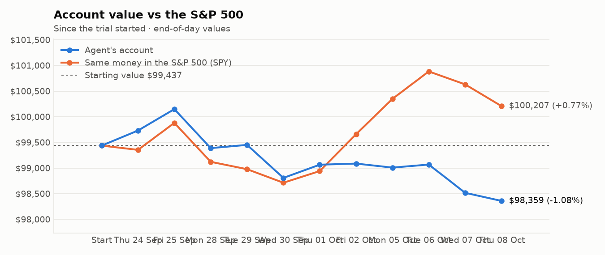
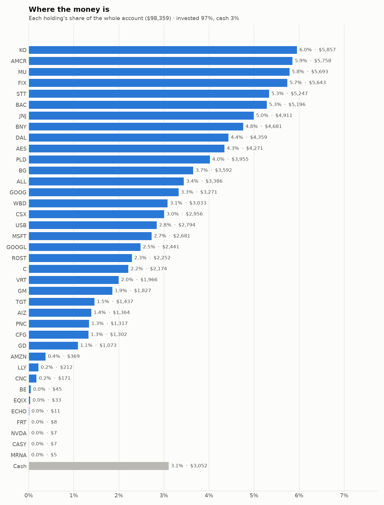
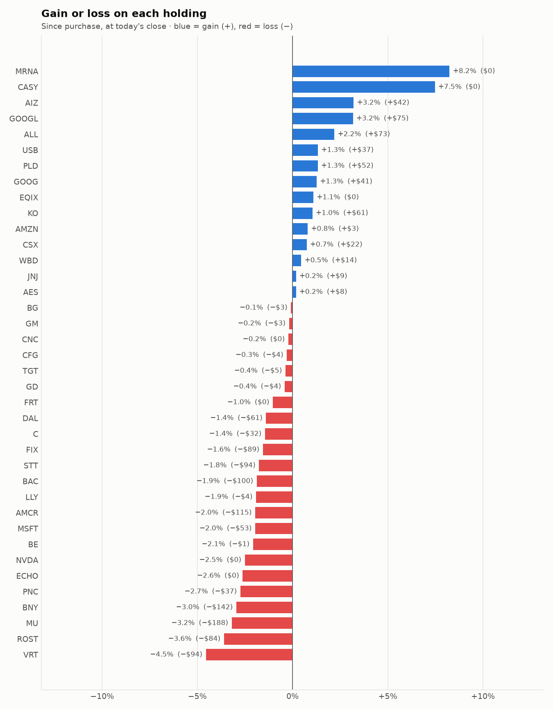

# Daily trading report — Thursday 08 October 2026

## Summary

- **Account value:** $98,359 (-$158, -0.2% today)
- **S&P 500 (SPY) today:** -0.4% — the agent was ahead of the index by 0.26%
- **Trades:** 4 buy(s) ($10,711), 5 sell(s) ($14,385)
- **2026-10-08 Morning rebalance:** traded — 8 order(s) placed
- **2026-10-08 Afternoon risk check:** traded — Sold 1 position(s) on the risk check (stop-loss: SNDK)

## Charts

## Why I bought

### JNJ — bought 12.484 shares at ~$254.00 ($3,171)

**Why:** combined score +0.69; ranked #8 of 503; driven mainly by low volatility +2.02, research (news + analyst consensus) +1.39; entering/adding to the top-ranked target portfolio; research detail: 16 recent headline(s), net positive tone (+7); analyst consensus +0.94/2 (7 strong buy, 15 buy, 9 hold, 0 sell, 0 strong sell)

**Research scores** (combined +0.69, ranked #8 in the S&P 500, sector: Health Care):

| Factor | Score | Measures |
|---|---|---|
| Value | -0.54 | cheap vs. sector peers on P/E and P/B |
| Quality | +0.33 | profitability (ROE, margins) and balance-sheet strength |
| Momentum | +0.61 | 12-month price trend, excluding the last month |
| Low volatility | +2.02 | steadier price than sector peers |
| Research | +1.39 | recent news tone + analyst consensus |

**Company financials (FMP, trailing 12 months):** P/E 29.4, P/B 7.3, return on equity 25.7%, gross margin 67.9%, debt/equity 0.58

**Price trend (Alpaca):** 12-month return (excl. last month) +50.9%, last month -4.0%, volatility 20.3%/yr

**News (Finnhub): 16 headline(s) in the last 2 days, net tone +7.** Most influential:
- [Johnson & Johnson (JNJ) Is Becoming a Growth Stock. Does AbbVie (ABBV) Make JNJ Look Expensive?](https://finnhub.io/api/news?id=77193bfeaac80c353a6ddb698c75fbb72f6b84e78e74bbbfa5d41b7083d85a41) — 07 Oct, Yahoo (tone +2)
- [RBC Capital Maintains Outperform on Johnson & Johnson, Raises Price Target to $290](https://finnhub.io/api/news?id=efd1b6bf312f07f06327bd3942229843cb39220f7eaa7f7738c506c9ab3f3951) — 06 Oct, Benzinga (tone +2)
- [Pfizer (PFE) Trades Below 10x Earnings. Why Does Johnson & Johnson (JNJ) Command More Than Twice the Multiple?](https://finnhub.io/api/news?id=904768d4646b4c625a90536c16f161ffc15968ceead861754922be31faa62b51) — 07 Oct, Yahoo (tone +1)
- [Johnson & Johnson Has Dividend Royalty Status. Does That Make It a Buy?](https://finnhub.io/api/news?id=0cb0291528fabe296f8b55180027c24a21f169e5f2f4c1c38d3f4f06a13e3aea) — 07 Oct, Yahoo (tone +1)
- [Johnson & Johnson (JNJ) Earnings Expected to Grow: Should You Buy?](https://finnhub.io/api/news?id=a3f8a87f2247a10637941042e5271f6a24617c3f3a272b6c8b7b459dd7c40c30) — 06 Oct, Yahoo (tone +1)

**Analysts (Finnhub, 2026-09-01):** 7 strong buy, 15 buy, 9 hold, 0 sell, 0 strong sell — consensus +0.94 on a -2 (strong sell) to +2 (strong buy) scale.

### KO — bought 34.131 shares at ~$86.72 ($2,960)

**Why:** combined score +0.78; ranked #4 of 503; driven mainly by research (news + analyst consensus) +1.54, low volatility +1.46; entering/adding to the top-ranked target portfolio; research detail: 12 recent headline(s), net positive tone (+12); analyst consensus +1.00/2 (8 strong buy, 19 buy, 8 hold, 0 sell, 0 strong sell)

**Research scores** (combined +0.78, ranked #4 in the S&P 500, sector: Consumer Staples):

| Factor | Score | Measures |
|---|---|---|
| Value | -0.65 | cheap vs. sector peers on P/E and P/B |
| Quality | +0.43 | profitability (ROE, margins) and balance-sheet strength |
| Momentum | +1.20 | 12-month price trend, excluding the last month |
| Low volatility | +1.46 | steadier price than sector peers |
| Research | +1.54 | recent news tone + analyst consensus |

**Company financials (Finnhub, trailing 12 months):** P/E 26.1, P/B 10.0, return on equity 43.0%, gross margin 61.9%, debt/equity 1.20

**Price trend (Alpaca):** 12-month return (excl. last month) +30.1%, last month -3.0%, volatility 20.0%/yr

**News (Finnhub): 12 headline(s) in the last 2 days, net tone +12.** Most influential:
- [Is Coca-Cola’s Safety Premium Getting Too Expensive?](https://finnhub.io/api/news?id=b67b7a971284f5b87d8dbc89482ebb3c57770e18f38ac83eef4ce28ccc92ddb0) — 08 Oct, Yahoo (tone +4)
- [Coca-Cola (KO) Raises Its Outlook, Is The Stock Still Undervalued?](https://finnhub.io/api/news?id=622d05a3ecfd1dc4b8d583b8da47da60cf05a8beec9310a252ed84062d97143b) — 07 Oct, Yahoo (tone +4)
- [Coca-Cola vs. Monster Beverage: Which Consumer Goods Stock Is a Better Buy in 2026?](https://finnhub.io/api/news?id=df2becee913f29096dc09204588c8d55cdb178cbac142a91d0c4048ce00b054a) — 07 Oct, Yahoo (tone +2)
- [The Coca-Cola Company: Is the Premium Valuation Still Justified?](https://finnhub.io/api/news?id=aa375d76b5ace61fe9e736c453bc5bdf4b54a7abf15c27186e33cdfea5676cdd) — 08 Oct, Yahoo (tone +1)
- [Coca-Cola: Reiterating 'Sell' Amid Insider Selling And Steep Valuation (Q3 Earnings Preview)](https://finnhub.io/api/news?id=6cc0be9004f9e0988f10663245a1f1468c8ae3705bfc4b530eed4542cec1b8dd) — 08 Oct, SeekingAlpha (tone +1)

**Analysts (Finnhub, 2026-09-01):** 8 strong buy, 19 buy, 8 hold, 0 sell, 0 strong sell — consensus +1.00 on a -2 (strong sell) to +2 (strong buy) scale.

### USB — bought 49.023 shares at ~$56.22 ($2,756)

**Why:** combined score +0.61; ranked #17 of 503; driven mainly by price momentum +0.85, low volatility +0.82; entering/adding to the top-ranked target portfolio; research detail: 5 recent headline(s), net positive tone (+4); analyst consensus +0.78/2 (6 strong buy, 10 buy, 10 hold, 1 sell, 0 strong sell)

**Research scores** (combined +0.61, ranked #17 in the S&P 500, sector: Financials):

| Factor | Score | Measures |
|---|---|---|
| Value | +0.78 | cheap vs. sector peers on P/E and P/B |
| Quality | -0.12 | profitability (ROE, margins) and balance-sheet strength |
| Momentum | +0.85 | 12-month price trend, excluding the last month |
| Low volatility | +0.82 | steadier price than sector peers |
| Research | +0.70 | recent news tone + analyst consensus |

**Company financials (Finnhub, trailing 12 months):** P/E 10.7, P/B 1.4, return on equity 12.5%, debt/equity 1.42

**Price trend (Alpaca):** 12-month return (excl. last month) +28.0%, last month -10.2%, volatility 19.0%/yr

**News (Finnhub): 5 headline(s) in the last 2 days, net tone +4.** Most influential:
- [Why U.S. Bancorp (USB) is Poised to Beat Earnings Estimates Again](https://finnhub.io/api/news?id=0a0ec08a00bb2108472212f2d23beda8955f2d767074ec8d462ba038595b2d34) — 07 Oct, Yahoo (tone +1)
- [Better Dividend Stock: U.S. Bancorp vs. Truist](https://finnhub.io/api/news?id=d196cd039f9b14a505596ff4e29cbe0afb05669e09ab47d9e9e537c64768a0aa) — 06 Oct, Yahoo (tone +1)
- [Truist Financial Has One Big Question Hanging Over Its Dividend](https://finnhub.io/api/news?id=5b675e74d85fc38e3eed3e986766058679da07da8c2c5b99dcf6af9cf97843ee) — 06 Oct, Yahoo (tone +1)
- [Raymond James Maintains Strong Buy on U.S. Bancorp, Lowers Price Target to $72](https://finnhub.io/api/news?id=ae3b1239832634a302ca3e290d750c150df7080f6d55c9c987fb04620925fb2c) — 06 Oct, Benzinga (tone +1)
- [U.S. Bancorp Likely To Report Higher Q3 Earnings; These Most Accurate Analysts Revise Forecasts Ahead Of Earnings Call](https://finnhub.io/api/news?id=8676b6d0f1ad67b594f0414517784f94611ee95edfed571d9bd1497212940c47) — 06 Oct, Benzinga (tone +0)

**Analysts (Finnhub, 2026-09-01):** 6 strong buy, 10 buy, 10 hold, 1 sell, 0 strong sell — consensus +0.78 on a -2 (strong sell) to +2 (strong buy) scale.

### BG — bought 16.966 shares at ~$107.54 ($1,825)

**Why:** combined score +0.63; ranked #13 of 503; driven mainly by price momentum +1.93, value (cheapness) +1.08; entering/adding to the top-ranked target portfolio; research detail: analyst consensus +1.15/2 (5 strong buy, 13 buy, 2 hold, 0 sell, 0 strong sell)

**Research scores** (combined +0.63, ranked #13 in the S&P 500, sector: Consumer Staples):

| Factor | Score | Measures |
|---|---|---|
| Value | +1.08 | cheap vs. sector peers on P/E and P/B |
| Quality | -0.57 | profitability (ROE, margins) and balance-sheet strength |
| Momentum | +1.93 | 12-month price trend, excluding the last month |
| Low volatility | -0.35 | steadier price than sector peers |
| Research | +0.48 | recent news tone + analyst consensus |

**Company financials (Finnhub, trailing 12 months):** P/E 20.1, P/B 1.3, return on equity 6.3%, gross margin 4.9%, debt/equity 0.96

**Price trend (Alpaca):** 12-month return (excl. last month) +46.9%, last month -14.8%, volatility 33.5%/yr

**News (Finnhub):** no headlines in the last 2 days.

**Analysts (Finnhub, 2026-09-01):** 5 strong buy, 13 buy, 2 hold, 0 sell, 0 strong sell — consensus +1.15 on a -2 (strong sell) to +2 (strong buy) scale.

## Why I sold

### SNDK — sold 3.38 shares at ~$1,600.51 ($5,410)

**Why:** stop-loss: -10.4% below the average purchase price of $1,787.39 (limit -10%); sold the whole position and won't buy it back for 7 days

**What triggered it:** the afternoon risk check trims a holding only when BOTH its recent news turns clearly negative AND its price is down 3%+ since purchase (it was -10.4%).

**News (Finnhub): 25 headline(s) in the last 2 days, net tone +11.** Most influential:
- [INTC, AMD, MU, SNDK, SOXX: Chips, Memory Stocks Slip Premarket After Sharp October Rally](https://finnhub.io/api/news?id=aa475f9363e423a2f98742f7531b2d0eb385a9a9efddf15069bd64880d0c5bd8) — 06 Oct, Yahoo (tone +2)
- [Mizuho Maintains Outperform on SanDisk, Raises Price Target to $2050](https://finnhub.io/api/news?id=6c9b662d29ffd6d29e90438a0ecc4cadfb425896c5e77ea53a953f5724d4f6ca) — 06 Oct, Benzinga (tone +2)
- [Lynx sees AI semiconductor rally extending into year-end](https://finnhub.io/api/news?id=7d8a647244720a3db0e9a18cb56cfd03494f98387b41e2784a6893b75aa4c0cd) — 08 Oct, Yahoo (tone +1)
- [Sandisk (SNDK) Is Up 1,322% in a Year: Is There Still Room to Run?](https://finnhub.io/api/news?id=8fa50b510a069b3615823b6069c97b7eec9bf3a77b11d5fde2c33ab2cd46c49b) — 08 Oct, Yahoo (tone +1)
- [Samsung’s Profit Just Rose Nearly Ninefold on Memory Chips](https://finnhub.io/api/news?id=367d40328fa35f847977b5526d799a4014ed2bf45573c7545ecd5eefc017a74c) — 08 Oct, Yahoo (tone +1)

### VRT — sold 12.671 shares at ~$249.10 ($3,156)

**Why:** combined score +0.54; ranked #24 of 503; driven mainly by price momentum +3.00, low volatility -1.75; trimmed toward target weight, or dropped out of the top-ranked names; research detail: 11 recent headline(s), net positive tone (+3); analyst consensus +1.17/2 (10 strong buy, 22 buy, 4 hold, 0 sell, 0 strong sell)

**Research scores** (combined +0.54, ranked #24 in the S&P 500, sector: Industrials):

| Factor | Score | Measures |
|---|---|---|
| Value | -0.94 | cheap vs. sector peers on P/E and P/B |
| Quality | +0.26 | profitability (ROE, margins) and balance-sheet strength |
| Momentum | +3.00 | 12-month price trend, excluding the last month |
| Low volatility | -1.75 | steadier price than sector peers |
| Research | +0.97 | recent news tone + analyst consensus |

**Company financials (Finnhub, trailing 12 months):** P/E 54.4, P/B 27.0, return on equity 42.1%, gross margin 38.0%, debt/equity 0.62

**Price trend (Alpaca):** 12-month return (excl. last month) +134.4%, last month -15.2%, volatility 65.2%/yr

**News (Finnhub): 11 headline(s) in the last 2 days, net tone +3.** Most influential:
- [Vertiv Is Compounding Exactly As Expected, And That's The Problem](https://finnhub.io/api/news?id=2c3a470c1fd6192d507be5759f69ba31b13db466ea71f1066d7d795ac15dd47e) — 07 Oct, SeekingAlpha (tone -1)
- [Vertiv: A Major AI Infrastructure Winner, But The Valuation Leaves Little Room For Error](https://finnhub.io/api/news?id=5846c94f1b634d2929e2708d30a8cc2f46ab873b620251a3110137a9e91cd4ee) — 07 Oct, SeekingAlpha (tone +1)
- [Vertiv: How Much Longer Can Hyperscaler CapEx Support This Growth?](https://finnhub.io/api/news?id=9bab225438abb0669be81d0b5ae431fab170f6dfa6145bfc2ca314e542f3a0f0) — 06 Oct, SeekingAlpha (tone +1)
- [The Overlooked AI Stock Poised to Outperform Nvidia and Palantir](https://finnhub.io/api/news?id=6d391a88a99329ad4bbdb966d4e2921aabe0c88baae31f89d2ccb7824c434058) — 06 Oct, Yahoo (tone +1)
- [Vertiv's Q3 Earnings Setup Unlocks Solid Upside (Preview)](https://finnhub.io/api/news?id=9cc8e34bf8f8c838481b59ec6acb7bee13cca0a48f452d6f0236db22a87871d3) — 06 Oct, SeekingAlpha (tone +1)

**Analysts (Finnhub, 2026-09-01):** 10 strong buy, 22 buy, 4 hold, 0 sell, 0 strong sell — consensus +1.17 on a -2 (strong sell) to +2 (strong buy) scale.

### CNC — sold 33.165 shares at ~$64.06 ($2,125)

**Why:** combined score +0.46; ranked #30 of 503; driven mainly by price momentum +2.15, value (cheapness) +1.64; trimmed toward target weight, or dropped out of the top-ranked names; research detail: 4 recent headline(s), net positive tone (+2); analyst consensus +0.59/2 (5 strong buy, 7 buy, 14 hold, 1 sell, 0 strong sell)

**Research scores** (combined +0.46, ranked #30 in the S&P 500, sector: Health Care):

| Factor | Score | Measures |
|---|---|---|
| Value | +1.64 | cheap vs. sector peers on P/E and P/B |
| Quality | -0.76 | profitability (ROE, margins) and balance-sheet strength |
| Momentum | +2.15 | 12-month price trend, excluding the last month |
| Low volatility | -1.01 | steadier price than sector peers |
| Research | -0.51 | recent news tone + analyst consensus |

**Company financials (Finnhub, trailing 12 months):** P/B 1.4, return on equity -24.0%, gross margin 7.2%, debt/equity 0.71

**Price trend (Alpaca):** 12-month return (excl. last month) +123.0%, last month +0.7%, volatility 36.3%/yr

**News (Finnhub): 4 headline(s) in the last 2 days, net tone +2.** Most influential:
- [Buy 5 Growth Stocks to Boost Your Portfolio in Q4 After a Mixed Q3](https://finnhub.io/api/news?id=c1005da31cd0f3c602c9af0cac58248e16d7fe24bbaa0515d210cc9c6c61c56e) — 06 Oct, Yahoo (tone +2)
- [Centene's Operations Improve: Does the 12.34X P/E Make it a Buy?](https://finnhub.io/api/news?id=d4d414e535c113d69cbf41853320347bc3550104d16aff4dab6d82f4251177f4) — 07 Oct, Yahoo (tone +0)
- [Ambetter Health Solutions and Marathon Health Expand Access to Primary Care for Members in Indiana and Missouri](https://finnhub.io/api/news?id=9758ff544c747c0479fc8c6b037f69bdd04040060d3b7a672ae04acd250c44bb) — 07 Oct, Yahoo (tone +0)
- [Centene Narrows Medicare Advantage Footprint as Costs Remain Elevated](https://finnhub.io/api/news?id=250795b088b35ed1b82bfdb6b49d9d54ec1117504f6d0546c96de0ab5b934acd) — 06 Oct, Yahoo (tone +0)

**Analysts (Finnhub, 2026-09-01):** 5 strong buy, 7 buy, 14 hold, 1 sell, 0 strong sell — consensus +0.59 on a -2 (strong sell) to +2 (strong buy) scale.

### AMZN — sold 7.676 shares at ~$258.80 ($1,987)

**Why:** combined score +0.47; ranked #29 of 503; driven mainly by research (news + analyst consensus) +1.59, price momentum +0.66; trimmed toward target weight, or dropped out of the top-ranked names; research detail: 70 recent headline(s), net positive tone (+7); analyst consensus +1.20/2 (20 strong buy, 49 buy, 5 hold, 0 sell, 0 strong sell)

**Research scores** (combined +0.47, ranked #29 in the S&P 500, sector: Consumer Discretionary):

| Factor | Score | Measures |
|---|---|---|
| Value | -0.08 | cheap vs. sector peers on P/E and P/B |
| Quality | +0.16 | profitability (ROE, margins) and balance-sheet strength |
| Momentum | +0.66 | 12-month price trend, excluding the last month |
| Low volatility | -0.21 | steadier price than sector peers |
| Research | +1.59 | recent news tone + analyst consensus |

**Company financials (FMP, trailing 12 months):** P/E 20.5, P/B 5.0, return on equity 30.5%, gross margin 50.8%, debt/equity 0.40

**Price trend (Alpaca):** 12-month return (excl. last month) +10.6%, last month +1.1%, volatility 42.0%/yr

**News (Finnhub): 70 headline(s) in the last 2 days, net tone +7.** Most influential:
- [Is Amazon Stock Poised to Rally on AI Services Revenue Expansion?](https://finnhub.io/api/news?id=c8971006b464ad82bc9fff6e3b416902cfbacd8ea1c7daffa2bcdb562ef5e19a) — 07 Oct, Yahoo (tone +3)
- [Not Microsoft. Not Google. Analysts Call This $2.7 Trillion Tech Titan the Most Undervalued AI Play.](https://finnhub.io/api/news?id=6ace78cffa55a1f59fc8f1d51337c8297fff889c1283b8b9c28203ebe2428365) — 06 Oct, Yahoo (tone +3)
- [Amazon layoffs hit nearly 1,000 retail jobs](https://finnhub.io/api/news?id=946c2e0dc19582605bfdc0859ba94c94f3775dcd54cd807ac2cf00ec9282c640) — 08 Oct, Yahoo (tone -2)
- [Amazon Trims Its Stores Unit Again After 30,000 Corporate Cuts](https://finnhub.io/api/news?id=1dfda64a4a494e0f2254b39c42506d50b4448e1a5340e2c0da164406f476df08) — 08 Oct, Yahoo (tone -2)
- [Amazon to cut nearly 1,000 white-collar jobs across stores division and other units: report](https://finnhub.io/api/news?id=bcbe4479d78c15e5c65c13fe7a68f78e62c3d463accf7c212487ef010ff3a1e0) — 08 Oct, Yahoo (tone -2)

**Analysts (Finnhub, 2026-09-01):** 20 strong buy, 49 buy, 5 hold, 0 sell, 0 strong sell — consensus +1.20 on a -2 (strong sell) to +2 (strong buy) scale.

### C — sold 13.472 shares at ~$126.79 ($1,708)

**Why:** combined score +0.57; ranked #22 of 503; driven mainly by price momentum +1.50, value (cheapness) +0.99; trimmed toward target weight, or dropped out of the top-ranked names; research detail: 6 recent headline(s), net positive tone (+3); analyst consensus +1.04/2 (7 strong buy, 15 buy, 6 hold, 0 sell, 0 strong sell)

**Research scores** (combined +0.57, ranked #22 in the S&P 500, sector: Financials):

| Factor | Score | Measures |
|---|---|---|
| Value | +0.99 | cheap vs. sector peers on P/E and P/B |
| Quality | -0.78 | profitability (ROE, margins) and balance-sheet strength |
| Momentum | +1.50 | 12-month price trend, excluding the last month |
| Low volatility | +0.06 | steadier price than sector peers |
| Research | +0.73 | recent news tone + analyst consensus |

**Company financials (Finnhub, trailing 12 months):** P/E 11.9, P/B 1.1, return on equity 8.4%, debt/equity 3.84

**Price trend (Alpaca):** 12-month return (excl. last month) +43.3%, last month -6.9%, volatility 24.6%/yr

**News (Finnhub): 6 headline(s) in the last 2 days, net tone +3.** Most influential:
- [Citigroup (C) Reports Next Week: Wall Street Expects Earnings Growth](https://finnhub.io/api/news?id=4c61c101db4de9340d38a8e0070de4f665e0142e670bdd362c223ed5716df787) — 06 Oct, Yahoo (tone +2)
- [Meta's Muse Could Generate $27 Billion a Year, Citi Says as AI Agent Usage Surges](https://finnhub.io/api/news?id=af942650a143bdc6f11c795c56d1c8a975deb5590c17d5ea0944164595af64ba) — 07 Oct, Yahoo (tone +1)
- [Zacks Earnings Trends Highlights: Micron, Nvidia, Alphabet, JPMorgan, Citigroup and Wells Fargo](https://finnhub.io/api/news?id=9434218a5d688b4ab85aed3f3a58f8f5f60736a984be662f54c09a851347df37) — 08 Oct, Yahoo (tone +0)
- [Once 'Nearly Impossible,' Now Reality: Brian Armstrong Cheers Citi Partnership, Says Coinbase 'Has Come a Long Way'](https://finnhub.io/api/news?id=daccf15a84f7426d15f938a7b1de70bdcfa182ae5e2bccc9e550fef081236f42) — 06 Oct, Yahoo (tone +0)
- [Citi Tops Global IPO Underwriting, Overtakes Goldman Sachs After SpaceX, SK Hynix, NSE Listings](https://finnhub.io/api/news?id=620bf45cb7acf339f18b4417ee17ec0326559d3f7a88d84e8ca4a0242cb7ce6c) — 06 Oct, Yahoo (tone +0)

**Analysts (Finnhub, 2026-09-01):** 7 strong buy, 15 buy, 6 hold, 0 sell, 0 strong sell — consensus +1.04 on a -2 (strong sell) to +2 (strong buy) scale.

## Holdings at the close

| Stock | Shares | Avg cost | Price | Market value | % of account | Today | Gain/loss $ | Gain/loss % |
|---|---:|---:|---:|---:|---:|---:|---:|---:|
| KO | 66.736 | $86.86 | $87.77 | $5,857 | 6.0% | +2.27% | +$61 | +1.05% |
| AMCR | 137.493 | $42.71 | $41.88 | $5,758 | 5.9% | +1.50% | −$115 | -1.95% |
| MU | 5.491 | $1,070.99 | $1,036.79 | $5,693 | 5.8% | -4.71% | −$188 | -3.19% |
| FIX | 3.307 | $1,733.36 | $1,706.39 | $5,643 | 5.7% | -2.01% | −$89 | -1.56% |
| STT | 29.965 | $178.22 | $175.09 | $5,247 | 5.3% | +0.52% | −$94 | -1.76% |
| BAC | 96.851 | $54.68 | $53.65 | $5,196 | 5.3% | +0.24% | −$100 | -1.88% |
| JNJ | 19.148 | $256.01 | $256.48 | $4,911 | 5.0% | -0.76% | +$9 | +0.18% |
| BNY | 32.596 | $147.98 | $143.61 | $4,681 | 4.8% | +0.62% | −$142 | -2.95% |
| DAL | 53 | $83.40 | $82.24 | $4,359 | 4.4% | -0.88% | −$61 | -1.39% |
| AES | 286.093 | $14.90 | $14.93 | $4,271 | 4.3% | +0.00% | +$8 | +0.18% |
| PLD | 30.618 | $127.47 | $129.16 | $3,955 | 4.0% | +1.46% | +$52 | +1.33% |
| BG | 33.312 | $107.91 | $107.82 | $3,592 | 3.7% | +2.19% | −$3 | -0.08% |
| ALL | 14.68 | $225.68 | $230.63 | $3,386 | 3.4% | +2.98% | +$73 | +2.19% |
| GOOG | 9.472 | $340.99 | $345.31 | $3,271 | 3.3% | -0.59% | +$41 | +1.27% |
| WBD | 98 | $30.81 | $30.95 | $3,033 | 3.1% | +0.00% | +$14 | +0.45% |
| CSX | 62.293 | $47.10 | $47.45 | $2,956 | 3.0% | +1.37% | +$22 | +0.74% |
| USB | 49.039 | $56.22 | $56.97 | $2,794 | 2.8% | +1.42% | +$37 | +1.33% |
| MSFT | 5.124 | $533.74 | $523.30 | $2,681 | 2.7% | -1.22% | −$53 | -1.96% |
| GOOGL | 7 | $337.98 | $348.70 | $2,441 | 2.5% | -0.51% | +$75 | +3.17% |
| ROST | 10 | $233.61 | $225.20 | $2,252 | 2.3% | -0.15% | −$84 | -3.60% |
| C | 16.966 | $130.04 | $128.16 | $2,174 | 2.2% | +0.66% | −$32 | -1.44% |
| VRT | 8.089 | $254.58 | $243.00 | $1,966 | 2.0% | -1.42% | −$94 | -4.55% |
| GM | 22.211 | $82.40 | $82.25 | $1,827 | 1.9% | +1.56% | −$3 | -0.18% |
| TGT | 9.278 | $155.48 | $154.91 | $1,437 | 1.5% | +2.64% | −$5 | -0.37% |
| AIZ | 5 | $264.38 | $272.86 | $1,364 | 1.4% | +2.30% | +$42 | +3.21% |
| PNC | 6 | $225.64 | $219.46 | $1,317 | 1.3% | +0.80% | −$37 | -2.74% |
| CFG | 20.32 | $64.28 | $64.09 | $1,302 | 1.3% | +1.62% | −$4 | -0.30% |
| GD | 3.251 | $331.27 | $329.90 | $1,073 | 1.1% | +1.00% | −$4 | -0.41% |
| AMZN | 1.448 | $252.59 | $254.60 | $369 | 0.4% | -2.05% | +$3 | +0.80% |
| LLY | 0.182 | $1,189.78 | $1,167.00 | $212 | 0.2% | -1.83% | −$4 | -1.91% |
| CNC | 2.63 | $65.14 | $65.00 | $171 | 0.2% | +0.02% | −$0 | -0.22% |
| BE | 0.166 | $279.83 | $274.03 | $45 | 0.0% | -5.93% | −$1 | -2.07% |
| EQIX | 0.033 | $1,000.20 | $1,011.16 | $33 | 0.0% | -2.00% | +$0 | +1.10% |
| ECHO | 0.116 | $95.87 | $93.36 | $11 | 0.0% | -4.43% | −$0 | -2.62% |
| FRT | 0.078 | $106.56 | $105.46 | $8 | 0.0% | +0.33% | −$0 | -1.03% |
| NVDA | 0.032 | $236.88 | $230.95 | $7 | 0.0% | -2.75% | −$0 | -2.50% |
| CASY | 0.011 | $597.62 | $642.28 | $7 | 0.0% | +1.43% | +$0 | +7.47% |
| MRNA | 0.028 | $181.06 | $195.99 | $5 | 0.0% | -0.25% | +$0 | +8.25% |
| **Invested** | | | | **$95,306** | **96.9%** | | **−$678** | |
| **Cash** | | | | $3,052 | 3.1% | | | |
| **Total account** | | | | **$98,359** | 100% | | | |

_Scores are sector-neutral z-scores: 0 is average for the stock's sector, +1 is one standard deviation better. News tone is a keyword count over recent headlines, not a deep read. None of this guarantees a stock will rise; a few days of results can't show whether the strategy has a real edge over the S&P 500._
