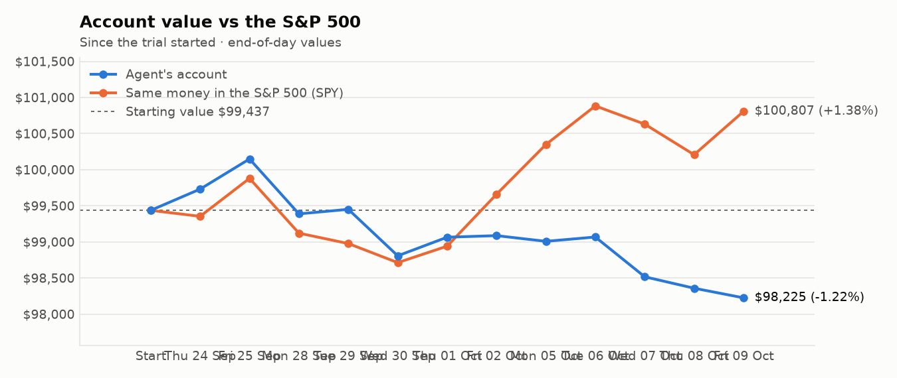
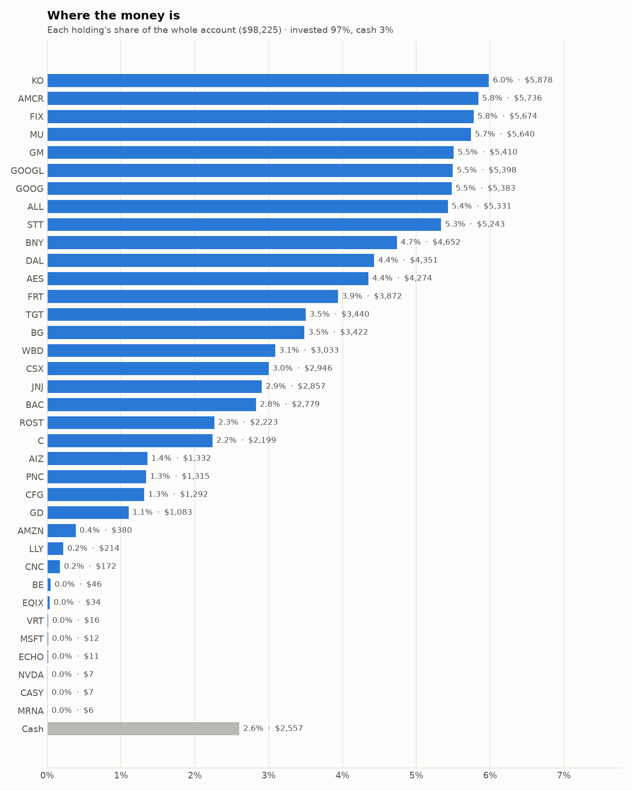
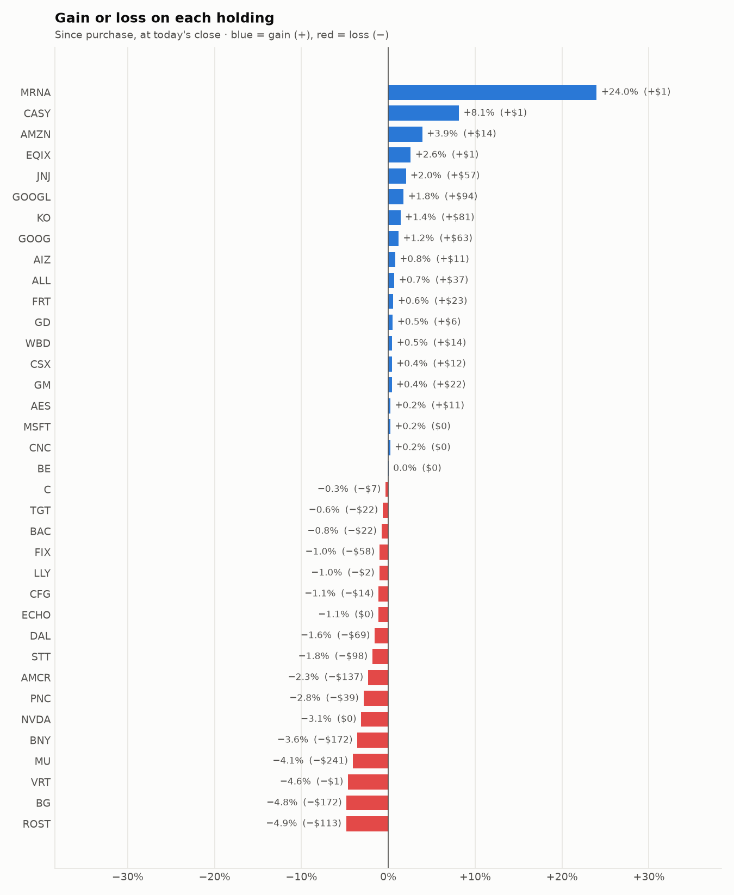

# Daily trading report — Friday 09 October 2026

## Summary

- **Account value:** $98,225 (-$133, -0.1% today)
- **S&P 500 (SPY) today:** +0.6% — the agent was behind the index by 0.73%
- **Trades:** 6 buy(s) ($16,427), 6 sell(s) ($15,931)
- **2026-10-09 Morning rebalance:** traded — 12 order(s) placed
- **2026-10-09 Afternoon risk check:** no trades needed — Risk-checked 36 holding(s): none was 10%+ below its purchase price, and none had both clearly negative news and a price drop of 3%+ since entry.

## Charts

## Why I bought

### FRT — bought 36.393 shares at ~$105.54 ($3,841)

**Why:** combined score +0.62; ranked #14 of 503; driven mainly by low volatility +1.79, value (cheapness) +0.63; entering/adding to the top-ranked target portfolio; research detail: analyst consensus +0.92/2 (6 strong buy, 11 buy, 8 hold, 0 sell, 0 strong sell)

**Research scores** (combined +0.62, ranked #14 in the S&P 500, sector: Real Estate):

| Factor | Score | Measures |
|---|---|---|
| Value | +0.63 | cheap vs. sector peers on P/E and P/B |
| Quality | +0.24 | profitability (ROE, margins) and balance-sheet strength |
| Momentum | +0.61 | 12-month price trend, excluding the last month |
| Low volatility | +1.79 | steadier price than sector peers |
| Research | +0.10 | recent news tone + analyst consensus |

**Company financials (Finnhub, trailing 12 months):** P/E 21.1, P/B 3.2, return on equity 13.3%, gross margin 67.5%, debt/equity 1.42

**Price trend (Alpaca):** 12-month return (excl. last month) +13.2%, last month -8.4%, volatility 12.9%/yr

**News (Finnhub):** no headlines in the last 2 days.

**Analysts (Finnhub, 2026-09-01):** 6 strong buy, 11 buy, 8 hold, 0 sell, 0 strong sell — consensus +0.92 on a -2 (strong sell) to +2 (strong buy) scale.

### GM — bought 43.188 shares at ~$82.40 ($3,559)

**Why:** combined score +0.69; ranked #10 of 503; driven mainly by price momentum +1.87, research (news + analyst consensus) +1.07; entering/adding to the top-ranked target portfolio; research detail: 12 recent headline(s), net positive tone (+6); analyst consensus +1.05/2 (11 strong buy, 19 buy, 7 hold, 1 sell, 0 strong sell)

**Research scores** (combined +0.69, ranked #10 in the S&P 500, sector: Consumer Discretionary):

| Factor | Score | Measures |
|---|---|---|
| Value | +0.66 | cheap vs. sector peers on P/E and P/B |
| Quality | -0.67 | profitability (ROE, margins) and balance-sheet strength |
| Momentum | +1.87 | 12-month price trend, excluding the last month |
| Low volatility | +0.05 | steadier price than sector peers |
| Research | +1.07 | recent news tone + analyst consensus |

**Company financials (FMP, trailing 12 months):** P/E 41.2, P/B 1.2, return on equity 3.0%, gross margin 5.7%, debt/equity 2.06

**Price trend (Alpaca):** 12-month return (excl. last month) +43.9%, last month -1.8%, volatility 34.6%/yr

**News (Finnhub): 12 headline(s) in the last 2 days, net tone +6.** Most influential:
- [EV Stocks’ Rally Is Narrow: Tesla and GM Lead While Pure Plays Lag](https://finnhub.io/api/news?id=1275d5f313c7a63eb1071322455d9c85040925ccc1f72cdbb1f5083d49055f02) — 09 Oct, ChartMill (tone +2)
- [Why Should General Motors Stock Holders Watch This Number?](https://finnhub.io/api/news?id=bedb23aa60c2fe19d2b61e8a17d173c16071b9be359c9a4d59be34e49eb5aade) — 08 Oct, Yahoo (tone +2)
- [General Motors vs. Tesla: What Revenue Growth Trends Tell Investors About These Automotive Giants](https://finnhub.io/api/news?id=b41945da21a43da6e3d6e225fd706919ccf4315de541bb31f96e589f747f3e69) — 08 Oct, Yahoo (tone +1)
- [Why Bank of America is bullish on GM's truck overhaul](https://finnhub.io/api/news?id=46bb5214d565cd5f4d3c8c942f97b5b64356c1c88b09635c1445555532947b8d) — 08 Oct, Yahoo (tone +1)
- [Why General Motors is dropping Blue Cross for salaried workers](https://finnhub.io/api/news?id=6bcb6b4661d2a1816853f52346a10eeb96489c4be6f232f58f75c3edbd8d85f5) — 08 Oct, Yahoo (tone +0)

**Analysts (Finnhub, 2026-09-01):** 11 strong buy, 19 buy, 7 hold, 1 sell, 0 strong sell — consensus +1.05 on a -2 (strong sell) to +2 (strong buy) scale.

### GOOGL — bought 8.345 shares at ~$352.08 ($2,938)

**Why:** combined score +0.69; ranked #8 of 503; driven mainly by price momentum +1.85, research (news + analyst consensus) +1.73; entering/adding to the top-ranked target portfolio; research detail: 47 recent headline(s), net positive tone (+17); analyst consensus +1.19/2 (20 strong buy, 43 buy, 7 hold, 0 sell, 0 strong sell)

**Research scores** (combined +0.69, ranked #8 in the S&P 500, sector: Communication Services):

| Factor | Score | Measures |
|---|---|---|
| Value | -0.77 | cheap vs. sector peers on P/E and P/B |
| Quality | +0.11 | profitability (ROE, margins) and balance-sheet strength |
| Momentum | +1.85 | 12-month price trend, excluding the last month |
| Low volatility | +0.10 | steadier price than sector peers |
| Research | +1.73 | recent news tone + analyst consensus |

**Company financials (FMP, trailing 12 months):** P/E 17.3, P/B 6.6, return on equity 50.8%, gross margin 60.9%, debt/equity 0.18

**Price trend (Alpaca):** 12-month return (excl. last month) +41.2%, last month +5.3%, volatility 34.0%/yr

**News (Finnhub): 47 headline(s) in the last 2 days, net tone +17.** Most influential:
- [This Utility Merger Pair Surges on Alphabet AI Deal](https://finnhub.io/api/news?id=6e510e2133f1ea199dd29fadb50227393218e1be681ca696cb4550cb9284256c) — 08 Oct, Yahoo (tone +2)
- [What Is Going on With Alphabet Stock on Thursday?](https://finnhub.io/api/news?id=0b00817fb0e77a8c25f12b5ae5bd2b5d347ac97ee971c33a653a3f422fc20be1) — 08 Oct, Benzinga (tone +2)
- [Update: Google's $10 Million Purchase of Spirit Airlines Data Raises Concerns From US Lawmakers](https://finnhub.io/api/news?id=d81af34163f1b020766f78f020fea363690fbbc041a14fd9c3f3c19ca0165e12) — 09 Oct, Yahoo (tone +1)
- [Google’s New Gemini Agent Works Inside Microsoft 365. Can It Add to Google Cloud’s Growth?](https://finnhub.io/api/news?id=88d75c3b4b18fbb8e3b318aeb863d38aa5fe14877976c594f844455d8566c3a9) — 09 Oct, Yahoo (tone +1)
- [Google's $10 Million Purchase of Spirit Airlines Data Raises Concerns From US Lawmakers](https://finnhub.io/api/news?id=03856d4a3999577928415a6cf7a27a6c7dbd64b3bf87d772eb46a80ff9c2fe97) — 09 Oct, Yahoo (tone +1)

**Analysts (Finnhub, 2026-09-01):** 20 strong buy, 43 buy, 7 hold, 0 sell, 0 strong sell — consensus +1.19 on a -2 (strong sell) to +2 (strong buy) scale.

### GOOG — bought 5.995 shares at ~$348.62 ($2,090)

**Why:** combined score +0.69; ranked #9 of 503; driven mainly by price momentum +1.82, research (news + analyst consensus) +1.73; entering/adding to the top-ranked target portfolio; research detail: 50 recent headline(s), net positive tone (+17); analyst consensus +1.19/2 (20 strong buy, 43 buy, 7 hold, 0 sell, 0 strong sell)

**Research scores** (combined +0.69, ranked #9 in the S&P 500, sector: Communication Services):

| Factor | Score | Measures |
|---|---|---|
| Value | -0.77 | cheap vs. sector peers on P/E and P/B |
| Quality | +0.11 | profitability (ROE, margins) and balance-sheet strength |
| Momentum | +1.82 | 12-month price trend, excluding the last month |
| Low volatility | +0.14 | steadier price than sector peers |
| Research | +1.73 | recent news tone + analyst consensus |

**Company financials (Finnhub, trailing 12 months):** P/E 17.4, P/B 6.8, return on equity 50.8%, gross margin 60.9%, debt/equity 0.15

**Price trend (Alpaca):** 12-month return (excl. last month) +40.2%, last month +5.0%, volatility 33.0%/yr

**News (Finnhub): 50 headline(s) in the last 2 days, net tone +17.** Most influential:
- [This Utility Merger Pair Surges on Alphabet AI Deal](https://finnhub.io/api/news?id=6e510e2133f1ea199dd29fadb50227393218e1be681ca696cb4550cb9284256c) — 08 Oct, Yahoo (tone +2)
- [What Is Going on With Alphabet Stock on Thursday?](https://finnhub.io/api/news?id=0b00817fb0e77a8c25f12b5ae5bd2b5d347ac97ee971c33a653a3f422fc20be1) — 08 Oct, Benzinga (tone +2)
- [Update: Google's $10 Million Purchase of Spirit Airlines Data Raises Concerns From US Lawmakers](https://finnhub.io/api/news?id=d81af34163f1b020766f78f020fea363690fbbc041a14fd9c3f3c19ca0165e12) — 09 Oct, Yahoo (tone +1)
- [Google’s New Gemini Agent Works Inside Microsoft 365. Can It Add to Google Cloud’s Growth?](https://finnhub.io/api/news?id=88d75c3b4b18fbb8e3b318aeb863d38aa5fe14877976c594f844455d8566c3a9) — 09 Oct, Yahoo (tone +1)
- [Google's $10 Million Purchase of Spirit Airlines Data Raises Concerns From US Lawmakers](https://finnhub.io/api/news?id=03856d4a3999577928415a6cf7a27a6c7dbd64b3bf87d772eb46a80ff9c2fe97) — 09 Oct, Yahoo (tone +1)

**Analysts (Finnhub, 2026-09-01):** 20 strong buy, 43 buy, 7 hold, 0 sell, 0 strong sell — consensus +1.19 on a -2 (strong sell) to +2 (strong buy) scale.

### TGT — bought 13.109 shares at ~$154.01 ($2,019)

**Why:** combined score +0.60; ranked #16 of 503; driven mainly by price momentum +2.85, research (news + analyst consensus) -0.54; entering/adding to the top-ranked target portfolio; research detail: 9 recent headline(s), net negative tone (-2); analyst consensus +0.44/2 (7 strong buy, 8 buy, 25 hold, 3 sell, 0 strong sell)

**Research scores** (combined +0.60, ranked #16 in the S&P 500, sector: Consumer Staples):

| Factor | Score | Measures |
|---|---|---|
| Value | +0.34 | cheap vs. sector peers on P/E and P/B |
| Quality | -0.13 | profitability (ROE, margins) and balance-sheet strength |
| Momentum | +2.85 | 12-month price trend, excluding the last month |
| Low volatility | -0.32 | steadier price than sector peers |
| Research | -0.54 | recent news tone + analyst consensus |

**Company financials (FMP, trailing 12 months):** P/E 15.9, P/B 3.9, return on equity 26.7%, gross margin 29.3%, debt/equity 1.05

**Price trend (Alpaca):** 12-month return (excl. last month) +72.2%, last month -1.8%, volatility 27.8%/yr

**News (Finnhub): 9 headline(s) in the last 2 days, net tone -2.** Most influential:
- [Target (TGT) Just Put A Marketplace Leader In Charge Of Its Delivery Unit](https://finnhub.io/api/news?id=2160c61b57ae25d28c9cf73933c49f9309988e3a512d42516045d31bae7d1205) — 08 Oct, Yahoo (tone -1)
- [Target’s Sales Are Recovering After 10,000+ Price Cuts. Is the Turnaround Already Priced In?](https://finnhub.io/api/news?id=f1856cdeb33a6465729d98ecf16cf77cc195ed580c6a253f690724f8c75b9244) — 06 Oct, Yahoo (tone -1)
- [Zacks Industry Outlook Ross Stores, Target, Dollar General  and  Dollar Tree](https://finnhub.io/api/news?id=e0d51d7d0a6c06d5c2d2cdb4e90cea34101b1402e1776f355db570072c370289) — 09 Oct, Yahoo (tone +0)
- [Target (TGT) On Its Merchandising Reset And The Case For More Upside](https://finnhub.io/api/news?id=ae399ba7f8b98d64134720b0d693f7a23068c7759e5d776af0d02f68bb007c88) — 08 Oct, Yahoo (tone +0)
- [Jim Cramer Said It Was “Suddenly” A Market For Walmart (WMT) But Made A Big Prediction For Target (TGT)](https://finnhub.io/api/news?id=e89d9f997bf89cd045d00ee9a981dccf4fc6414d4c971b424c9845181e36df61) — 08 Oct, Yahoo (tone +0)

**Analysts (Finnhub, 2026-09-01):** 7 strong buy, 8 buy, 25 hold, 3 sell, 0 strong sell — consensus +0.44 on a -2 (strong sell) to +2 (strong buy) scale.

### ALL — bought 8.554 shares at ~$231.50 ($1,980)

**Why:** combined score +0.73; ranked #5 of 503; driven mainly by value (cheapness) +1.66, quality (profitability/balance sheet) +1.28; entering/adding to the top-ranked target portfolio; research detail: 5 recent headline(s), net positive tone (+2); analyst consensus +0.47/2 (5 strong buy, 9 buy, 12 hold, 3 sell, 1 strong sell)

**Research scores** (combined +0.73, ranked #5 in the S&P 500, sector: Financials):

| Factor | Score | Measures |
|---|---|---|
| Value | +1.66 | cheap vs. sector peers on P/E and P/B |
| Quality | +1.28 | profitability (ROE, margins) and balance-sheet strength |
| Momentum | +0.82 | 12-month price trend, excluding the last month |
| Low volatility | -0.24 | steadier price than sector peers |
| Research | -0.14 | recent news tone + analyst consensus |

**Company financials (Finnhub, trailing 12 months):** P/E 4.3, P/B 1.8, return on equity 43.1%, debt/equity 0.22

**Price trend (Alpaca):** 12-month return (excl. last month) +26.6%, last month -9.0%, volatility 28.7%/yr

**News (Finnhub): 5 headline(s) in the last 2 days, net tone +2.** Most influential:
- [Earnings Upgrades and Digital Efficiency Gains Could Be A Game Changer For Allstate (ALL)](https://finnhub.io/api/news?id=10b6008d5de2438cf7afd1888500dab3c70b75e67fed36a651115074f2d1ee5a) — 08 Oct, Yahoo (tone +1)
- [Mizuho Maintains Outperform on Allstate, Lowers Price Target to $295](https://finnhub.io/api/news?id=94b24f18bd7f38358e2239a488c350f37f8c8c7f5199182a5a194ea7e2a29b1c) — 07 Oct, Benzinga (tone +1)
- [The Allstate Corporation (ALL) Is a Trending Stock: Facts to Know Before Betting on It](https://finnhub.io/api/news?id=2d95c28d346cec98be37aed5d41ae6bfe2e9dfdfce7dd3ecbd6b559a2b702425) — 08 Oct, Yahoo (tone +0)
- [Carriers Add Mobile Value for Policyholders with Personalized Savings Offers, Streamlined Coverage Tools and Enhanced Login Security](https://finnhub.io/api/news?id=b2ec9a102d86081240148012770403bb96e3d0e7db6a723acdbf69bdc4825350) — 07 Oct, Yahoo (tone +0)
- [Barclays Maintains Underweight on Allstate, Lowers Price Target to $221](https://finnhub.io/api/news?id=c738b4dc203e119d90d03b04d3afdbed9a86836a472e41c925916f2d56c9c511) — 07 Oct, Benzinga (tone +0)

**Analysts (Finnhub, 2026-09-01):** 5 strong buy, 9 buy, 12 hold, 3 sell, 1 strong sell — consensus +0.47 on a -2 (strong sell) to +2 (strong buy) scale.

## Why I sold

### PLD — sold 30.618 shares at ~$128.64 ($3,939)

**Why:** combined score +0.39; ranked #49 of 503; driven mainly by price momentum +0.90, research (news + analyst consensus) +0.58; trimmed toward target weight, or dropped out of the top-ranked names; research detail: 8 recent headline(s), net positive tone (+1); analyst consensus +0.87/2 (5 strong buy, 10 buy, 8 hold, 0 sell, 0 strong sell)

**Research scores** (combined +0.39, ranked #49 in the S&P 500, sector: Real Estate):

| Factor | Score | Measures |
|---|---|---|
| Value | +0.00 | cheap vs. sector peers on P/E and P/B |
| Quality | +0.00 | profitability (ROE, margins) and balance-sheet strength |
| Momentum | +0.90 | 12-month price trend, excluding the last month |
| Low volatility | +0.33 | steadier price than sector peers |
| Research | +0.58 | recent news tone + analyst consensus |

**Price trend (Alpaca):** 12-month return (excl. last month) +19.4%, last month -4.7%, volatility 20.3%/yr

**News (Finnhub): 8 headline(s) in the last 2 days, net tone +1.** Most influential:
- [What is Prologis’s (PLD) Economic Moat, and is it Widening or Narrowing?](https://finnhub.io/api/news?id=850bbab5e7ff1ea3bb47c36222d503107395176c2df698b7749991418a58e3e2) — 06 Oct, Yahoo (tone +1)
- [Clarion Hires Prologis Executive To Lead Power Strategy](https://finnhub.io/api/news?id=bc281d9f9963907663a56b252b104db23acb9d606256785a279f8af8ca8f4ffc) — 08 Oct, Yahoo (tone +0)
- [Form 8.3 Prologis, Inc](https://finnhub.io/api/news?id=9198fad661d0cc9311534c2b1b6cd1d8993d354c01449e76f9dd29c169acc9a5) — 08 Oct, Yahoo (tone +0)
- [Dimensional Fund Advisors Ltd. : Form 8.3 - PROLOGIS INC - Ordinary Shares](https://finnhub.io/api/news?id=9805df63793f85ca7e65bb2dc9eb38792a0e358397a0f661c133261dec4b11c1) — 08 Oct, Yahoo (tone +0)
- [What Does Prologis (PLD) Risk From Texas Data Center Power Limits?](https://finnhub.io/api/news?id=8e133702d7e23c6400892cda82563c089788c72bda3b3b169b5496dcc0da0586) — 08 Oct, Yahoo (tone +0)

**Analysts (Finnhub, 2026-09-01):** 5 strong buy, 10 buy, 8 hold, 0 sell, 0 strong sell — consensus +0.87 on a -2 (strong sell) to +2 (strong buy) scale.

### USB — sold 49.039 shares at ~$56.59 ($2,775)

**Why:** combined score +0.38; ranked #58 of 503; driven mainly by price momentum +0.87, low volatility +0.82; trimmed toward target weight, or dropped out of the top-ranked names; research detail: 3 recent headline(s), net positive tone (+2); analyst consensus +0.78/2 (6 strong buy, 10 buy, 10 hold, 1 sell, 0 strong sell)

**Research scores** (combined +0.38, ranked #58 in the S&P 500, sector: Financials):

| Factor | Score | Measures |
|---|---|---|
| Value | +0.00 | cheap vs. sector peers on P/E and P/B |
| Quality | +0.00 | profitability (ROE, margins) and balance-sheet strength |
| Momentum | +0.87 | 12-month price trend, excluding the last month |
| Low volatility | +0.82 | steadier price than sector peers |
| Research | +0.18 | recent news tone + analyst consensus |

**Price trend (Alpaca):** 12-month return (excl. last month) +27.7%, last month -8.2%, volatility 19.0%/yr

**News (Finnhub): 3 headline(s) in the last 2 days, net tone +2.** Most influential:
- [U.S. Bancorp (USB) Earnings Expected to Grow: What to Know Ahead of Next Week's Release](https://finnhub.io/api/news?id=440ad8c4683cf42e6cd7ce25041179128c3295e68c76119abb5e00313adcfa09) — 08 Oct, Yahoo (tone +1)
- [Why U.S. Bancorp (USB) is Poised to Beat Earnings Estimates Again](https://finnhub.io/api/news?id=0a0ec08a00bb2108472212f2d23beda8955f2d767074ec8d462ba038595b2d34) — 07 Oct, Yahoo (tone +1)
- [TD Cowen Reinstates Buy on U.S. Bancorp, Announces $70 Price Target](https://finnhub.io/api/news?id=575bdbf2b522dd49bc3312135733a2e463e431326e6d75d4e39001908b329db7) — 08 Oct, Benzinga (tone +0)

**Analysts (Finnhub, 2026-09-01):** 6 strong buy, 10 buy, 10 hold, 1 sell, 0 strong sell — consensus +0.78 on a -2 (strong sell) to +2 (strong buy) scale.

### MSFT — sold 5.101 shares at ~$529.79 ($2,702)

**Why:** combined score +0.35; ranked #62 of 503; driven mainly by research (news + analyst consensus) +1.35, low volatility +1.25; trimmed toward target weight, or dropped out of the top-ranked names; research detail: 94 recent headline(s), net positive tone (+23); analyst consensus +1.26/2 (23 strong buy, 41 buy, 5 hold, 0 sell, 0 strong sell)

**Research scores** (combined +0.35, ranked #62 in the S&P 500, sector: Information Technology):

| Factor | Score | Measures |
|---|---|---|
| Value | +0.00 | cheap vs. sector peers on P/E and P/B |
| Quality | +0.00 | profitability (ROE, margins) and balance-sheet strength |
| Momentum | -0.43 | 12-month price trend, excluding the last month |
| Low volatility | +1.25 | steadier price than sector peers |
| Research | +1.35 | recent news tone + analyst consensus |

**Price trend (Alpaca):** 12-month return (excl. last month) -1.3%, last month +6.3%, volatility 39.9%/yr

**News (Finnhub): 94 headline(s) in the last 2 days, net tone +23.** Most influential:
- [PepsiCo Lowers Guidance; Levi Strauss Sales Growth Disappoints / Stock Movers](https://finnhub.io/api/news?id=0306fa774b1f99d173ff7b2c979e077dd95cc905063b937cbaf2f62c2318130f) — 08 Oct, Yahoo (tone +2)
- [Can Microsoft's Big AI Capex Translate Into Sustainable Returns Ahead?](https://finnhub.io/api/news?id=b0457d93c776841644fcd3ad84453ec43e333c53a0e658582351f491bd90b19b) — 08 Oct, Yahoo (tone +2)
- [Evercore ISI Group Maintains Outperform on Microsoft, Raises Price Target to $635](https://finnhub.io/api/news?id=9c0e58b48481afb74baf8cbdfc1b05a64b48ade83dcf313ab72edf593c8b3ff3) — 07 Oct, Benzinga (tone +2)
- [Google’s New Gemini Agent Works Inside Microsoft 365. Can It Add to Google Cloud’s Growth?](https://finnhub.io/api/news?id=88d75c3b4b18fbb8e3b318aeb863d38aa5fe14877976c594f844455d8566c3a9) — 09 Oct, Yahoo (tone +1)
- [Is Microsoft Stock a Buy After Expanding Its Nvidia Partnership?](https://finnhub.io/api/news?id=854cab280bc456d04d967204248b1413e559512ff7f2036152072aa03118caa8) — 08 Oct, Yahoo (tone +1)

**Analysts (Finnhub, 2026-09-01):** 23 strong buy, 41 buy, 5 hold, 0 sell, 0 strong sell — consensus +1.26 on a -2 (strong sell) to +2 (strong buy) scale.

### BAC — sold 45.634 shares at ~$53.54 ($2,443)

**Why:** combined score +0.58; ranked #18 of 503; driven mainly by low volatility +1.10, value (cheapness) +0.84; trimmed toward target weight, or dropped out of the top-ranked names; research detail: 17 recent headline(s), net positive tone (+3); analyst consensus +1.00/2 (6 strong buy, 17 buy, 6 hold, 0 sell, 0 strong sell)

**Research scores** (combined +0.58, ranked #18 in the S&P 500, sector: Financials):

| Factor | Score | Measures |
|---|---|---|
| Value | +0.84 | cheap vs. sector peers on P/E and P/B |
| Quality | -0.40 | profitability (ROE, margins) and balance-sheet strength |
| Momentum | +0.83 | 12-month price trend, excluding the last month |
| Low volatility | +1.10 | steadier price than sector peers |
| Research | +0.62 | recent news tone + analyst consensus |

**Company financials (Finnhub, trailing 12 months):** P/E 10.9, P/B 1.3, return on equity 11.1%, debt/equity 2.43

**Price trend (Alpaca):** 12-month return (excl. last month) +26.7%, last month -14.5%, volatility 19.6%/yr

**News (Finnhub): 17 headline(s) in the last 2 days, net tone +3.** Most influential:
- [Investors need sustained Fed cuts to move cash off sidelines: BofA’s Hartnett](https://finnhub.io/api/news?id=02b8d29654f34affc7fca31fb663f854c04b1db16382dc4b3a1bf36ca7f839d6) — 09 Oct, Yahoo (tone -1)
- [DraftKings Is Down 19% in a Month: Did Bank of America Just Call the Bottom?](https://finnhub.io/api/news?id=a3acb0e5fba42f3a38fd3d7f640bf7ae806819ebd85d79231f70f1866db237e5) — 08 Oct, Yahoo (tone +1)
- [BofA Just Sent a Warning Shot for Apple Investors](https://finnhub.io/api/news?id=9b7f9f8aaa98dd426e923f034e710a9883145efbf61fc878e08c740fb95835ad) — 08 Oct, Yahoo (tone -1)
- [Bank of America’s EPS Growth Is Expected to Slow From 36% to Single Digits. Here’s What October 14 Needs to Show](https://finnhub.io/api/news?id=855d1b81b67dd2d482fc0e778ef28b22d5f7b4074ce6f122379103c152e773f6) — 08 Oct, Yahoo (tone +1)
- [BofA Sees Strong Demand for OpenAI, Anthropic IPOs](https://finnhub.io/api/news?id=592a2cd1d08714e546f202c56e90aa694eb67d52fcb45ea5e8c4553e55e22e67) — 07 Oct, Yahoo (tone +1)

**Analysts (Finnhub, 2026-09-01):** 6 strong buy, 17 buy, 6 hold, 0 sell, 0 strong sell — consensus +1.00 on a -2 (strong sell) to +2 (strong buy) scale.

### JNJ — sold 8.211 shares at ~$259.40 ($2,130)

**Why:** combined score +0.56; ranked #21 of 503; driven mainly by low volatility +2.00, research (news + analyst consensus) +0.81; trimmed toward target weight, or dropped out of the top-ranked names; research detail: 15 recent headline(s), net positive tone (+5); analyst consensus +0.94/2 (7 strong buy, 15 buy, 9 hold, 0 sell, 0 strong sell)

**Research scores** (combined +0.56, ranked #21 in the S&P 500, sector: Health Care):

| Factor | Score | Measures |
|---|---|---|
| Value | -0.57 | cheap vs. sector peers on P/E and P/B |
| Quality | +0.33 | profitability (ROE, margins) and balance-sheet strength |
| Momentum | +0.60 | 12-month price trend, excluding the last month |
| Low volatility | +2.00 | steadier price than sector peers |
| Research | +0.81 | recent news tone + analyst consensus |

**Company financials (FMP, trailing 12 months):** P/E 30.0, P/B 7.5, return on equity 25.7%, gross margin 67.9%, debt/equity 0.58

**Price trend (Alpaca):** 12-month return (excl. last month) +49.9%, last month -4.0%, volatility 19.6%/yr

**News (Finnhub): 15 headline(s) in the last 2 days, net tone +5.** Most influential:
- [Johnson & Johnson (JNJ) Is Becoming a Growth Stock. Does AbbVie (ABBV) Make JNJ Look Expensive?](https://finnhub.io/api/news?id=77193bfeaac80c353a6ddb698c75fbb72f6b84e78e74bbbfa5d41b7083d85a41) — 07 Oct, Yahoo (tone +2)
- [Will Johnson & Johnson (JNJ) Beat Estimates Again in Its Next Earnings Report?](https://finnhub.io/api/news?id=eeda12d4353a9e6cecc79a96719db44023b120900ae3c2e9b36334d98ffd9f36) — 08 Oct, Yahoo (tone +1)
- [Pfizer (PFE) Trades Below 10x Earnings. Why Does Johnson & Johnson (JNJ) Command More Than Twice the Multiple?](https://finnhub.io/api/news?id=904768d4646b4c625a90536c16f161ffc15968ceead861754922be31faa62b51) — 07 Oct, Yahoo (tone +1)
- [Johnson & Johnson Has Dividend Royalty Status. Does That Make It a Buy?](https://finnhub.io/api/news?id=0cb0291528fabe296f8b55180027c24a21f169e5f2f4c1c38d3f4f06a13e3aea) — 07 Oct, Yahoo (tone +1)
- [New Johnson & Johnson ICOTYDE® (icotrokinra) long-term data demonstrate robust 2-year results in the treatment of adults and adolescents with plaque psoriasis](https://finnhub.io/api/news?id=1d9fdf1b275991a36a5a060bd9ccc4d73c9e3a6e5a653fdc64ee18c35955c90a) — 09 Oct, Yahoo (tone +0)

**Analysts (Finnhub, 2026-09-01):** 7 strong buy, 15 buy, 9 hold, 0 sell, 0 strong sell — consensus +0.94 on a -2 (strong sell) to +2 (strong buy) scale.

### VRT — sold 8.022 shares at ~$242.06 ($1,942)

**Why:** combined score +0.33; ranked #65 of 503; driven mainly by price momentum +2.67, low volatility -1.74; trimmed toward target weight, or dropped out of the top-ranked names; research detail: 9 recent headline(s), neutral/mixed tone; analyst consensus +1.17/2 (10 strong buy, 22 buy, 4 hold, 0 sell, 0 strong sell)

**Research scores** (combined +0.33, ranked #65 in the S&P 500, sector: Industrials):

| Factor | Score | Measures |
|---|---|---|
| Value | -0.89 | cheap vs. sector peers on P/E and P/B |
| Quality | +0.26 | profitability (ROE, margins) and balance-sheet strength |
| Momentum | +2.67 | 12-month price trend, excluding the last month |
| Low volatility | -1.74 | steadier price than sector peers |
| Research | +0.28 | recent news tone + analyst consensus |

**Company financials (Finnhub, trailing 12 months):** P/E 53.9, P/B 27.0, return on equity 42.1%, gross margin 38.0%, debt/equity 0.62

**Price trend (Alpaca):** 12-month return (excl. last month) +115.8%, last month -7.3%, volatility 65.2%/yr

**News (Finnhub): 9 headline(s) in the last 2 days, net tone +0.** Most influential:
- [Vertiv Is Compounding Exactly As Expected, And That's The Problem](https://finnhub.io/api/news?id=2c3a470c1fd6192d507be5759f69ba31b13db466ea71f1066d7d795ac15dd47e) — 07 Oct, SeekingAlpha (tone -1)
- [Vertiv: A Major AI Infrastructure Winner, But The Valuation Leaves Little Room For Error](https://finnhub.io/api/news?id=5846c94f1b634d2929e2708d30a8cc2f46ab873b620251a3110137a9e91cd4ee) — 07 Oct, SeekingAlpha (tone +1)
- [3 Stocks Already Winning the OpenAI vs. Anthropic Race](https://finnhub.io/api/news?id=0748b40b7e1c2ea6db8fcb8441c5fc56fb89b66cfcc7cee8d2d55ea8b57b860c) — 08 Oct, Yahoo (tone +0)
- [Jim Cramer On GE Vernova (GEV) & Vertiv (VRT): Two Stocks To Buy Due To The Jobs](https://finnhub.io/api/news?id=ceab0525b47d0122cc58f70d3da4522dfd967560149f96a7ea8a76a82c22dd4f) — 08 Oct, Yahoo (tone +0)
- [Here’s How Much You Would Have Made Owning Vertiv Holdings Stock In The Last 5 Years](https://finnhub.io/api/news?id=5d1925d7eb33f53542aa0d8856ae309cd058cc36b1e804ffc4f7b9cbad076a05) — 08 Oct, Benzinga (tone +0)

**Analysts (Finnhub, 2026-09-01):** 10 strong buy, 22 buy, 4 hold, 0 sell, 0 strong sell — consensus +1.17 on a -2 (strong sell) to +2 (strong buy) scale.

## Holdings at the close

| Stock | Shares | Avg cost | Price | Market value | % of account | Today | Gain/loss $ | Gain/loss % |
|---|---:|---:|---:|---:|---:|---:|---:|---:|
| KO | 66.736 | $86.86 | $88.08 | $5,878 | 6.0% | +0.35% | +$81 | +1.40% |
| AMCR | 137.493 | $42.71 | $41.72 | $5,736 | 5.8% | -0.38% | −$137 | -2.33% |
| FIX | 3.307 | $1,733.36 | $1,715.69 | $5,674 | 5.8% | +0.55% | −$58 | -1.02% |
| MU | 5.491 | $1,070.99 | $1,027.11 | $5,640 | 5.7% | -0.84% | −$241 | -4.10% |
| GM | 65.399 | $82.40 | $82.73 | $5,410 | 5.5% | +0.58% | +$22 | +0.40% |
| GOOGL | 15.345 | $345.65 | $351.75 | $5,398 | 5.5% | +0.99% | +$94 | +1.77% |
| GOOG | 15.467 | $343.95 | $348.02 | $5,383 | 5.5% | +0.92% | +$63 | +1.18% |
| ALL | 23.234 | $227.82 | $229.43 | $5,331 | 5.4% | -0.52% | +$37 | +0.71% |
| STT | 29.965 | $178.22 | $174.96 | $5,243 | 5.3% | -0.07% | −$98 | -1.83% |
| BNY | 32.596 | $147.98 | $142.71 | $4,652 | 4.7% | -0.63% | −$172 | -3.56% |
| DAL | 53 | $83.40 | $82.10 | $4,351 | 4.4% | -0.05% | −$69 | -1.56% |
| AES | 286.093 | $14.90 | $14.94 | $4,274 | 4.4% | +0.07% | +$11 | +0.25% |
| FRT | 36.471 | $105.54 | $106.16 | $3,872 | 3.9% | +0.66% | +$23 | +0.59% |
| TGT | 22.387 | $154.62 | $153.64 | $3,440 | 3.5% | -0.72% | −$22 | -0.63% |
| BG | 33.312 | $107.91 | $102.73 | $3,422 | 3.5% | -4.72% | −$172 | -4.80% |
| WBD | 98 | $30.81 | $30.95 | $3,033 | 3.1% | +0.00% | +$14 | +0.45% |
| CSX | 62.293 | $47.10 | $47.30 | $2,946 | 3.0% | -0.08% | +$12 | +0.42% |
| JNJ | 10.937 | $256.01 | $261.20 | $2,857 | 2.9% | +1.84% | +$57 | +2.03% |
| BAC | 51.217 | $54.68 | $54.25 | $2,779 | 2.8% | +1.19% | −$22 | -0.78% |
| ROST | 10 | $233.61 | $222.27 | $2,223 | 2.3% | -1.30% | −$113 | -4.85% |
| C | 16.966 | $130.05 | $129.64 | $2,199 | 2.2% | +1.22% | −$7 | -0.32% |
| AIZ | 5 | $264.38 | $266.49 | $1,332 | 1.4% | -2.33% | +$11 | +0.80% |
| PNC | 6 | $225.64 | $219.21 | $1,315 | 1.3% | -0.21% | −$39 | -2.85% |
| CFG | 20.32 | $64.28 | $63.57 | $1,292 | 1.3% | -0.81% | −$14 | -1.10% |
| GD | 3.251 | $331.27 | $333.00 | $1,083 | 1.1% | +0.94% | +$6 | +0.52% |
| AMZN | 1.448 | $252.59 | $262.49 | $380 | 0.4% | +3.32% | +$14 | +3.92% |
| LLY | 0.182 | $1,189.78 | $1,177.40 | $214 | 0.2% | +0.67% | −$2 | -1.04% |
| CNC | 2.63 | $65.21 | $65.36 | $172 | 0.2% | +1.27% | +$0 | +0.23% |
| BE | 0.166 | $279.83 | $279.95 | $46 | 0.0% | +2.61% | +$0 | +0.04% |
| EQIX | 0.033 | $1,000.20 | $1,026.06 | $34 | 0.0% | +1.47% | +$1 | +2.59% |
| VRT | 0.067 | $254.61 | $242.81 | $16 | 0.0% | -0.38% | −$1 | -4.63% |
| MSFT | 0.023 | $533.74 | $534.99 | $12 | 0.0% | +2.37% | +$0 | +0.23% |
| ECHO | 0.116 | $95.87 | $94.81 | $11 | 0.0% | +1.55% | −$0 | -1.11% |
| NVDA | 0.032 | $236.88 | $229.48 | $7 | 0.0% | -0.43% | −$0 | -3.12% |
| CASY | 0.011 | $597.62 | $646.27 | $7 | 0.0% | +0.62% | +$1 | +8.14% |
| MRNA | 0.028 | $181.06 | $224.50 | $6 | 0.0% | +13.96% | +$1 | +23.99% |
| **Invested** | | | | **$95,669** | **97.4%** | | **−$721** | |
| **Cash** | | | | $2,557 | 2.6% | | | |
| **Total account** | | | | **$98,225** | 100% | | | |

_Scores are sector-neutral z-scores: 0 is average for the stock's sector, +1 is one standard deviation better. News tone is a keyword count over recent headlines, not a deep read. None of this guarantees a stock will rise; a few days of results can't show whether the strategy has a real edge over the S&P 500._
